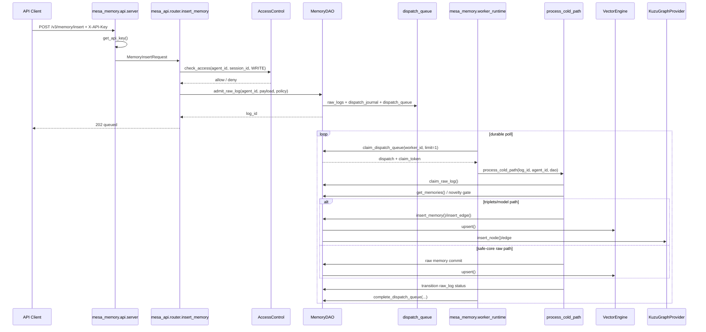
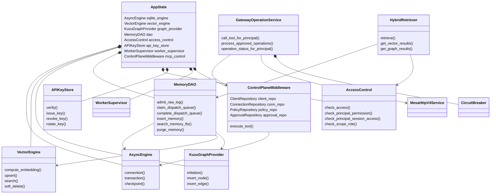
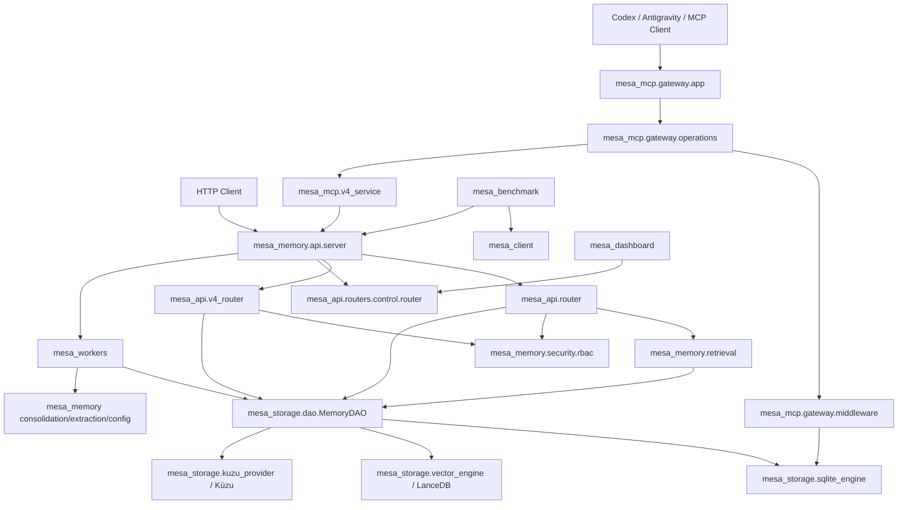

# MESA Sistem Denetimi — Uçtan Uca Teknik İnceleme

> [!danger] Nihai karar
> **Sistem mevcut haliyle canlıya hazır değildir.** Üç doğrudan canlı engeli vardır: kontrol düzleminde rol/yetki denetimi yoktur, V3 veri uçlarında doğrulanmış principal ile hedef agent/session arasında bağ kurulmamaktadır ve V4 `/rebuild` ucu hiçbir işlem başlatmadan sahte `202 queued` cevabı vermektedir.

## 0. Denetim yöntemi ve kanıt sınırı

İncelenen kaynak: `MESA-main (39).zip`.

Denetimde README, `docs/`, `.audit/`, yorumlar ve test adları doğruluk kanıtı olarak kabul edilmedi. Bunlar yalnızca kodla çelişki tespiti için kullanıldı. Gerçek çağrı akışları Python AST envanteri, doğrudan kaynak okuması, import grafiği, route çıkarımı ve sözdizimi derlemesiyle takip edildi.

Gerçekleştirilen kontroller:

- ZIP’in tamamı açıldı; **726 dosya**, **380 Python kaynağı**, **496 sınıf**, **3.298 fonksiyon/metot** statik olarak tarandı.
- Üretim kodunda **90 FastAPI route handler** çıkarıldı.
- **57 benzersiz ortam değişkeni** kaynak satırlarıyla çıkarıldı.
- Python kaynaklarının tamamı `compileall` ile derlendi; **sözdizimi hatası bulunmadı**.
- Paketler arası import grafiği ve iki dosya düzeyi import döngüsü çıkarıldı.
- Test envanteri: **142 Python test dosyası / 1.189 test fonksiyonu** ve **2 TypeScript/E2E test dosyası**.
- Tam `pytest` çalıştırması başlatıldı ancak çalışma ortamında `slowapi` kurulu olmadığı için test collection başlayamadı. `uv run --frozen` denemesi de bağımlılık deposundan `setuptools` çekilirken HTTP 503 ile durdu. Bu nedenle bu rapor testlerin geçtiğini iddia etmez.
- Basit secret-pattern taramasında gömülü gerçek API anahtarı veya private key bulunmadı; bu bir tam secret scanner/SAST yerine geçmez.

İlgili ekler:

- [[MESA_Tam_Dosya_Agaci]]
- [[MESA_API_Route_Envanteri]]
- [[MESA_Ortam_Degiskenleri]]
- [[MESA_Bagimlilik_Envanteri]]
- [[MESA_Test_Envanteri]]

## 1. Sistem envanteri

### 1.1 Ana modüller

| Modül                           | Gerçek sorumluluk                                                                                       |
| ------------------------------- | ------------------------------------------------------------------------------------------------------- |
| `mesa_memory`                   | Runtime başlatma, API host uygulaması, config, retrieval, güvenlik, consolidation ve gözlemlenebilirlik |
| `mesa_api`                      | V3/V4 HTTP route tanımları ve MCP kontrol route’ları                                                    |
| `mesa_storage`                  | SQLite, LanceDB, Kùzu, schema/migration ve birleşik `MemoryDAO`                                         |
| `mesa_workers`                  | Cold-path ingestion, projection, maintenance, consolidation, REM ve supervisor                          |
| `mesa_mcp`                      | STDIO MCP, HTTP gateway, Codex/Antigravity köprüleri ve control plane                                   |
| `mesa_client`                   | HTTP istemci SDK’sı ve LangChain adaptörü                                                               |
| `mesa_evals`                    | Değerlendirme, soak/gatekeeper ve adapter karşılaştırmaları                                             |
| `mesa-benchmark/mesa_benchmark` | Benchmark runner, dataset, evaluator, provider clientleri ve yerel dashboard                            |
| `mesa_dashboard`                | MCP/control dashboard React uygulaması                                                                  |

### 1.2 Üretilmiş veya ikili içerik

Ana kaynak ağacında içerikleri açılmadan listelenen kökler:

- `mesa-benchmark/mesa_benchmark/dashboard/static/`: 18 derlenmiş dashboard dosyası.
- `demo/assets/`: 11 derlenmiş/statik demo asseti.
- `mesa_dashboard/public/brand/`: 8 ikili marka/favicon dosyası.

`node_modules`, `vendor`, `build`, `dist` adlı bağımlılık/build klasörleri ZIP içinde yoktur. Python `__pycache__` klasörleri açma/derleme sırasında üretildi ve kaynak envanterine dahil edilmedi.

### 1.3 Giriş noktaları

#### Container/runtime

- `python -m mesa_memory.runtime_entrypoint` container girişidir; worker-only profilde `mesa_memory.worker_runtime`, diğer API profillerinde Uvicorn başlatır (`mesa_memory/runtime_entrypoint.py:17-38`).
- Uvicorn hedefi `mesa_memory.api.server:app`, bind adresi `0.0.0.0`, worker sayısı belirtilmediği için tek process’tir (`mesa_memory/runtime_entrypoint.py:23-33`).
- Docker image non-root kullanıcıyla çalışır ve `/var/lib/mesa` kalıcı volume’dür (`Dockerfile:21-39`).

#### Python console scriptleri

`pyproject.toml:117-124`:

- `mesa-recovery`
- `mesa-benchmark`
- `mesa-v4-admin`
- `mesa-mcp`
- `mesa-mcp-gateway`
- `mesa-antigravity-bridge`
- `mesa`

#### HTTP uygulamaları

- Ana API: `mesa_memory.api.server:app`.
- Direct MCP Gateway: `mesa_mcp.gateway.app:create_gateway_app()`; varsayılan `127.0.0.1:8765` (`mesa_mcp/gateway/app.py:255-270`).
- Benchmark dashboard: `mesa_benchmark.dashboard.app:create_dashboard_app()`; CLI yalnız loopback host kabul eder (`mesa-benchmark/mesa_benchmark/cli.py:76-90`).

### 1.4 Konfigürasyon ve ortam

Runtime profili fail-closed tasarlanmıştır:

- `MESA_RUNTIME_PROFILE` zorunlu (`mesa_memory/config.py:76-87`).
- `MESA_STORAGE_ROOT` zorunlu; `/`, home ve current-working-directory reddedilir (`mesa_memory/config.py:88-96`).
- Dotenv yalnız açıkça etkinleştirilip mutlak dosya yolu verilirse yüklenir (`mesa_memory/config.py:97-103`, `155-179`).
- `test-isolated` profili model, dış provider ve dotenv kullanımını reddeder (`mesa_memory/config.py:124-154`).
- Queue admission sınırları global ve tenant bazında tanımlıdır (`mesa_memory/config.py:182-220`).

Tam değişken listesi [[MESA_Ortam_Degiskenleri]] ekindedir. Kritik runtime değişkenleri: `MESA_API_KEY`, `MESA_PRINCIPAL_ID`, `MESA_RUNTIME_PROFILE`, `MESA_STORAGE_ROOT`, `MESA_MODEL_ENABLED`, `MESA_EXTERNAL_PROVIDER_ENABLED`, `MESA_REQUIRE_WORKER_READINESS`, `MESA_DAILY_REQUEST_LIMIT`, `MESA_LOG_LEVEL`, `MESA_LOG_FORMAT`.

### 1.5 Bağımlılıklar ve sürümler

- Python doğrudan bağımlılıkları alt sınırlarla `pyproject.toml:22-67`, optional gruplar `pyproject.toml:69-115` içinde tanımlıdır.
- `uv.lock` 263 çözülmüş paket kaydı içerir; Docker build `uv export --frozen` kullandığı için Python image build’i lock’a bağlıdır (`Dockerfile:17-19`).
- Her iki React uygulamasında `package-lock.json` vardır; frontend buildleri lock’lanabilir.
- Tam doğrudan ve lock sürümleri [[MESA_Bagimlilik_Envanteri]] ekindedir.

### 1.6 Test kapsamı — gerçekte ne çalışıyor?

`pyproject.toml:297-304` varsayılan pytest kökünü yalnız `tests/` olarak sınırlar. Sonuç:

- Kök `tests/`: 130 dosya / 1.070 test fonksiyonu.
- `mesa-benchmark/tests/`: 9 dosya / 118 test fonksiyonu; varsayılan `pytest` çağrısına dahil değildir.
- Script altında test benzeri 3 dosya / 1 fonksiyon vardır.
- Benchmark frontend’de bir Vitest ve bir Playwright dosyası bulunur.

Coverage kaynak listesi yalnız `mesa_memory`, `mesa_workers`, `mesa_client`, `mesa_storage`, `mesa_api` paketlerini ölçer; **`mesa_mcp`, `mesa_evals`, `mesa_benchmark` kapsam metriğinin dışında kalır** (`pyproject.toml:306-314`). Bu nedenle `%82` eşiği MCP ve benchmark kodunun güvenilirliğini kanıtlamaz.

Ayrıca test `test_codex_dashboard_summary_is_secret_safe_and_can_revoke`, auth dependency bağlamadan kontrol router’ını mount eder ve anonim credential revoke işleminin `200` dönmesini başarılı davranış sayar (`tests/test_codex_control_api.py:31-55`). Bu test açığı yakalamak yerine mevcut açığı sözleşmeye dönüştürmektedir.

## 2. Mimari inceleme

### 2.1 Katman ayrımı

Katmanlar net ayrılmamıştır; çift yönlü bağımlılıklar vardır:

- `mesa_memory.api.server` route’ları `mesa_api` paketinden import eder (`mesa_memory/api/server.py:23-25`).
- `mesa_api` tekrar config, retrieval, consolidation ve RBAC için `mesa_memory` paketine bağımlıdır (`mesa_api/router.py:64-69`, `mesa_api/v4_router.py:20-22`).
- `mesa_memory` worker sınıflarını import eder (`mesa_memory/api/server.py:51-63`, `mesa_memory/worker_runtime.py:31-32`).
- `mesa_workers` config, extraction ve consolidation için tekrar `mesa_memory` paketine bağımlıdır (`mesa_workers/ingestion_worker.py:55-59`).
- Storage katmanı runtime config’e doğrudan erişir (`mesa_storage/dao.py:5621`).

Bu yapı bir “dependency inversion” katmanı yerine paketlerin birbirini karşılıklı bilmesine yol açıyor. API, domain, orchestration ve storage sınırları derleme seviyesinde ayrılmış değildir.

`MemoryDAO` 6.000’den fazla satırlık tek bir sınıftır ve catalog, queue, projection, purge, vector, graph, migration recovery, session ve mutation işlerini birleştirir (`mesa_storage/dao.py:175-207`). Sınıf docstring’i “her public method ilk positional arg olarak agent_id alır” der (`mesa_storage/dao.py:175-182`), fakat V4 catalog ve lifecycle metotları bu sözleşmeye uymaz. Bu yalnız yorum eskimesi değil, sınıfın tek ve doğrulanabilir bir kontrata sahip olmadığının göstergesidir.

### 2.2 Paket bağımlılık grafiği

Başlıca doğrudan import yoğunlukları:

- `mesa_memory -> mesa_storage`: 14
- `mesa_memory -> mesa_workers`: 9
- `mesa_api -> mesa_memory`: 10
- `mesa_workers -> mesa_memory`: 10
- `mesa_mcp -> mesa_storage`: 18
- `mesa_benchmark -> mesa_memory`: 9
- `mesa_benchmark -> mesa_storage`: 6

Dosya düzeyi iki import döngüsü vardır:

1. `mesa_mcp.antigravity_cli -> mesa_mcp.codex_cli` (`mesa_mcp/antigravity_cli.py:16`) ve fonksiyon-içi ters importlar (`mesa_mcp/codex_cli.py:45`, `120`).
2. `mesa_storage.kuzu_schema_migration -> mesa_storage.kuzu_setup` (`mesa_storage/kuzu_schema_migration.py:13`) ve fonksiyon-içi ters import (`mesa_storage/kuzu_setup.py:178`).

Fonksiyon-içi import döngünün import-time patlamasını azaltıyor; ancak bileşenlerin birbirinden bağımsız test/packaging sınırlarını bozuyor.

### 2.3 State yerleşimi ve izolasyon

#### Process-scoped state

Ana API tüm altyapıyı modül seviyesinde tek `AppState` nesnesinde tutar (`mesa_memory/api/server.py:148-164`). İçinde DAO, engine’ler, graph provider, AccessControl, APIKeyStore, worker supervisor ve background task seti bulunur.

Bu state tenant bazlı değildir; tenant/agent izolasyonu sorgular ve RBAC tabloları üzerinden sağlanmaya çalışılır. Dolayısıyla bir route’ta scope kontrolünün atlanması halinde process-level singleton doğrudan bütün tenant verisine erişebilir. V3 açığının etkisini büyüten temel mimari budur.

MCP tarafında:

- `ControlPlaneMiddleware._active_connections` process-local dict’tir (`mesa_mcp/gateway/middleware.py:37`). Restart veya çoklu instance’ta ortak gerçeklik değildir.
- `GatewayOperationService._recall_cache` ve `_inflight_recalls` process-local’dır (`mesa_mcp/gateway/operations.py:90-92`).
- `CircuitBreaker` sayaçları yalnız process içindedir (`mesa_mcp/gateway/operations.py:37-72`).

#### Tenant izolasyonu

Storage sorgularında genel olarak `agent_id` parametrelenmiş SQL ve LanceDB filtreleri vardır. V4 ayrıca principal/session ve dataset-role kontrolünü birlikte uygular (`mesa_api/v4_router.py:148-228`). Ancak V3 kritik data route’larında authenticated principal hiç kullanılmadığı için isolation yalnız caller’ın gönderdiği `agent_id/session_id` ve legacy grant’e dayanır; ayrıntı Kritik K-02’de.

### 2.4 Eşzamanlılık modeli

#### SQLite

`AsyncEngine` gerçek bir connection pool değildir. Her acquisition yeni `aiosqlite.connect()` açar, PRAGMA uygular ve çıkışta kapatır; semaphore yalnız eşzamanlı connection sayısını sınırlar (`mesa_storage/sqlite_engine.py:245-284`). Her write transaction `BEGIN IMMEDIATE` ile başlar (`mesa_storage/sqlite_engine.py:286-305`), dolayısıyla SQLite’ın tek-writer sınırı erken alınır.

Her connection’a WAL, `synchronous=NORMAL` ve 64 MB cache PRAGMA’sı uygulanır (`mesa_storage/sqlite_engine.py:220-241`, `425-429`). Varsayılan çoklu connection ve API+worker process yapısında memory ve lock contention artabilir.

#### Vector

`VectorEngine` thread pool ile sync LanceDB çağrılarını event loop dışına çıkarır (`mesa_storage/vector_engine.py:159-198`). Bütün mutation’lar tek `asyncio.Lock` altında serialize edilir (`mesa_storage/vector_engine.py:194-195`, `362-395`, `433-454`). Bu process içi yarışları azaltır, fakat farklı process veya replica’lar arasında lock sağlamaz.

#### Worker queue

Dispatch claim fencing token ve lease kullanır (`mesa_storage/dao.py:5733-5768`). Combined runtime uzun işte 60 saniyede lease yeniler ve sahiplik kaybolursa task’ı iptal eder (`mesa_memory/api/server.py:185-222`). Worker-only runtime ise `process_cold_path` boyunca lease yenilemez (`mesa_memory/worker_runtime.py:72-100`). Varsayılan lease 300 saniyedir (`mesa_storage/dao.py:5733-5735`). İş 5 dakikayı aşarsa ikinci worker aynı dispatch’i reclaim edebilir ve iki işlem eşzamanlı ilerleyebilir.

Cold-path process seviyesinde global semaphore 10, Tier-3 semaphore 3’tür (`mesa_workers/ingestion_worker.py:64-72`). Tenant başına fairness yoktur; tek tenant bütün slotları tüketebilir.

#### MCP approval worker

`process_approved_operations` tüm `PENDING_APPROVAL` kayıtlarını seçer, sonra herhangi bir atomic compare-and-set/claim olmadan durumu `APPROVED` yapıp side effect’i çalıştırır (`mesa_mcp/gateway/operations.py:229-251`). İki gateway instance aynı operasyonu aynı anda seçebilir. V4 tarafındaki idempotency bazı yazıları koruyabilir; fakat bu methodun kendi “exactly once” garantisi yoktur ve tüm downstream etkilerin idempotent olduğu kanıtlanmamıştır.

### 2.5 Hata yönetimi

Olumlu taraflar:

- API search 30 saniyelik hard timeout kullanır (`mesa_api/router.py:400-410`).
- Queue claim/complete fencing token ve retry/dead-letter state’leri kullanır (`mesa_storage/dao.py:5733-5838`).
- Vector mutasyonları hata halinde sessiz fallback yerine exception üretir (`mesa_storage/vector_engine.py:418-428`).
- Runtime readiness SQLite, vector, graph ve worker durumunu kontrol eder (`mesa_memory/api/server.py:757-782`).

Sorunlar:

- Cold-path en dış `except Exception` ile her hatayı yakalar ve tekrar fırlatmaz (`mesa_workers/ingestion_worker.py:474-507`). Queue state üzerinden retry tasarımı vardır; fakat stack-level failure supervisor’a ulaşmadığı için worker health yalnız loop’un yaşamasını ölçer, işlerin sürekli hata verdiğini “process unhealthy” yapmaz.
- ECOD import veya runtime hatasında gate fail-open davranır ve kayıt otomatik geçirilir (`mesa_workers/ingestion_worker.py:576-587`). Bu availability odaklıdır fakat “anomaly gate zorunludur” şeklindeki her iddiayla çelişir.
- Tier-3 legacy V3 yolunda hata yalnız warning olarak loglanır ve önceden commit edilmiş memory başarılı kabul edilir (`mesa_workers/ingestion_worker.py:433-463`).
- Benchmark dashboard `_system_snapshot` içindeki Ollama/GPU hatalarını tamamen yutar (`mesa-benchmark/mesa_benchmark/dashboard/app.py:56-97`). UI yalnız offline/null görür, kök neden kaybolur.
- MCP STDIO/bridge bazı hatalarda `str(e)` değerini istemciye döndürür (`mesa_mcp/gateway/http_gateway.py:114-115`; `mesa_mcp/server.py:93-103`). İç URL, dosya yolu veya provider mesajı sızabilir.

### 2.6 Veri kalıcılığı ve tutarlılık

#### Canonical ve derived store’lar

- SQLite: nodes, raw logs, queue/journal, V4 catalog/mutations, control plane tabloları.
- LanceDB: embedding vectorları.
- Kùzu: graph node/edge projectionları.
- JSONL/files: benchmark event, state ve result çıktıları.

SQLite tek başına ACID sağlar. SQLite + LanceDB + Kùzu işlemleri dağıtık transaction değildir; saga/repair ile eventual consistency hedeflenmiştir.

#### Gerçek dual-write sırası ile recovery çelişkisi

Mevcut insert akışı önce LanceDB, sonra Kùzu, en son SQLite’a yazar (`mesa_storage/dao.py:3295-3398`). Kùzu hatasında vector compensation denenir (`mesa_storage/dao.py:3317-3343`), fakat SQLite transaction/commit hatasında vector veya graph için compensation yoktur.

Startup reconciliation ise açıklama ve implementasyon olarak ters yönü kontrol eder: “SQLite node var, LanceDB vector yok” durumunu arar (`mesa_storage/dao.py:3019-3072`). Hatta docstring hâlâ process’in “SQLite INSERT ile LanceDB upsert arasındaki” sırada öldüğünü söyler (`mesa_storage/dao.py:3020-3029`). Güncel gerçek sıra bunun tersidir. Sonuç: process secondary write sonrası SQLite’dan önce ölürse oluşan **vector/graph orphan** mevcut reconciliation tarafından temizlenmez.

Tarama ayrıca yalnız ilk 100 agent’ın son 500 node’unu kontrol eder (`mesa_storage/dao.py:3031-3059`). Daha eski veya 100 agent sınırının dışındaki tutarsızlıklar kalıcı olabilir.

`_atomic_saga_commit` secondary store’ları yazdıktan sonra SQLite commit eder; commit exception’ında compensation yoktur (`mesa_storage/dao.py:4126-4144`). `update_entity_description` bu helper’ı kullanır (`mesa_storage/dao.py:4150-4185`). Böylece vector yeni embedding’e geçmişken SQLite eski content’te kalabilir.

### 2.7 Ölçeklenebilirlik sınırları

- Uvicorn tek worker process ile başlar (`mesa_memory/runtime_entrypoint.py:23-33`).
- SQLite `BEGIN IMMEDIATE` nedeniyle write throughput tek writer ile sınırlıdır (`mesa_storage/sqlite_engine.py:286-305`).
- Vector mutation lock yalnız process içindedir (`mesa_storage/vector_engine.py:194-195`).
- Kùzu ve LanceDB local embedded dosyalardır; uygulama dağıtık lock/leader election sağlamaz.
- MCP cache, circuit breaker ve active connections process-local’dır.
- API ve worker aynı named volume’u paylaşır (`docker-compose.yml:13-15`, `34-59`); fakat processler arasında VectorEngine mutation lock paylaşılmaz.
- Recall cache 45 saniye TTL yazar ama expired entry’leri periyodik temizlemez; benzersiz query sayısı arttıkça dict büyür (`mesa_mcp/gateway/operations.py:384-438`). Yalnız write sonrası bütün cache temizlenir (`mesa_mcp/gateway/operations.py:683-687`). Read-heavy ve write-az sistemde memory büyümesi mümkündür.

Bu kod tek node/sınırlı concurrency pilot için tasarlanmıştır. Yatay replica eklemek mevcut halde güvenli değildir.

## 3. Kod seviyesi kritik inceleme

## K-01 — Kontrol düzlemi için authorization yok

**Seviye:** Kritik — canlı engeli  
**Bileşen:** `/control/mcp/*`

Ana server, control router’a yalnız API key ve günlük rate limit dependency’si bağlar (`mesa_memory/api/server.py:724-753`). API key principal üretir (`mesa_memory/api/server.py:118-145`), fakat control handler’larının hiçbiri `Request`, `request.state.principal`, role veya explicit admin permission kullanmaz.

Yetkisiz bir aktif API key sahibi şunları yapabilir:

- Yeni client ve caller seçimiyle sahte `principal_id` oluşturma (`mesa_api/routers/control/router.py:21-37`).
- Global settings değiştirme (`mesa_api/routers/control/router.py:58-66`).
- Caller seçimiyle sahte `created_by` kullanarak policy oluşturma (`mesa_api/routers/control/router.py:68-90`).
- Client enable/disable (`mesa_api/routers/control/router.py:99-104`).
- Credential revoke (`mesa_api/routers/control/router.py:158-170`).
- Approval kararında caller’ın gönderdiği `decided_by` alanını kullanma (`mesa_api/routers/control/router.py:192-223`).

Bu bir “authentication var ama authorization yok” açığıdır. Tenant izolasyonu ve support/admin separation fiilen uygulanmaz.

Test de anonim router mount edip credential revoke işlemini başarı olarak doğrular (`tests/test_codex_control_api.py:31-55`).

**Canlı etkisi:** Her geçerli API key bir control-plane admin anahtarına dönüşür. Credential iptali, policy manipülasyonu ve onay sahteciliği mümkündür.

**Zorunlu düzeltme:** Control router seviyesinde ayrı `require_control_role()` dependency; principal’ın server-side rolü; `created_by/decided_by/principal_id` alanlarının authenticated subject’ten türetilmesi; tenant/scope authorization; negatif cross-role testleri.

## K-02 — V3 data route’larında principal izolasyonu atlanıyor

**Seviye:** Kritik — canlı engeli  
**Bileşen:** V3 insert/search/status/record

Auth dependency doğrulanmış principal’ı `request.state.principal` içine koyar (`mesa_memory/api/server.py:118-145`). Ancak aşağıdaki V3 data route’ları bu principal’ı kullanmaz:

- Insert yalnız caller’ın gönderdiği `agent_id/session_id` için legacy `check_access` çağırır (`mesa_api/router.py:196-235`).
- Status yalnız `agent_id, "__any__", READ` kontrol eder (`mesa_api/router.py:317-343`).
- Search caller scope’unu doğrudan `HybridRetriever`’a verir (`mesa_api/router.py:367-409`); retriever da yalnız legacy agent/session kontrolü yapar (`mesa_memory/retrieval/hybrid.py:48-66`).
- Record get yalnız legacy `check_access` kullanır (`mesa_api/router.py:496-510`).

Aynı router’daki purge ve session-context/end yolları doğru modeli gösterir: principal status ve `check_principal_session_access` kontrolü yaparlar (`mesa_api/router.py:577-602`, `720-735`, `798-813`). Dolayısıyla eksiklik tasarım zorunluluğu değil, route bazlı uygulanmamış authorization’dır.

**Sömürü koşulu:** Saldırganın geçerli API key’i ve hedef `agent_id/session_id` bilgisi olması yeterlidir; hedef scope için legacy grant aktifse principal’ın o scope’a bağlı olması aranmadan arama/okuma/yazma yapılabilir.

**Test boşluğu:** `tests/test_principal_authorization.py` session create/read-only senaryolarını test eder (`tests/test_principal_authorization.py:71-150`), fakat insert/search/status/get-record için cross-principal negatif test yoktur.

**Zorunlu düzeltme:** Bütün V3 handler’lar için ortak `_require_principal_session_access`; `agent_id` hiçbir zaman authorization subject olmamalı; status için raw log’un session scope’u önce server-side çözülmeli; cross-principal ve disabled-principal testleri eklenmeli.

## K-03 — `/v4/rebuild` sahte başarı döndürüyor

**Seviye:** Kritik — operasyonel doğruluk canlı engeli  
**Bileşen:** V4 maintenance

`POST /v4/rebuild`:

- Principal veya tenant rolü kontrol etmiyor.
- Queue/journal kaydı oluşturmuyor.
- Worker çağırmıyor.
- Index veya projection state değiştirmiyor.
- Yalnız `{"status": "rebuild_queued"}` döndürüyor.

Kaynak: `mesa_api/v4_router.py:559-562`.

Bu, fonksiyon adının vaat ettiği işi yapmadığı örnek sınıfın doğrudan karşılığıdır. HTTP 202 kabul eden operator, onarımın gerçekten planlandığını sanır; sistemde hiçbir side effect yoktur.

**Zorunlu düzeltme:** Uç kaldırılmalı veya durable rebuild operation kaydı + authorization + idempotency + worker claim + progress/status + failure/DLQ akışı tamamlanmalıdır. Tamamlanana kadar `501 Not Implemented` fail-closed cevabı verilmelidir.

## Ö-01 — Dual-write recovery güncel write sırasını onarmıyor

**Seviye:** Önemli

Gerçek sıra secondary-first (`mesa_storage/dao.py:3295-3398`), reconciliation ise SQLite-first orphan varsayıyor (`mesa_storage/dao.py:3019-3072`). SQLite commit öncesi crash ile oluşan LanceDB/Kùzu orphan’ları temizlenmez. Tarama 100 agent × son 500 node ile sınırlıdır (`mesa_storage/dao.py:3031-3059`).

**Etki:** Index bloat, graph pollution, eksik/yanlış ranking ve disk büyümesi. Uzun süreli işletmede sessiz tutarsızlık birikir.

## Ö-02 — API key rotation atomik değil

**Seviye:** Önemli

`rotate_key` önce mevcut key’i ayrı transaction’da revoke eder, sonra yeni key üretir (`mesa_memory/security/api_keys.py:182-196`). Yeni key insert’i başarısız olursa eski key zaten iptal edilmiştir. Tek aktif admin/service key senaryosunda sistem kilitlenebilir.

Bootstrap secret de yalnız `bootstrap` kaydı yoksa hash’lenir (`mesa_memory/security/api_keys.py:83-106`); deployment sonrası yalnız env secret değiştirmek DB’deki bootstrap key’i rotate etmez.

**Düzeltme:** Replacement key’i aynı transaction’da oluştur, sonra eskiyi revoke et; iki key’li kısa overlap veya compare-and-swap rotation kullan; rotation recovery prosedürü ekle.

## Ö-03 — Worker-only dispatch lease yenilemiyor

**Seviye:** Önemli

Worker-only consumer 300 saniyelik claim alır ve bütün cold-path tamamlanana kadar renewal yapmaz (`mesa_memory/worker_runtime.py:72-100`, `mesa_storage/dao.py:5733-5755`). Combined consumer doğru olarak her 60 saniyede renewal yapar (`mesa_memory/api/server.py:197-221`).

**Etki:** Uzun işlemlerde aynı queue kaydı ikinci worker tarafından reclaim edilebilir. Raw-log fencing bazı sonuçları korusa da secondary-store side effectlerinin tamamının exactly-once olduğu kanıtlanmamıştır.

## Ö-04 — MCP approved-operation worker atomic claim yapmıyor

**Seviye:** Önemli

Gateway bütün pending kayıtları okur, onayı kontrol eder, sonra koşulsuz `APPROVED` yazar ve çalıştırır (`mesa_mcp/gateway/operations.py:229-251`). Birden fazla instance için `UPDATE ... WHERE status='PENDING_APPROVAL' RETURNING` benzeri claim/fence yoktur.

**Etki:** Aynı approved write/delete iki kez yürütülebilir. Idempotency ledger var (`mesa_mcp/gateway/operations.py:493-531`), fakat burada yürütme sahipliği için CAS yoktur.

## Ö-05 — Legacy MCP approval payload’a bağlı değil

**Seviye:** Önemli

`ControlPlaneMiddleware.execute_tool` approval gereken işlemde sabit `payload_hash = "mock-hash"` kullanır (`mesa_mcp/gateway/middleware.py:125-145`). Böylece onay, gerçek argument payload’una kriptografik olarak bağlı değildir. Aynı middleware ayrıca tam `arguments` dict’ini activity metadata’ya yazar (`mesa_mcp/gateway/middleware.py:99-110`); token, path veya hassas içerik varsa audit DB’ye taşınabilir.

Direct gateway operation servisi gerçek SHA-256 ve encrypted payload kullanır (`mesa_mcp/gateway/operations.py:493-530`); iki paralel MCP yolunun güvenlik kontratı farklıdır.

## Ö-06 — Kullanılmayan HTTP gateway kodu mevcut auth sınıfıyla kırık

**Seviye:** Önemli / ölü kod

`create_gateway_router` `Depends(auth.authenticate)` çağırır (`mesa_mcp/gateway/http_gateway.py:27-74`), fakat `GatewayAuth` yalnız `authenticate_credential` metoduna sahiptir (`mesa_mcp/gateway/auth.py:17-32`). Router mount edilirse AttributeError oluşur.

Aynı dosyada yorumlar implementasyonun mock/simplified olduğunu açıkça belirtir (`mesa_mcp/gateway/http_gateway.py:79-83`) ve heartbeat authenticated client ile connection ownership eşleştirmeden yalnız connection id’ye heartbeat yazar (`mesa_mcp/gateway/http_gateway.py:51-57`).

Bu router mevcut `create_gateway_app` yolunda mount edilmediği için doğrudan çalışan endpoint açığı değildir; ancak deploy edilmemesi gereken kırık üretim benzeri koddur.

## Ö-07 — Recall cache expired entry’leri temizlemiyor

**Seviye:** Önemli

Cache hit yalnız `expires_at > now` ise kullanılır, fakat expired key silinmez; her benzersiz query yeni entry ekler (`mesa_mcp/gateway/operations.py:384-438`). Write olduğunda tüm cache temizlenir (`mesa_mcp/gateway/operations.py:683-687`). Read-heavy sistemde write yoksa dict sınırsız büyüyebilir.

**Düzeltme:** LRU/TTL cache, max-size, periodic pruning ve metric.

## Ö-08 — Tek-writer embedded storage yatay ölçeklenemez

**Seviye:** Önemli

- SQLite write’ları `BEGIN IMMEDIATE` (`mesa_storage/sqlite_engine.py:286-305`).
- LanceDB mutation lock process-local (`mesa_storage/vector_engine.py:194-195`).
- API ve worker aynı local volume’a bağlanır (`docker-compose.yml:13-15`, `34-59`).
- Gateway state/cache process-local.

Tek instance dışına çıkıldığında uygulama seviyesinde distributed fencing/leader election yoktur. “Replica artır” operasyonu güvenli değildir.

## Ö-09 — Default split worker graph provider olmadan çalışıyor

**Seviye:** Önemli / özellik uyumsuzluğu

Worker-only runtime `MemoryDAO(engine, vector_engine)` oluşturur; graph provider vermez (`mesa_memory/worker_runtime.py:122-131`). Default compose worker’da model kapalıdır (`docker-compose.yml:20-29`, `49-54`). Cold-path triplet çıkarmayı atlar ve raw memory commit eder (`mesa_workers/ingestion_worker.py:328-337`, `409-431`).

Sonuç olarak default API+worker deployment V3 raw/vector memory işleyebilir, fakat cold-path graph projection üretmez. Search dokümanı “full vector + lexical + graph” diye tarif edilse de default split profilde graph kaynağı boş/degraded kalabilir (`mesa_api/router.py:372-379`). Bu davranış açık capability/profile olarak sunulmalıdır.

## Ö-10 — Test ve coverage kapıları kritik paketleri dışlıyor

**Seviye:** Önemli

- Benchmark testleri varsayılan pytest’te yok (`pyproject.toml:297-304`).
- MCP ve benchmark coverage metriğinde yok (`pyproject.toml:306-314`).
- Critical V3 cross-principal route senaryoları yok.
- Control testleri authz yokluğunu başarı kabul ediyor (`tests/test_codex_control_api.py:31-55`).
- Full suite bu denetim ortamında dependency collection aşamasını geçemedi; canlı kararı için yeşil CI kanıtı mevcut değildir.

## Ö-11 — Docker build benchmark entrypoint’ini paketleyemiyor

**Seviye:** Önemli / packaging kontratı

Project console scripts içinde `mesa-benchmark = mesa_benchmark.cli:main` vardır (`pyproject.toml:117-120`) ve package discovery `mesa-benchmark` kökünü içerir (`pyproject.toml:133-144`). Ancak Docker builder yalnız ana `mesa_*` klasörlerini kopyalar, `mesa-benchmark/` klasörünü kopyalamaz (`Dockerfile:8-16`).

Bu image içinde entrypoint metadata oluşsa bile `mesa_benchmark` modülü wheel’e giremez; container içinde `mesa-benchmark` çağrısı import hatası üretir. Image yalnız API runtime içinse script paket metadata’sından çıkarılmalı; benchmark da destekleniyorsa kaynak kopyalanmalıdır.

## Ö-12 — Benchmark dashboard güvenliği yalnız CLI bind kontrolüne bağlı

**Seviye:** Önemli / deploy guard

Dashboard app içinde auth yoktur. Ollama URL kaydetme, dataset sync, benchmark job oluşturma/kontrol ve sonuç okuma route’ları anonimdir (`mesa-benchmark/mesa_benchmark/dashboard/app.py:142-281`, `283-439`). CLI loopback dışı host’u reddeder (`mesa-benchmark/mesa_benchmark/cli.py:76-90`), bu nedenle varsayılan çağrı güvenli sınırdadır.

Fakat `create_dashboard_app()` import edilip başka ASGI host’a mount edilirse app’in kendi içinde ikinci bir local-only guard veya auth yoktur. “local_only: true” yalnız health payload değeridir (`mesa-benchmark/mesa_benchmark/dashboard/app.py:111-114`).

## Ö-13 — Type safety en kritik katmanlarda gevşetilmiş

**Seviye:** Önemli

Mypy strict bayrakları global olarak açık görünse de retrieval, server, API router, DAO, vector, SQLite ve bütün workers paketinde ana strict kontroller kapatılır (`pyproject.toml:203-231`). MCP paketi de auxiliary olarak tamamen gevşetilmiştir (`pyproject.toml:280-295`).

Bu dosyalar tam olarak tenant isolation, transaction ve concurrency riskinin yoğun olduğu alanlardır. Type gate’in “strict” görünmesi gerçek kritik path güvenini yansıtmıyor.

## Ö-14 — API key doğrulaması rate-limit öncesi pahalı hash çalıştırıyor

**Seviye:** Önemli / DoS sertleştirmesi

Router dependency sırası önce `get_api_key`, sonra daily limit’tir (`mesa_memory/api/server.py:724-728`). API key verify her istekte SQLite read ve scrypt digest çalıştırır (`mesa_memory/security/api_keys.py:137-162`). SlowAPI route-level limitler auth handler’dan sonra devreye girebilir.

Compose yalnız loopback publish eder (`docker-compose.yml:40-41`), ancak reverse proxy ile internete açılırsa rastgele credential denemeleri CPU maliyeti yaratır. Edge rate limit ve kısa-lived verified-key cache yoktur.

## KZ-01 — Kozmetik: V3 handler dekoratör görünümü ve stale yorumlar

Kaynakta bazı yorum/docstring’ler güncel davranışla uyuşmuyor:

- DAO reconciliation SQLite-first saga anlatıyor, gerçek kod secondary-first (`mesa_storage/dao.py:3020-3029`, `3295-3398`).
- `MemoryDAO` bütün public metotlar agent-first der, gerçek API böyle değildir (`mesa_storage/dao.py:175-182`).
- MCP server başlığı “five-tool” derken tool mapping/store/search/get/context ve V4 araçları daha fazladır (`mesa_mcp/server.py:1`, `mesa_mcp/gateway/middleware.py:49-61`).

Bunlar tek başına runtime açığı değildir, fakat denetimde yanlış güven üretir.

## 4. Uçtan uca çalışma mantığı

### 4.1 V3 memory insert

1. Container `runtime_entrypoint` üzerinden Uvicorn’u başlatır (`mesa_memory/runtime_entrypoint.py:17-38`).
2. Lifespan runtime profilini doğrular, storage path’lerini kurar (`mesa_memory/api/server.py:269-286`).
3. SQLite schema, LanceDB, Kùzu, `MemoryDAO`, `AccessControl`, `APIKeyStore` initialize edilir (`mesa_memory/api/server.py:292-361`).
4. İstek router dependency’de API key ile doğrulanır ve principal request state’e yazılır (`mesa_memory/api/server.py:118-145`, `724-738`).
5. `/v3/memory/insert` client payload’ındaki agent/session için yalnız legacy WRITE kontrolü yapar (`mesa_api/router.py:196-235`).
6. `MemoryDAO.admit_raw_log` queue capacity/idempotency kontrolüyle raw log ve dispatch kaydı oluşturur (`mesa_api/router.py:246-284`).
7. API `202 queued` döndürür (`mesa_api/router.py:292-305`). API process cold-path çalıştırmaz.
8. Worker dispatch queue’dan fencing token ile bir kayıt claim eder (`mesa_memory/worker_runtime.py:72-87`, `mesa_storage/dao.py:5733-5768`).
9. `process_cold_path` raw log’u claim eder, payload guard ve novelty gate çalıştırır (`mesa_workers/ingestion_worker.py:225-316`).
10. Safe-core profilde model/REBEL atlanır (`mesa_workers/ingestion_worker.py:328-337`).
11. Triplet yoksa raw memory node/vector commit edilir (`mesa_workers/ingestion_worker.py:409-431`).
12. Raw log `processed/rejected/failed` olur (`mesa_workers/ingestion_worker.py:460-507`).
13. Worker `complete_dispatch_queue` ile success receipt veya retry/dead-letter state’i yazar (`mesa_storage/dao.py:5770-5838`).

Yan etkiler: SQLite raw log/queue/node; LanceDB vector; graph provider varsa Kùzu; structured log ve Prometheus metric.

### 4.2 V3 search

1. API key doğrulanır; principal request state’e eklenir.
2. Route caller’ın verdiği agent/session ile `HybridRetriever` oluşturur (`mesa_api/router.py:367-409`).
3. Retriever legacy READ grant kontrolü yapar (`mesa_memory/retrieval/hybrid.py:48-66`).
4. Query normalize/entity extraction yapılır (`mesa_memory/retrieval/hybrid.py:67-86`).
5. Vector, Kùzu graph ve FTS sorguları eşzamanlı `asyncio.gather(..., return_exceptions=True)` ile çalışır (`mesa_memory/retrieval/hybrid.py:92-136`).
6. Bir kaynak hata verirse source degraded olarak işaretlenir; diğer kaynaklarla devam edilir (`mesa_memory/retrieval/hybrid.py:127-195`).
7. Cold-start veya graph yoksa vector+lexical; aksi halde RRF fusion yapılır (`mesa_memory/retrieval/hybrid.py:197-234`).
8. Cross-encoder varsa rerank; ardından içerik ve diagnostics response’a çevrilir (`mesa_memory/retrieval/hybrid.py:236-266`).

Yan etkiler: Retrieval metric/log; normal search kalıcı state değiştirmez.

### 4.3 Direct MCP write/approval

1. Gateway bearer token’ı `GatewayAuth.authenticate_credential` ile client/binding principal’a çevirir (`mesa_mcp/gateway/app.py:74-105`, `mesa_mcp/gateway/auth.py:17-32`).
2. `GatewayOperationService.call_tool_for_principal` caller scope alanlarına güvenmeyip credential binding’ini çözer (`mesa_mcp/gateway/operations.py:276-333`).
3. `idempotency_key` ile encrypted durable operation ledger kaydı oluşturur (`mesa_mcp/gateway/operations.py:493-531`).
4. Policy `DENY`, `REQUIRE_APPROVAL` veya `ALLOW` üretir (`mesa_mcp/gateway/operations.py:304-333`).
5. Approval gerekiyorsa gerçek payload hash/encrypted payload approval tablosuna yazılır (`mesa_mcp/gateway/operations.py:316-329`).
6. Background approval loop her saniye approved operationları tarar (`mesa_mcp/gateway/app.py:170-178`).
7. Operation V4 HTTP service’e gider; downstream mutation idempotency sonucu ledger’a yazılır (`mesa_mcp/gateway/operations.py:533-644`).

Risk: approval worker atomic claim yapmadığı için multi-instance duplicate execution mümkündür.

### 4.4 Benchmark run

1. CLI config path alır ve `BenchmarkRunner` kurar (`mesa-benchmark/mesa_benchmark/cli.py:92-103`).
2. Config/dataset/manifest hash’leri doğrulanır, resume yalnız hashler aynıysa kabul edilir (`mesa-benchmark/mesa_benchmark/core/runner.py:261-347`).
3. Evaluatorlar register edilir; config’in istediği evaluator yoksa fail eder (`mesa-benchmark/mesa_benchmark/core/runner.py:349-353`).
4. `generation.enabled` ise gerçek `OllamaAnswerGenerator` kurulur; model yoksa hata verir (`mesa-benchmark/mesa_benchmark/core/runner.py:190-209`).
5. Client adapter dinamik import edilir ve initialize edilir (`mesa-benchmark/mesa_benchmark/core/runner.py:163-188`).
6. Operasyonlar provider timeout ve exponential retry ile yürütülür (`mesa-benchmark/mesa_benchmark/core/runner.py:230-259`).
7. Her sonuç append-only JSONL’a yazılır, flush ve `fsync` yapılır (`mesa-benchmark/mesa_benchmark/core/runner.py:217-228`).

Bu nedenle benchmark runner “sadece string birleştiren” bir stub değildir. Stub olan bakım ucu V4 `/rebuild`’dir.

## 5. Mermaid diyagramları

### 5.1 Veri akış şeması — V3 insert ve worker

### 5.2 UML sınıf diyagramı

### 5.3 Bileşen/mimari diyagramı

## 6. Canlıya hazırlık puanları

> 0 = işlevsel/güvenli kanıt yok, 10 = üretim düzeyinde kanıtlı.

| Bileşen | Doğruluk | Dayanıklılık | Güvenlik | Ölçeklenebilirlik | Test kapsamı | Gerekçe |
|---|---:|---:|---:|---:|---:|---|
| V3 API ve session akışı | 5 | 6 | **2** | 4 | 5 | Queue/timeout iyi; principal isolation data route’larında eksik |
| V4 API/catalog/mutation | 6 | 6 | 7 | 4 | 6 | Role checks güçlü; `/rebuild` sahte ve auth’suz |
| Storage/DAO | 5 | 6 | 6 | **3** | 7 | Parametreli scope iyi; multi-store saga/recovery ters ve DAO aşırı büyük |
| Worker/dispatch | 6 | 7 | 6 | 4 | 7 | Durable queue/fencing var; worker-only lease renewal yok, graph profili sınırlı |
| MCP direct gateway | 6 | 6 | 6 | 4 | 4 | Credential binding/encrypted ledger iyi; approval claim yarışı ve cache büyümesi |
| MCP control plane | 4 | 5 | **1** | 4 | 3 | Admin authorization tamamen eksik; legacy approval mock hash |
| API key/RBAC | 6 | 5 | 5 | 4 | 6 | Scrypt/hash ve principal model var; route’lara tutarlı uygulanmıyor, rotation atomik değil |
| Benchmark runner | 7 | 7 | 6 | 5 | 6 | Gerçek provider/generator, hash/resume/fsync; ayrı test suite varsayılan gate dışında |
| Benchmark dashboard | 7 | 6 | 5 | 3 | 5 | Local CLI guard var; app içinde auth yok ve tek-process scheduler |
| Packaging/deployment | 6 | 6 | 7 | 3 | 4 | Non-root/read-only/loopback iyi; benchmark package Docker’da eksik, embedded shared storage |
| Frontend dashboard | 5 | 5 | 4 | 5 | 2 | Build lock’lu; backend authz açığı nedeniyle güvenli yönetim yüzeyi olamaz |

**Genel canlı hazırlık puanı: 4,8 / 10.** Bu aritmetik ortalama değil; kritik security/correctness bulguları nedeniyle üst sınırı düşürülmüş mimari karardır.

## 7. Bulguların öncelikli özeti

### Kritik — bunlar olmadan canlıya çıkılamaz

1. **K-01:** `/control/mcp/*` için admin/role authorization yok; her aktif API key control admin olabilir.
2. **K-02:** V3 insert/search/status/record uçları authenticated principal ile hedef scope’u eşleştirmiyor; cross-principal erişim mümkün.
3. **K-03:** `/v4/rebuild` hiçbir side effect üretmeden sahte `202 rebuild_queued` dönüyor.

### Önemli — pilot öncesi veya ilk üretim sertleştirmesinde çözülmeli

1. Secondary-first dual-write ile startup reconciliation ters yönlü.
2. API key rotation atomik değil.
3. Worker-only dispatch lease yenilemiyor.
4. Approved MCP operationlar atomic claim edilmiyor.
5. Legacy approval `mock-hash`; activity metadata full arguments saklıyor.
6. Kırık/ölü `http_gateway.py` mevcut auth sınıfıyla uyumsuz.
7. Recall cache bounded değil.
8. SQLite/LanceDB/Kùzu ve process-local locklar yatay ölçeklemeyi engelliyor.
9. Default worker graph provider’sız; “graph retrieval” deployment profiline göre gerçek olmayabilir.
10. MCP/benchmark coverage dışında; benchmark testleri varsayılan pytest dışında.
11. Docker image benchmark console entrypoint kaynağını paketlemiyor.
12. Benchmark dashboard güvenliği yalnız CLI loopback guard’ına bağlı.
13. Kritik paketlerde mypy strict kontrolleri kapalı.
14. Pahalı API key hash işlemi edge rate limit öncesinde DoS yüzeyi oluşturabilir.

### Kozmetik / bakım borcu

1. Stale saga, DAO ve tool-count yorumları.
2. Paket import döngüleri ve fonksiyon-içi importlarla gizlenen coupling.
3. `MemoryDAO` god-object; değişiklik etkisi ve review yüzeyi aşırı büyük.
4. Bazı exception blokları yalnız warning/`pass` ile kök nedeni görünmez yapıyor.

## 8. Önerilen düzeltme sırası

### Aşama 0 — Release freeze

- V3 data route’larını ve `/control/mcp` yönetim yüzeyini public/tenant kullanımına kapat.
- `/v4/rebuild` için `501` döndür veya route’u kaldır.
- Mevcut API key’leri tek tek envanterle; control access’i ayrı ağ/credential ile sınırla.

### Aşama 1 — Authorization kontratı

- Ortak `PrincipalAuthorizationService` oluştur.
- Bütün V3/V4/control route’larında authenticated subject → tenant/workspace/dataset/agent/session mapping zorunlu olsun.
- Caller-controlled `created_by`, `decided_by`, `principal_id` alanlarını kaldır.
- Route matrisi çıkar: endpoint × permission × scope × negative test.

### Aşama 2 — Durable operation correctness

- Rebuild için gerçek durable operation state machine.
- MCP approved work için atomic claim/fencing.
- Worker-only lease renewal’ı combined consumer ile ortak helper’a taşı.
- API key rotation’ı tek transaction/CAS yap.

### Aşama 3 — Multi-store tutarlılık

- Canonical SQLite mutation/outbox önce yazılmalı; LanceDB/Kùzu yalnız projection worker ile idempotent uygulanmalı.
- Reverse orphan taraması eklenmeli: vector/graph id’leri canonical SQLite ile karşılaştırılmalı.
- Repair scan cursor/checkpoint ile tüm tenant ve tüm tarih aralığını kapsamalı.
- Projection version, retry, DLQ ve parity metricleri health/readiness’e bağlanmalı.

### Aşama 4 — Mimari ayrıştırma

- `mesa_domain` veya protocol/interface katmanı çıkar.
- `mesa_api` → domain/application; `mesa_workers` → application; `mesa_storage` → interface implementation tek yönlü bağımlılık kullansın.
- `MemoryDAO` catalog, ingestion journal, memory repository, projection repository, purge repository ve control repository olarak bölünsün.

### Aşama 5 — Kanıt kapıları

- Root pytest + benchmark pytest + frontend unit + Playwright ayrı CI jobları.
- Coverage’a `mesa_mcp` ve `mesa_benchmark` ekle; paket bazında eşik belirle.
- Cross-principal, control-role, duplicate approval, lease-expiry ve crash-between-stores fault-injection testleri.
- Docker image smoke test: bütün declared console entrypoint’leri import/`--help` çalıştırmalı.
- Restore/recovery ve multi-process soak testi gerçek filesystem üzerinde çalışmalı.

## 9. Doğrulanamayan noktalar

Aşağıdakiler kaynak koddan statik olarak değerlendirildi, fakat bu denetim ortamında dinamik olarak kanıtlanamadı:

- Gerçek Kùzu/LanceDB processler arası eşzamanlı davranış ve dosya kilidi sınırları.
- Gerçek Ollama/provider latency, timeout ve model dimension uyumu.
- Bütün 1.189 Python testinin sonucu; `slowapi` eksikliği ve package-index 503 nedeniyle collection başlayamadı.
- Docker image’ın gerçek build sonucu; Docker daemon/build çalıştırılmadı. Docker packaging bulgusu COPY/package discovery kontratından türetildi.
- Browser tabanlı dashboard E2E sonucu; Node bağımlılıkları kurulup Playwright çalıştırılmadı.

Bu sınırlamalar hiçbir kritik bulguyu varsayıma dayandırmaz: K-01, K-02 ve K-03 doğrudan çalışan route kaynaklarından kanıtlanmıştır.
