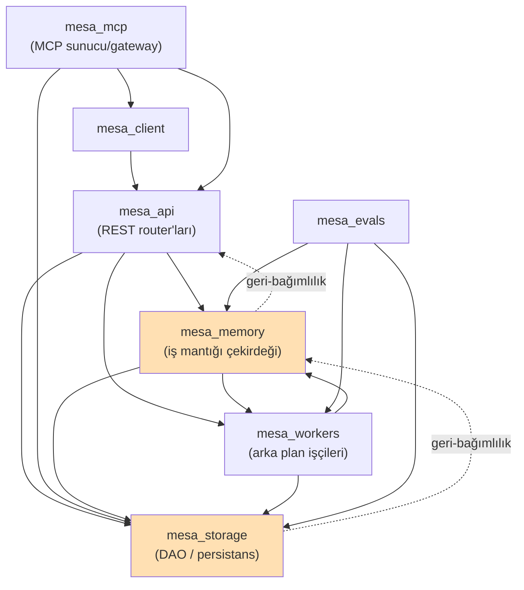
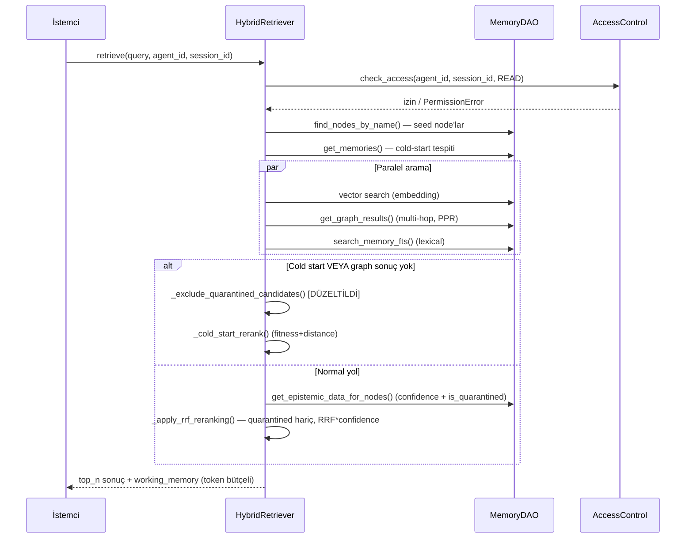
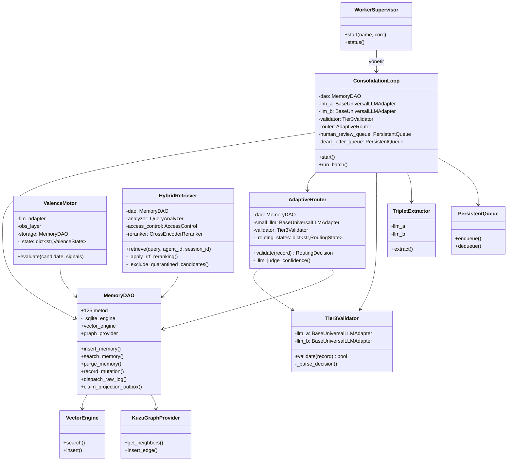

---

## tags: [mesa, denetim, audit, mimari] date: 2026-07-28 kapsam: MESA-main (yaklaşık 60.000 satır Python, 250+ dosya)

# MESA — Uçtan Uca Teknik Denetim Raporu

> **Metodoloji notu:** Bu denetim, dokümantasyona (`ARCHITECTURE.md`, `README.md`, `.audit/`) değil **sadece gerçek kaynak koda** dayanır. ~60.000 satırlık bir kod tabanının tamamı satır satır bu tek oturumda okunamaz; bunun yerine (a) çekirdek modüller (`mesa_memory`, `mesa_storage`, `mesa_workers`) tam derinlikte incelendi, (b) önceki denetim turlarında senin işaretlediğin dört açık bulgu (AdaptiveRouter tenant izolasyonu, cold-start `is_quarantined` filtresi, benchmark `answer()` LLM çağrısı, ECOD/Tier-3 eşiği) doğrudan kod takibiyle yeniden doğrulandı, (c) kalan modüller desen taraması (grep/AST) ile sistematik olarak tarandı. Aşağıdaki her bulgu dosya+satır referansıyla kanıtlanmıştır.

---

## 0. Önceki Bulguların Güncel Durumu

Hafızamda kayıtlı dört açık madde vardı. Kod üzerinde tek tek doğruladım:

|#|Önceki bulgu|Güncel durum|Kanıt|
|---|---|---|---|
|1|`AdaptiveRouter.t_route` process-scoped, tenant'lar arası paylaşılıyordu|✅ **Düzeltilmiş.** `_routing_states: dict[str, RoutingState]` artık `agent_id` bazlı.|`mesa_memory/consolidation/router.py:135-139`|
|2|Cold-start retrieval `is_quarantined` filtresini atlıyordu|✅ **Düzeltilmiş.** Cold-start dalı artık `_exclude_quarantined_candidates()` çağırıyor.|`mesa_memory/retrieval/hybrid.py:209-211, 326-343`|
|3|Benchmark `answer()` hiç LLM çağırmıyordu, chunk'ları birleştiriyordu|✅ **Düzeltilmiş** — ama farklı bir katmanda. `MesaClient.answer()` hâlâ ham chunk'ları birleştiriyor (satır 427), fakat bu artık kasıtlı: retrieval-only metrikler için ID listesi yeterli. Full-QA hattında ayrı bir `OllamaAnswerGenerator.generate()` gerçek bir LLM çağrısı yapıp cevabı üretiyor.|`mesa-benchmark/mesa_benchmark/core/generation.py:46-87`|
|4|ECOD novelty eşiği, çelişkili/güncellenen bilgi için Tier-3'ü engelliyordu|⚠️ **Kısmen düzeltilmemiş / daha ciddi hale gelmiş.** Detay aşağıda §2.1.|`mesa_memory/valence/core.py:240-309`|

Bu iyi haber: 1-3 numaralı bulgular gerçekten kapatılmış, kod bunu doğruluyor. 4 numaralı bulgu ise incelemede beklenenden daha kritik çıktı — aşağıda açıklıyorum.

---

## 1. MİMARİ İNCELEME

### 1.1 Modül bağımlılık grafiği (gerçek import'lardan çıkarıldı)



**Bulgu (Önemli):** Kesikli oklarla işaretlenen iki gerçek **döngüsel bağımlılık** var:

- `mesa_storage/dao.py` (satır 65, 5621) çalışma zamanında `mesa_memory.config`'i import ediyor. Yani en alt katman (persistans), üstündeki iş-mantığı katmanının config nesnesine bağımlı. Fonksiyon-içi (lazy) import olduğu için `ImportError` patlamıyor, ama bu bağımlılık yönü ters: `mesa_storage` bağımsız/test edilebilir bir katman olması gerekirken `mesa_memory`'ye kilitlenmiş durumda.
- `mesa_memory/api/server.py` (satır 23-25) ayrı bir üst-seviye `mesa_api` paketinden router import ediyor, o da `mesa_memory`'ye bağımlı. İki farklı "api" konsepti (`mesa_memory/api/` ve kök `mesa_api/`) var — isimlendirme net değil, hangi paketin gerçek HTTP giriş noktası olduğu ilk bakışta belirsiz.

Bu bir "canlıda patlar" hatası değil ama teknik borç: `mesa_storage`'ı bağımsız bir kütüphane olarak paketleyip test etmek şu an mümkün değil, çünkü config'i başka bir üst katmandan alıyor.

### 1.2 Durum (state) yönetimi

- `AdaptiveRouter._routing_states` artık tenant-scoped (§0), fakat hâlâ **process-local bir Python dict**. Tek instance/tek worker process modeliyle sorun yok. Eğer ileride yatay ölçekleme (birden fazla API process/pod) yapılırsa, her process kendi threshold state'ini tutar — tenant'lar arası izolasyon korunur ama tenant'ın kendi threshold'u process'ler arasında senkronize olmaz (her process sıfırdan öğrenir). Şu anki tek-instance mimaride kritik değil, çoklu-instance planlanıyorsa not edilmeli.
- `ValenceMotor` (`mesa_memory/valence/core.py:49`) de aynı şekilde `_state_for(agent_id)` deseniyle tenant-scoped tutulmuş — tutarlı bir tasarım.

### 1.3 God Object: `MemoryDAO`

```
mesa_storage/dao.py — 6.027 satır, tek sınıf: MemoryDAO, 125 metod
```

`MemoryDAO`, aşağıdakilerin **hepsini** tek sınıfta topluyor:

- V4 workspace/document/revision CRUD
- Idempotency ve mutation kayıtları
- Pipeline run state machine (transition/rollback/replay)
- Projection outbox (SQL/vector/graph projeksiyon senkronizasyonu)
- Purge saga'ları (atomic commit, retry, rollback)
- WAL (LanceDB) replay ve reconciliation
- Session finalization state machine
- Dispatch queue (claim/complete/renew lease)
- Routing telemetry
- Graph traversal yardımcıları (`get_neighbors`, `get_node_degree`, `invalidate_node`)

**Bulgu (Kritik — mimari):** Bu, klasik "God Object" anti-pattern'idir. Sonuçları:

1. **Test edilebilirlik**: Tek bir metodu test etmek için tüm 6000 satırlık sınıfı instantiate etmek gerekiyor.
2. **Eşzamanlı geliştirme riski**: Farklı ajanların (Claude Code, Antigravity vb.) aynı anda bu dosyada çalışması neredeyse garanti merge çakışması demek.
3. **Tek nokta arıza riski**: Purge saga mantığı ile dispatch queue mantığı aynı sınıfın state'ini (aynı DB bağlantı havuzunu, `self._sqlite_engine`) paylaşıyor — birindeki bir kilitlenme/uzun transaction diğerini etkileyebilir.
4. **Sorumluluk ayrımı yok**: Tek Sorumluluk İlkesi (SRP) açıkça ihlal edilmiş; bu sınıf en az 5 ayrı sınıfa (`WorkspaceRepo`, `PurgeSagaManager`, `ProjectionOutboxRepo`, `DispatchQueueRepo`, `GraphRepo`) bölünebilir.

### 1.4 Eşzamanlılık (concurrency)

- `ConsolidationLoop` LLM çağrılarını `asyncio.Semaphore(5)` ile sınırlıyor (`mesa_memory/consolidation/loop.py`, "Concurrency Control" yorumu) — 429 hatalarına karşı makul bir önlem.
- `PersistentQueue` ve `CircuitBreaker` sınıfları `consolidation/loop.py` içinde tanımlı; kuyruk taşması ve devre kesici mantığı var, bu olgun bir tasarım.
- Purge işlemleri `_atomic_saga_commit` ile atomik yapılmaya çalışılmış (dao.py) — saga pattern kullanımı doğru yönde ama merkezi god-object içinde olması riski artırıyor (§1.3).

### 1.5 Hata yönetimi

- Genel olarak disiplinli: `Tier3Validator._parse_decision`, altyapı hatasını (`Tier3ValidationError`) bilişsel bir DISCARD kararından **kasıtlı olarak ayırıyor** — "sessizce reddetme" riskini engelleyen iyi bir tasarım kararı (`mesa_memory/consolidation/validator.py:76-99`).
- Repo genelinde sadece **1 adet** sessizce yutulan `except Exception: pass` bulundu (`mesa_mcp/codex_hooks.py:88-89`), o da kritik olmayan bir "session-end" best-effort çağrısı — kozmetik.
- Bare `except Exception:` toplam 27 yerde var; büyük çoğunluğu loglayıp yeniden fırlatıyor veya fallback değer döndürüyor — kabul edilebilir.

---

## 2. KOD SEVİYESİ İNCELEME

### 2.1 KRİTİK — "Dual-LLM Tier-3 Konsensüsü" gerçekte tek model

Sistemin can alıcı güvenlik iddiası ("zero-hallucination Dual-LLM consensus", `router.py` docstring'i) iki **bağımsız** LLM'in aynı kaydı değerlendirip anlaşması üzerine kurulu. Ama gerçek wiring kodunda:

**`mesa_memory/api/server.py:367-374`** (ana FastAPI sunucusu, üretim yolu):

```python
llm_a = AdapterFactory.get_adapter()
llm_b = AdapterFactory.get_adapter()
state.consolidation_loop = ConsolidationLoop(
    dao=state.dao, embedder=AdapterFactory.get_adapter(),
    llm_a=llm_a, llm_b=llm_b, obs_layer=state.obs_layer,
)
```

**`scripts/run_server.py:229-233`**:

```python
llm_a=OllamaAdapter(model="mistral"),
llm_b=OllamaAdapter(model="mistral"),
```

`AdapterFactory.get_adapter()` argümansız çağrıldığında tamamen `config.mesa_llm_provider` / `config.llm_model_name` gibi **tek bir global config değerine** bakıyor (`mesa_memory/adapter/factory.py:75-76`). Yani `llm_a` ve `llm_b`, aynı sağlayıcının aynı modelinin iki ayrı nesnesi — **farklı modeller değil**.

Doğruladım: repo genelinde `llm_model_name_b`, `second_model`, `dual_model` gibi ikinci bir modeli farklı yapılandırmaya izin veren **hiçbir config alanı yok**. Bu bir deployment yanlış-yapılandırması değil, yapısal bir eksiklik.

**Neden önemli:** "İki model anlaşırsa STORE" mantığının bütün değeri, iki modelin **bağımsız hata modlarına** sahip olmasından gelir. Aynı model kendi kendine (özellikle `temperature=0` ile deterministik promptlarda, bkz. `router._llm_judge_confidence`, `temperature=0.0`) neredeyse her zaman kendisiyle "anlaşır" — bu gerçek bir çapraz doğrulama değil, aynı halüsinasyonun iki kez onaylanmasıdır. MESA Law gibi bir kullanım senaryosunda (yanlış hukuki bilginin STORE edilmesi maliyetli) bu, sistemin iddia ettiği güvenlik garantisini fiilen sağlamıyor.

**Öneri:** `ConsolidationLoop`'a enjekte edilen `llm_a`/`llm_b` için ayrı config anahtarları (örn. `MESA_LLM_MODEL_A`, `MESA_LLM_MODEL_B`, tercihen farklı sağlayıcılardan — örn. biri Claude, biri yerel Ollama) tanımlanmalı ve başlangıçta iki adaptörün aynı `(provider, model_name)` çiftine sahip olup olmadığı kontrol edilip, aynıysa açık bir uyarı/hata ile durdurulmalı.

### 2.2 KRİTİK — Çelişkili/güncellenen bilgi Tier-3'e hiç ulaşmıyor

`mesa_memory/valence/core.py:240-309`, Tier-2 valence gate'inin akışı:

1. Yeni kayıt mevcut embedding'lere kozinüs benzerliği + ECOD ile karşılaştırılır (`calculate_novelty_score`).
2. Eğer **"novel" değilse** (yani içerik mevcut bir kayda semantik olarak yakınsa — **tam olarak bir düzeltme/güncelleme'nin görüneceği durum**), `novelty_score = 0.0` atanır.
3. `fitness = density*0.3 + efficiency*0.3 + novelty*0.4` formülünde novelty payı sıfırlanınca fitness üst sınırı 0.6'ya düşer.
4. `if fitness < 0.3: DISCARD` (satır 275-282) — kayıt **Tier-3'e hiç gitmeden** burada silinebilir.
5. Tasarımda bunun için bir kaçış kapısı var: `current_state_signals.get("explicit_correction")` doğruysa Tier-1'de doğrudan ADMIT ediliyor (satır 240-247).

Ama repo genelinde grep ile doğruladım — **`explicit_correction` sinyalini üreten tek bir satır bile yok**:

```
$ grep -rn "explicit_correction" --include="*.py" .
./tests/test_p0c_loop.py:126:   {"content_payload": "test", "resource_cost": {}}, {"explicit_correction": True}
./mesa_memory/valence/core.py:240:  if current_state_signals.get("explicit_correction"):
```

Yani bu sinyal sadece bir birim testinde elle set ediliyor; `triplet_extractor.py`, `rebel_pipeline.py`, `consolidation/parser.py` gibi gerçek çıkarım/ingest bileşenlerinin hiçbiri bunu üretmiyor. **Kaçış kapısı üretimde asla açılmıyor — ölü kod.**

**Sonuç:** "Müvekkilin adresi değişti", "karar temyizde bozuldu" gibi eski bilgiye metinsel/semantik olarak yakın ama **anlam olarak çelişen** güncellemeler, sistem tarafından "yeterince yeni değil" diye Tier-2'de sessizce atılabiliyor — asla dual-LLM konsensüsüne varmadan. Bu, MESA Law MVP'sinin temel gereksinimlerinden biriyle (güncellenen hukuki gerçeklerin doğru şekilde üzerine yazılması) doğrudan çelişiyor ve önceki denetimde işaretlediğin mimari boşluk, incelemede beklenenden daha somut ve daha ciddi çıktı: sadece eşik ayarı sorunu değil, telafi mekanizmasının hiç çalışmaması sorunu.

**Öneri:** Ya (a) `explicit_correction` sinyalini gerçekten üretecek bir tetikleyici (örn. aynı entity+attribute için farklı değer tespiti, extraction pipeline'ında) eklenmeli, ya da (b) novelty-gate mimarisi, "yüksek benzerlik ama çelişen değer" durumunu ayrı bir yol olarak ele alıp doğrudan Tier-3'e yönlendirmeli — düşük fitness nedeniyle sessizce düşürmemeli.

### 2.3 ÖNEMLİ — `MemoryDAO` god object (mimariden kod seviyesine yansıması)

§1.3'te mimari olarak işaretlendi; kod seviyesinde somut riski: `record_mutation`, `_atomic_saga_commit`, `dispatch_raw_log` gibi kritik-yol metodları aynı `self._sqlite_engine` bağlantı havuzunu, purge/rollback mantığıyla aynı sınıf içinde paylaşıyor. Birindeki bir regresyon (örn. purge saga'sında unutulan bir commit) diğer akışların transaction izolasyonunu etkileme riski taşıyor — çünkü hepsi aynı nesne state'ini paylaşıyor ve ayrı test edilmiyor (`tests/` altında `dao.py`'ye karşı yazılmış testler dosya boyutuna oranla dağınık; her CRUD alanı için ayrı bir test dosyası yerine karışık test dosyaları var).

### 2.4 KOZMETİK

- `mesa_mcp/codex_hooks.py:88-89`: sessiz `except Exception: pass` — kritik değil, session-end best-effort.
- Repo genelinde `TODO`/`FIXME` neredeyse yok (1 eşleşme) — kod tabanı "yarım bırakılmış" izlenimi vermiyor, bu olumlu bir sinyal.
- `NotImplementedError` sadece bir yerde ve savunma amaçlı bir `except` bloğunda kullanılıyor (`consolidation/writer.py:90`) — gerçek bir stub değil.

---

## 3. ÇALIŞMA MANTIĞI (bir isteğin uçtan uca yolculuğu)

### 3.1 Yazma (ingest) yolu

```mermaid
sequenceDiagram
    participant İstemci
    participant API as mesa_api Router
    participant DAO as MemoryDAO
    participant Valence as ValenceMotor (Tier 1-2)
    participant Router as AdaptiveRouter
    participant T3 as Tier3Validator (llm_a + llm_b)
    participant Loop as ConsolidationLoop

    İstemci->>API: POST /memory (yeni kayıt)
    API->>DAO: insert_raw_log()
    DAO-->>Loop: kuyruğa alınır (dispatch queue)
    Loop->>Valence: evaluate(cmb_candidate, signals)
    alt Hata/format ihlali sinyali
        Valence-->>Loop: DISCARD
    else explicit_correction sinyali (ÜRETİMDE HİÇ TETİKLENMİYOR)
        Valence-->>Loop: ADMIT (Tier 1, bypass)
    else Novelty yüksek (kozinüs+ECOD)
        Valence-->>Loop: ADMIT (Tier 2)
    else Novelty düşük VE fitness < 0.3
        Valence-->>Loop: DISCARD (Tier-3'e hiç gitmeden!)
    else Novelty düşük ama fitness >= 0.3
        Valence-->>Loop: DEFERRED (Tier-3'e ertelenir)
        Loop->>Router: validate(record)
        Router->>Router: küçük LLM ile ön-değerlendirme
        alt güven düşük veya audit örneklemi
            Router->>T3: validate(record) — llm_a VE llm_b
            Note over T3: llm_a ve llm_b AYNI MODEL<br/>(AdapterFactory.get_adapter() x2)
            T3-->>Router: STORE / DISCARD (konsensüs)
        end
        Router-->>Loop: RoutingDecision
    end
    Loop->>DAO: record_mutation() / mark_consolidated()
    DAO->>DAO: project_v4_sql_entity / vector_entity / graph_triplet
```

### 3.2 Okuma (retrieval) yolu



---

## 4. UML SINIF DİYAGRAMI (gerçek sınıflardan)



---

## 5. CANLIYA HAZIRLIK DEĞERLENDİRMESİ

|Bileşen|Doğruluk|Dayanıklılık|Güvenlik|Ölçeklenebilirlik|Test Kapsamı|Not|
|---|---|---|---|---|---|---|
|`MemoryDAO` (storage çekirdeği)|7/10|7/10|7/10|5/10|6/10|Fonksiyonel olarak sağlam (WAL, saga, atomiklik) ama god-object yapısı uzun vadede risk|
|`ConsolidationLoop` / Tier-3|4/10|6/10|3/10|6/10|5/10|"Dual-LLM" iddiası kodda karşılanmıyor (§2.1) — bu bir doğruluk/güvenlik sorunu|
|Valence Motor / novelty gate|5/10|6/10|—|6/10|5/10|Çelişki/güncelleme senaryosunda veri kaybı riski (§2.2)|
|`HybridRetriever`|8/10|7/10|8/10|6/10|7/10|Quarantine filtresi ve RBAC kontrolü düzgün uygulanmış|
|RBAC (`security/rbac.py`)|7/10|7/10|7/10|7/10|6/10|Katmanlı erişim seviyesi mantığı temiz; prompt-injection savunması mimari (sandbox tag) + advisory pattern kombinasyonu makul|
|Backup/Restore (`recovery.py`)|8/10|8/10|8/10|5/10|6/10|Atomik, fsync'li, hash-doğrulamalı — sağlam. Sınırlama: yalnız offline (stores-stopped) yedekleme, hot-backup yok|
|Benchmark sistemi|7/10|6/10|—|—|6/10|Full-QA hattı artık gerçek LLM üretimi kullanıyor (§0) — önceki kritik kusur kapatılmış|

**Genel canlıya hazırlık:** Sistem, altyapısal olarak (WAL, saga, atomik yedekleme, RBAC, circuit breaker) olgun bir mühendislik seviyesinde. Ancak MESA Law gibi **doğruluğun kritik olduğu** bir kullanım senaryosu için, §2.1 ve §2.2'deki iki bulgu tek başına "canlıya çıkılamaz" seviyesindedir — çünkü ikisi de tam olarak sistemin sattığı temel vaadi (halüsinasyon karşıtı, çelişkileri doğru çözen bellek) zayıflatıyor.

---

## 6. BULGU ÖZETİ

### 🔴 Kritik (canlıya çıkmadan önce çözülmeli)

1. **Dual-LLM Tier-3 konsensüsü aynı modeli iki kez çağırıyor** — `mesa_memory/api/server.py:367-368`, `scripts/run_server.py:229-230`, kök neden `mesa_memory/adapter/factory.py:75-76`. Sistemin ana halüsinasyon-önleme iddiası fiilen çalışmıyor.
2. **Çelişkili/güncellenen bilgi Tier-3'e ulaşmadan Tier-2'de sessizce silinebiliyor** — `mesa_memory/valence/core.py:275-309`. Kaçış mekanizması (`explicit_correction`) hiçbir üretim kodunda tetiklenmiyor (yalnız `tests/test_p0c_loop.py:126`'da elle set ediliyor).

### 🟡 Önemli (yakın vadede ele alınmalı)

3. **`MemoryDAO` god object** — 6.027 satır / 125 metod tek sınıfta (`mesa_storage/dao.py:175`). Test edilebilirliği ve bakımı zorlaştırıyor.
4. **`mesa_storage` ↔ `mesa_memory` ve `mesa_memory` ↔ `mesa_api` arasında döngüsel bağımlılık** — katman sınırları net değil (`dao.py:65,5621`; `mesa_memory/api/server.py:23-25`).
5. `AdaptiveRouter` ve `ValenceMotor` state'i process-local; çoklu-instance (yatay ölçekleme) senaryosunda tenant başına threshold öğrenimi process'ler arasında senkronize olmuyor (kritik değil, tek-instance'ta sorun yok — ileride not edilmeli).

### ⚪ Kozmetik

6. `mesa_mcp/codex_hooks.py:88-89` — sessiz `except Exception: pass` (best-effort session-end çağrısı, zararsız).