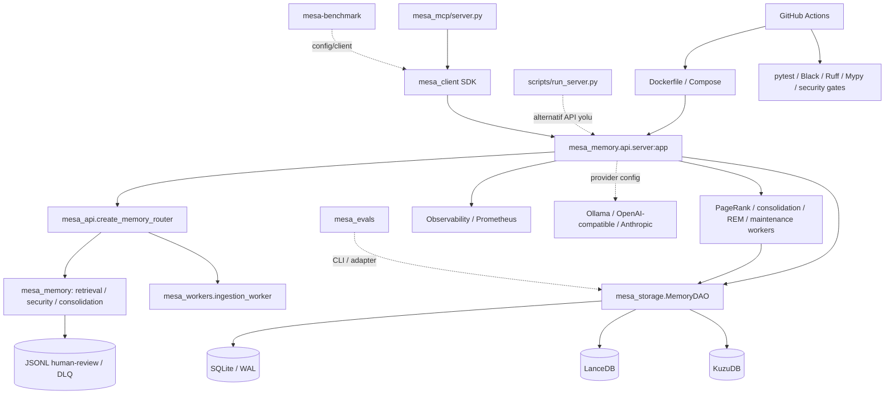

# Sistem Haritası

Gerçek bileşenler Faz 2’de kanıtlanmış kaynak referanslarıyla eklenir. Diyagram varsa kaynak dosyası ve üretim yöntemi belirtilir.

## Bileşen kataloğu

| Bileşen ID | Ad | Tür | Sorumluluk | Girdi | Çıktı | Sahip olduğu veri | Kanıt |
|---|---|---|---|---|---|---|---|
| — | — | — | — | — | — | — | — |

## Bağımlılık ilişkileri

| Kaynak bileşen | İlişki | Hedef bileşen | Protokol / arayüz | Senkron mu? | Hata davranışı | Kanıt |
|---|---|---|---|---|---|---|
| — | — | — | — | — | — | — |

## Açık mimari soruları

| ID | Soru | Etkilenen alan | Gerekli kanıt | Durum |
|---|---|---|---|---|
| — | — | — | — | — |

## Faz 0 ilk seviye sistem haritası

Bu harita importlar, Docker/Compose tanımları ve entry point metadatasından çıkarılmıştır. Düz çizgiler statik olarak kanıtlanmış import/başlatma ilişkisini; kesikli çizgiler çalışma zamanında doğrulanması gereken yapılandırma veya harici bağımlılığı gösterir.

### Bileşen kataloğu

| ID | Bileşen | Tür | Sorumluluk | Girdi / çıktı | Kanıt | Durum |
|---|---|---|---|---|---|---|
| CMP-API | mesa_memory.api.server | FastAPI app | Lifespan, state, auth/health/metrics ve router bağlama | HTTP → router/DAO | Docker CMD, app, importlar | Doğrulandı (statik) |
| CMP-ROUTER | mesa_api.router | APIRouter factory | Memory API endpoint’leri ve servis bağımlılıkları | Request → retrieval/ingestion/DAO | create_memory_router ve importlar | Doğrulandı (statik) |
| CMP-CORE | mesa_memory | Domain modülleri | Config, adapters, retrieval, extraction, consolidation, security, valence | Router/worker → domain işlemleri | Paket ağacı/importlar | Doğrulandı (statik) |
| CMP-DAO | mesa_storage.dao | DAO | Çoklu storage erişimini birleştirme | Core/router ↔ SQL/vector/graph | API state.dao kurulumu | Doğrulandı (statik) |
| CMP-SQL | sqlite_engine + schemas | Local SQL | Async SQLite WAL ve schema | DAO ↔ SQLite | API server/CI importları | Doğrulandı (statik) |
| CMP-VECTOR | vector_engine | Local vector DB | LanceDB initialize/persist/search | DAO ↔ LanceDB | API state.vector_engine | Doğrulandı (statik) |
| CMP-GRAPH | kuzu_provider + kuzu_setup | Local graph DB | Kuzu schema/provider | DAO ↔ Kuzu | API state.graph_provider | Doğrulandı (statik) |
| CMP-WORKERS | mesa_workers | Async background workers | Ingestion, consolidation, REM, maintenance, PageRank | API task → DAO/adapter | API lifespan schedule/import | Doğrulandı (statik) |
| CMP-QUEUE | consolidation PersistentQueue | File queue | Review/DLQ persistence ve retry akışı | Consolidation ↔ JSONL | config queue path/loop referansı | Doğrulandı (statik) |
| CMP-SDK | mesa_client | Client SDK | Sync/async HTTP client ve LangChain wrapper | Caller ↔ API | MCP/client importları | Doğrulandı (statik) |
| CMP-MCP | mesa_mcp.server | MCP server | MCP tool çağrılarını AsyncMesaClient’a yönlendirme | MCP ↔ SDK/API | Server/AsyncMesaClient importları | Doğrulandı (statik) |
| CMP-EVAL | mesa_evals | Eval/quality CLI | Legal audit, load/soak/recall/sweep | CLI ↔ data/storage/adapters | __main__/argparse | Doğrulandı (statik) |
| CMP-BENCH | mesa-benchmark | Benchmark subproject | Client/adapters/dataset/evaluator/report | CLI/container → clients | __main__/Dockerfile | Doğrulandı (statik) |
| CMP-OBS | observability | Telemetry | Logger, Prometheus metrics, tracing | API/worker → telemetry | API importları | Doğrulandı (statik) |
| CMP-OPS | Docker/Compose/Actions/hook | Operations | Build, run, CI gates, local hook | Source → container/CI | Konfigürasyon dosyaları | Doğrulandı (statik) |

### Doğrulanmış bağımlılık ilişkileri

| Kaynak | İlişki | Hedef | Protokol / arayüz | Çalışma biçimi | Kanıt |
|---|---|---|---|---|---|
| Dockerfile | CMD | mesa_memory.api.server:app | Uvicorn/HTTP | Doğrudan container girişi | Dockerfile |
| API server | include_router | mesa_api.router | FastAPI APIRouter | Senkron request path | server.py, router.py |
| API server | oluşturur | AsyncEngine, VectorEngine, KuzuGraphProvider, MemoryDAO | Python API | Lifespan | server.py import/atamalar |
| Router | kullanır | QueryAnalyzer, HybridRetriever, AccessControl, ConsolidationLoop, ingestion worker | Python API | Request/background | router.py importları |
| API server | schedule eder | PageRank, consolidation, REM, maintenance | asyncio task/worker API | Arka plan | server.py schedule_* / Worker çağrıları |
| Consolidation loop | kullanır | PersistentQueue | Dosya tabanlı JSONL yol | Arka plan | config.py, loop.py |
| SDK | sağlar | MesaClient, AsyncMesaClient | HTTP client | Doğrudan çağıran taraf | mesa_client/client.py |
| MCP server | kullanır | AsyncMesaClient | Python SDK | MCP request path | mesa_mcp/server.py |
| Benchmark | içerir | Client/evaluator/report pipeline | Python CLI | Ayrı subproject | mesa-benchmark ağacı |
| CI | çağırır | Docker build, quality/security/canary jobs | GitHub Actions | Push/PR main | ci.yml |

### API → servis → storage ilk zinciri

| Aşama | Bileşen | Statik kanıt | Doğrulama sınırı |
|---|---|---|---|
| API giriş | mesa_memory.api.server:app | Docker CMD ve FastAPI app | Endpoint davranışı çalıştırılmadı |
| Router | mesa_api.create_memory_router | API server import/include, router factory | Route sözleşmeleri Faz 3’te |
| Domain/service | Retrieval, consolidation, RBAC, extraction modülleri | router ve worker importları | İş kuralı Faz 4-6’da |
| Persistence | MemoryDAO | API server state.dao | Transaction/runtime Faz 6’da |
| SQL | AsyncEngine / SQLite | API server ve CI | Şema/consistency Faz 6’da |
| Vector | VectorEngine / LanceDB | API server state | Query/compaction Faz 3/10’da |
| Graph | KuzuGraphProvider | API server state | Isolation/concurrency Faz 5/6’da |
| Yanıt/health | Router response / health endpoint | server ve schema dosyaları | Runtime Faz 1/3’te |

### Worker ve queue ilişkileri

| Worker / mekanizma | Başlatılma kanıtı | Bağımlılık | Açık doğrulama |
|---|---|---|---|
| ingestion_worker | Router importu ve endpoint arka plan çağrısı | DAO, extraction, consolidation | Gerçek task lifecycle |
| entity_consolidation_worker | API lifespan schedule_consolidation_worker | DAO, LLM adapter | Interval/shutdown davranışı |
| maintenance_pagerank | API lifespan schedule_pagerank_worker | DAO/Kuzu provider | Scheduling ve hata geri kazanımı |
| REMCycleWorker | API lifespan import/oluşturma | DAO/adapter | Periodik yaşam döngüsü |
| MaintenanceWorker | API lifespan start | SQLite/LanceDB | Vacuum/compaction güvenliği |
| PersistentQueue + DLQ | ConsolidationLoop config path’leri | Local storage | Retry, recovery ve locking |

### Harici / isteğe bağlı servisler

| Servis | Bağlanma noktası | Statik durum | Not |
|---|---|---|---|
| Ollama | adapter/ollama.py, MESA_OLLAMA_URL | Opsiyonel/provider seçimine bağlı | Zero-cost ve install scripti bunu işaret eder |
| OpenAI-compatible | adapter/live.py, LLM_BASE_URL/LLM_API_KEY/OPENAI_API_KEY | Opsiyonel/provider seçimine bağlı | Secret değeri okunmadı |
| Anthropic | adapter/claude.py, ANTHROPIC_API_KEY | Opsiyonel/provider seçimine bağlı | Secret değeri okunmadı |
| Groq/LiteLLM | pyproject optional adapters | Opsiyonel | Runtime adapter seçimi doğrulanmadı |
| Qdrant | Mem0 benchmark adapter | Benchmark bağımlılığı | Core API için kanıtlanmadı |
| Redis/PostgreSQL/MinIO | — | Bu statik taramada bulunmadı | Yoktur sonucu değildir; sonraki fazlarda doğrulanır |

### Deployment bileşenleri

| Bileşen | Tanım | Etki | Durum |
|---|---|---|---|
| Dockerfile | Python 3.10 multi-stage API image; non-root user; healthcheck; storage volume | API deployment | Statik doğrulandı |
| docker-compose.yml | mesa-api service, port 8000, storage volume/env_file | Local/container operasyonu | Statik doğrulandı |
| mesa-benchmark/Dockerfile | Python 3.10 benchmark image; module ENTRYPOINT | Benchmark reproducibility | Statik doğrulandı |
| GitHub Actions | Docker/build/security/install/canary job’ları | CI quality gate | Statik doğrulandı |
| .githooks/pre-push | Black/Ruff/Mypy/Pytest | Local pre-push gate | Dosya mevcut; etkinlik bilinmiyor |

### Açık mimari soruları

| ID | Soru | Etkilenen alan | Gerekli kanıt | Durum |
|---|---|---|---|---|
| Q-001 | Docker API entry ve scripts/run_server.py app davranışları eşdeğer mi? | API/deployment | Faz 1 dar runtime baseline | Açık |
| Q-002 | Compose mount yolları API’nin çözdüğü storage dizinleriyle birebir mi? | Storage/deployment | Config çözümlemesi + kontrollü runtime | Açık |
| Q-003 | Benchmark/eval adaptörlerinin hangi servisleri gerçekten gerektirdiği nedir? | Benchmark/eval | Faz 1/8 yapılandırma ve test kanıtı | Açık |
| Q-004 | MCP fallback storage yolu ile normal API storage topolojisi aynı mı? | MCP/storage | Faz 2-3 akış incelemesi | Açık |
