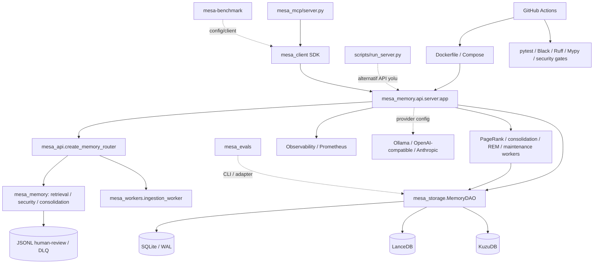
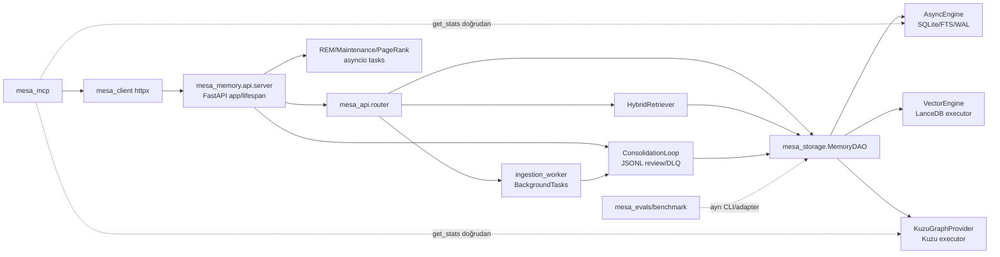
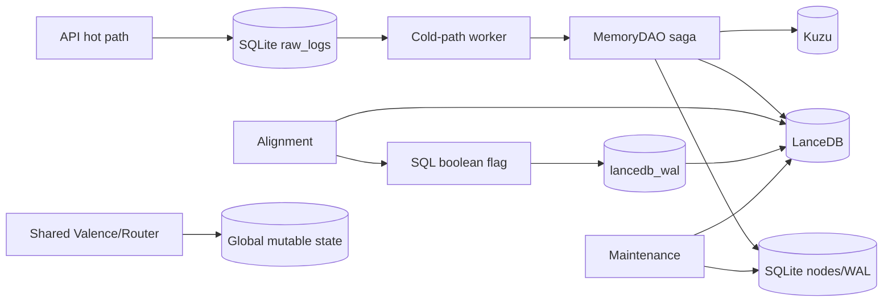

# Sistem Haritası

Gerçek bileşenler Faz 2’de kanıtlanmış kaynak referanslarıyla eklenir. Diyagram varsa kaynak dosyası ve üretim yöntemi belirtilir.

## Bileşen kataloğu

| Bileşen ID | Ad | Tür | Sorumluluk | Girdi | Çıktı | Sahip olduğu veri | Kanıt |
|---|---|---|---|---|---|---|---|
| — | — | — | — | — | — | — | — |

## Bağımlılık ilişkileri

| Kaynak bileşen | İlişki | Hedef bileşen | Protokol / arayüz | Senkron mu? | Hata davranışı | Kanıt |
|---|---|---|---|---|---|---|
| — | — | — | — | — | — | — |

## Açık mimari soruları

| ID | Soru | Etkilenen alan | Gerekli kanıt | Durum |
|---|---|---|---|---|
| — | — | — | — | — |


## Faz 0 ilk seviye sistem haritası

Bu harita importlar, Docker/Compose tanımları ve entry point metadatasından çıkarılmıştır. Düz çizgiler statik olarak kanıtlanmış import/başlatma ilişkisini; kesikli çizgiler çalışma zamanında doğrulanması gereken yapılandırma veya harici bağımlılığı gösterir.



### Bileşen kataloğu

| ID | Bileşen | Tür | Sorumluluk | Girdi / çıktı | Kanıt | Durum |
|---|---|---|---|---|---|---|
| CMP-API | mesa_memory.api.server | FastAPI app | Lifespan, state, auth/health/metrics ve router bağlama | HTTP → router/DAO | Docker CMD, app, importlar | Doğrulandı (statik) |
| CMP-ROUTER | mesa_api.router | APIRouter factory | Memory API endpoint’leri ve servis bağımlılıkları | Request → retrieval/ingestion/DAO | create_memory_router ve importlar | Doğrulandı (statik) |
| CMP-CORE | mesa_memory | Domain modülleri | Config, adapters, retrieval, extraction, consolidation, security, valence | Router/worker → domain işlemleri | Paket ağacı/importlar | Doğrulandı (statik) |
| CMP-DAO | mesa_storage.dao | DAO | Çoklu storage erişimini birleştirme | Core/router ↔ SQL/vector/graph | API state.dao kurulumu | Doğrulandı (statik) |
| CMP-SQL | sqlite_engine + schemas | Local SQL | Async SQLite WAL ve schema | DAO ↔ SQLite | API server/CI importları | Doğrulandı (statik) |
| CMP-VECTOR | vector_engine | Local vector DB | LanceDB initialize/persist/search | DAO ↔ LanceDB | API state.vector_engine | Doğrulandı (statik) |
| CMP-GRAPH | kuzu_provider + kuzu_setup | Local graph DB | Kuzu schema/provider | DAO ↔ Kuzu | API state.graph_provider | Doğrulandı (statik) |
| CMP-WORKERS | mesa_workers | Async background workers | Ingestion, consolidation, REM, maintenance, PageRank | API task → DAO/adapter | API lifespan schedule/import | Doğrulandı (statik) |
| CMP-QUEUE | consolidation PersistentQueue | File queue | Review/DLQ persistence ve retry akışı | Consolidation ↔ JSONL | config queue path/loop referansı | Doğrulandı (statik) |
| CMP-SDK | mesa_client | Client SDK | Sync/async HTTP client ve LangChain wrapper | Caller ↔ API | MCP/client importları | Doğrulandı (statik) |
| CMP-MCP | mesa_mcp.server | MCP server | MCP tool çağrılarını AsyncMesaClient’a yönlendirme | MCP ↔ SDK/API | Server/AsyncMesaClient importları | Doğrulandı (statik) |
| CMP-EVAL | mesa_evals | Eval/quality CLI | Legal audit, load/soak/recall/sweep | CLI ↔ data/storage/adapters | __main__/argparse | Doğrulandı (statik) |
| CMP-BENCH | mesa-benchmark | Benchmark subproject | Client/adapters/dataset/evaluator/report | CLI/container → clients | __main__/Dockerfile | Doğrulandı (statik) |
| CMP-OBS | observability | Telemetry | Logger, Prometheus metrics, tracing | API/worker → telemetry | API importları | Doğrulandı (statik) |
| CMP-OPS | Docker/Compose/Actions/hook | Operations | Build, run, CI gates, local hook | Source → container/CI | Konfigürasyon dosyaları | Doğrulandı (statik) |

### Doğrulanmış bağımlılık ilişkileri

| Kaynak | İlişki | Hedef | Protokol / arayüz | Çalışma biçimi | Kanıt |
|---|---|---|---|---|---|
| Dockerfile | CMD | mesa_memory.api.server:app | Uvicorn/HTTP | Doğrudan container girişi | Dockerfile |
| API server | include_router | mesa_api.router | FastAPI APIRouter | Senkron request path | server.py, router.py |
| API server | oluşturur | AsyncEngine, VectorEngine, KuzuGraphProvider, MemoryDAO | Python API | Lifespan | server.py import/atamalar |
| Router | kullanır | QueryAnalyzer, HybridRetriever, AccessControl, ConsolidationLoop, ingestion worker | Python API | Request/background | router.py importları |
| API server | schedule eder | PageRank, consolidation, REM, maintenance | asyncio task/worker API | Arka plan | server.py schedule_* / Worker çağrıları |
| Consolidation loop | kullanır | PersistentQueue | Dosya tabanlı JSONL yol | Arka plan | config.py, loop.py |
| SDK | sağlar | MesaClient, AsyncMesaClient | HTTP client | Doğrudan çağıran taraf | mesa_client/client.py |
| MCP server | kullanır | AsyncMesaClient | Python SDK | MCP request path | mesa_mcp/server.py |
| Benchmark | içerir | Client/evaluator/report pipeline | Python CLI | Ayrı subproject | mesa-benchmark ağacı |
| CI | çağırır | Docker build, quality/security/canary jobs | GitHub Actions | Push/PR main | ci.yml |

### API → servis → storage ilk zinciri

| Aşama | Bileşen | Statik kanıt | Doğrulama sınırı |
|---|---|---|---|
| API giriş | mesa_memory.api.server:app | Docker CMD ve FastAPI app | Endpoint davranışı çalıştırılmadı |
| Router | mesa_api.create_memory_router | API server import/include, router factory | Route sözleşmeleri Faz 3’te |
| Domain/service | Retrieval, consolidation, RBAC, extraction modülleri | router ve worker importları | İş kuralı Faz 4-6’da |
| Persistence | MemoryDAO | API server state.dao | Transaction/runtime Faz 6’da |
| SQL | AsyncEngine / SQLite | API server ve CI | Şema/consistency Faz 6’da |
| Vector | VectorEngine / LanceDB | API server state | Query/compaction Faz 3/10’da |
| Graph | KuzuGraphProvider | API server state | Isolation/concurrency Faz 5/6’da |
| Yanıt/health | Router response / health endpoint | server ve schema dosyaları | Runtime Faz 1/3’te |

### Worker ve queue ilişkileri

| Worker / mekanizma | Başlatılma kanıtı | Bağımlılık | Açık doğrulama |
|---|---|---|---|
| ingestion_worker | Router importu ve endpoint arka plan çağrısı | DAO, extraction, consolidation | Gerçek task lifecycle |
| entity_consolidation_worker | API lifespan schedule_consolidation_worker | DAO, LLM adapter | Interval/shutdown davranışı |
| maintenance_pagerank | API lifespan schedule_pagerank_worker | DAO/Kuzu provider | Scheduling ve hata geri kazanımı |
| REMCycleWorker | API lifespan import/oluşturma | DAO/adapter | Periodik yaşam döngüsü |
| MaintenanceWorker | API lifespan start | SQLite/LanceDB | Vacuum/compaction güvenliği |
| PersistentQueue + DLQ | ConsolidationLoop config path’leri | Local storage | Retry, recovery ve locking |

### Harici / isteğe bağlı servisler

| Servis | Bağlanma noktası | Statik durum | Not |
|---|---|---|---|
| Ollama | adapter/ollama.py, MESA_OLLAMA_URL | Opsiyonel/provider seçimine bağlı | Zero-cost ve install scripti bunu işaret eder |
| OpenAI-compatible | adapter/live.py, LLM_BASE_URL/LLM_API_KEY/OPENAI_API_KEY | Opsiyonel/provider seçimine bağlı | Secret değeri okunmadı |
| Anthropic | adapter/claude.py, ANTHROPIC_API_KEY | Opsiyonel/provider seçimine bağlı | Secret değeri okunmadı |
| Groq/LiteLLM | pyproject optional adapters | Opsiyonel | Runtime adapter seçimi doğrulanmadı |
| Qdrant | Mem0 benchmark adapter | Benchmark bağımlılığı | Core API için kanıtlanmadı |
| Redis/PostgreSQL/MinIO | — | Bu statik taramada bulunmadı | Yoktur sonucu değildir; sonraki fazlarda doğrulanır |

### Deployment bileşenleri

| Bileşen | Tanım | Etki | Durum |
|---|---|---|---|
| Dockerfile | Python 3.10 multi-stage API image; non-root user; healthcheck; storage volume | API deployment | Statik doğrulandı |
| docker-compose.yml | mesa-api service, port 8000, storage volume/env_file | Local/container operasyonu | Statik doğrulandı |
| mesa-benchmark/Dockerfile | Python 3.10 benchmark image; module ENTRYPOINT | Benchmark reproducibility | Statik doğrulandı |
| GitHub Actions | Docker/build/security/install/canary job’ları | CI quality gate | Statik doğrulandı |
| .githooks/pre-push | Black/Ruff/Mypy/Pytest | Local pre-push gate | Dosya mevcut; etkinlik bilinmiyor |

### Açık mimari soruları

| ID | Soru | Etkilenen alan | Gerekli kanıt | Durum |
|---|---|---|---|---|
| Q-001 | Docker API entry ve scripts/run_server.py app davranışları eşdeğer mi? | API/deployment | Faz 1 dar runtime baseline | Açık |
| Q-002 | Compose mount yolları API’nin çözdüğü storage dizinleriyle birebir mi? | Storage/deployment | Config çözümlemesi + kontrollü runtime | Açık |
| Q-003 | Benchmark/eval adaptörlerinin hangi servisleri gerçekten gerektirdiği nedir? | Benchmark/eval | Faz 1/8 yapılandırma ve test kanıtı | Açık |
| Q-004 | MCP fallback storage yolu ile normal API storage topolojisi aynı mı? | MCP/storage | Faz 2-3 akış incelemesi | Açık |


# Faz 2 — Koddan doğrulanan mimari harita

## Dokümantasyon İddia Envanteri

| İddia ID | Kaynak | İddia | Kodda doğrulanan alan | Durum |
|---|---|---|---|---|
| CLAIM-001 | ARCH/README | Headless FastAPI daemon ve `/v3/memory/*` | `mesa_memory/api/server.py:410-484`; `mesa_api/router.py:create_memory_router` | Doğrulandı |
| CLAIM-002 | ARCH | MemoryDAO tek storage arayüzüdür | Router/retrieval DAO kullanır; API lifecycle üç engine’i doğrudan kurar, MCP `get_stats` storage açar | Kısmen doğrulandı |
| CLAIM-003 | ARCH/README | Triple Storage Engine | `AsyncEngine`, `VectorEngine`, `KuzuGraphProvider` API lifespan’ta kuruluyor | Doğrulandı |
| CLAIM-004 | ARCH | Zorunlu `agent_id` izolasyonu | DAO public veri yolları doğrular; VectorEngine API’si bazı metodlarda opsiyonel filtre kabul eder, MCP graph stats sorgusu kapsamlı değildir | Kısmen doğrulandı |
| CLAIM-005 | ARCH | SQLite WAL | `sqlite_engine.py:_PRAGMA_INIT`; API WAL checkpoint task | Doğrulandı |
| CLAIM-006 | ARCH | LanceDB dimension routing/executor | `vector_engine.py:VectorEngine`, dimension-table ve executor çağrıları | Doğrulandı |
| CLAIM-007 | ARCH | Kuzu composite tenant kimliği | `dao.py:get_neighbors` ve Kuzu provider agent-prefix/Cypher binding | Doğrulandı |
| CLAIM-008 | ARCH | Dual-write Saga | `dao.py:insert_memory`, `bulk_insert_memory`, `purge_memory` vector/SQLite rollback akışları | Doğrulandı (statik) |
| CLAIM-009 | ARCH/README | Tombstone ile hard-delete ayrıdır | Router `purge_memory` DAO soft-delete; `MaintenanceWorker` hard-delete/VACUUM/optimize | Doğrulandı (statik) |
| CLAIM-010 | ARCH/README | API ve background worker process-level izoledir | Worker’lar `server.py` içinde `asyncio.create_task` veya aynı event loop task’ı olarak başlar; Docker tek `uvicorn` CMD | Yalanlandı |
| CLAIM-011 | ARCH | Valence state restartta kalıcıdır | Lifespan `load_state` / shutdown `save_state` | Doğrulandı (statik) |
| CLAIM-012 | ARCH/README | Hybrid retrieval üç aramayı paralel yapar | `hybrid.py:retrieve` `asyncio.gather` vector+graph+FTS | Doğrulandı |
| CLAIM-013 | ARCH | CrossEncoder graceful fallback | `reranker.py:CrossEncoderReranker`; router config-gated singleton | Doğrulandı (statik) |
| CLAIM-014 | ARCH | Extraction/Tier-3/DLQ ayrıdır | `triplet_extractor`, `Tier3Validator`, `ConsolidationLoop` persistent queue workers | Doğrulandı |
| CLAIM-015 | ARCH/README | `/health/init` ve Prometheus metrics vardır | `server.py:health_init`, `/metrics`, `PROM_HTTP_REQUESTS` | Doğrulandı |
| CLAIM-016 | ARCH/README | SDK REST API kullanır | `mesa_client/client.py` httpx `/v3/memory/*` | Doğrulandı |
| CLAIM-017 | ARCH/README | MCP → SDK → REST API | record/search/forget tool’ları `AsyncMesaClient`; `get_stats` doğrudan storage | Kısmen doğrulandı |
| CLAIM-018 | README | `make dev` workers ve Kuzu olmadan hafif sunucudur | `scripts/run_server.py` Kuzu ve üç worker türü başlatır | Yalanlandı |
| CLAIM-019 | ARCH/README | Docker production parity sağlar | Docker tek API process başlatır; Compose volume yolları server storage yollarıyla uyuşmaz | Yalanlandı |
| CLAIM-020 | ARCH/README | Observability structured log/tracing içerir | logger structlog; server metrics; tracing env-gated LiteLLM | Doğrulandı (statik) |
| CLAIM-021 | ARCH | StorageFacade deprecated/kullanım dışıdır | `mesa_memory/DEPRECATION_NOTICE.md`; kaynak importlarında `StorageFacade` bulunmadı | Doğrulandı (statik) |
| CLAIM-022 | README | SDK/MCP API şemalarını paylaşır | `mesa_client` ve `mesa_mcp` `mesa_api.schemas` import eder | Doğrulandı |

Sayılar: 16 doğrulandı, 3 kısmen doğrulandı, 3 yalanlandı, 0 kod bulunamadı.

## Bileşen ve dependency graph



Düz çizgiler statik import veya doğrudan çağrıyla doğrulanmıştır; kesikli çizgiler production çağrı yolu değildir veya ayrı doğrulama gerektirir.

## Process, storage ve config modeli

- Production composition root: `mesa_memory/api/server.py:lifespan`. Docker yalnız `uvicorn mesa_memory.api.server:app` başlatır.
- Gerçek process modeli: API ve PageRank, entity consolidation, Tier-3, DLQ, WAL checkpoint, maintenance ve REM işleri aynı Python process/event loop içindeki task/coroutine’lerdir. ThreadPoolExecutor sadece sync LanceDB/Kuzu/reranker işlemlerini offload eder.
- Storage sahipliği: API lifecycle engine’leri kurar; `MemoryDAO` request/cold-path uygulama erişimini birleştirir. Async SQLite connection-per-context; VectorEngine/Kuzu provider connection+executor state sahibidir; VectorEngine stateless değildir.
- Config akışı: `mesa_memory/config.py` import-time `load_dotenv()` ve global `config = calculate_dynamic_limits(MesaConfig())`; server ve Compose ayrıca `os.environ` okur. MCP environment’ı import-time okur; `scripts/run_server.py` ayrı defaultları kullanır.
- Deployment: Docker build `[adapters,ml]` ve build-time spaCy indirmesi içerir; runtime non-root API process’tir. Compose yalnız `mesa-api` service tanımlar.

## Startup / shutdown çağrı zinciri

```text
Docker CMD / uvicorn
→ mesa_memory.api.server:app
→ module import: config/adapters/router ve module-level storage path çözümü
→ lifespan: logging/tracing + API-key guard
→ AsyncEngine.initialize + Alembic schema; VectorEngine.initialize
→ Kuzu schema/database/provider; MemoryDAO; AccessControl
→ ConsolidationLoop + valence load_state
→ PageRank/entity/Tier-3/DLQ/maintenance/REM/WAL task’leri
→ state.is_ready=True; router ve `/health/init`
→ shutdown: REM/maintenance/PageRank/WAL stop/cancel; loop.stop; valence save
→ graph provider/database ve SQLite close
```

Statik lifecycle boşlukları: `state.vector_engine.close()` çağrısı yoktur; `consolidation_task`, `tier3_task` ve `dlq_task` oluşturulur ancak shutdown’da açıkça cancel/await edilmez.

## API ilişki tablosu

| Endpoint | Router/schema | Auth | Core çağrı | Storage/queue | Response |
|---|---|---|---|---|---|
| POST `/v3/memory/insert` | `insert_memory` / `MemoryInsertRequest` | API key + daily limit + RBAC | `process_cold_path` | `dao.insert_raw_log`, FastAPI BackgroundTasks | 202, persistence cold path bitmeden |
| GET `/v3/memory/status/{id}` | `get_status` | API key + RBAC | — | `dao.get_raw_log` | Anlık raw-log status |
| POST `/v3/memory/search` | `search_memory` / `MemorySearchRequest` | API key + RBAC | `HybridRetriever.retrieve` | DAO vector/FTS/graph ve hydration | Senkron, 30s timeout |
| DELETE `/v3/memory/purge` | `purge_memory` / `MemoryPurgeRequest` | API key + RBAC | DAO tombstone | Vector soft-delete + SQLite tombstone | Senkron purge sonucu |
| Session endpoints | session schemas | API key + RBAC | — | AccessControl, DAO raw logs | Senkron |
| `/health/init`, `/health`, `/metrics` | server functions | init açık; diğerleri API key | DAO health / Prometheus | storage health | Ready/health/metrics |

## Worker tablosu

| Worker | Entry / process modeli | Queue/storage/tetikleyici | Shutdown / kullanım kanıtı |
|---|---|---|---|
| Cold path | `process_cold_path`; FastAPI BackgroundTask | `raw_logs`, DAO; insert sonrası | FastAPI task lifecycle; router çağrısı |
| ConsolidationLoop | `ConsolidationLoop.start`; API task | DAO + human-review/DLQ JSONL | `loop.stop`; API lifespan |
| Entity consolidation | `schedule_consolidation_worker`; API task | DAO+LLM, active agent scan | explicit task cancel yok; API lifespan |
| Tier-3 deferred / DLQ | `start_*_worker`; API task | DAO + PersistentQueue polling | explicit task cancel yok; API lifespan |
| REM | `REMCycleWorker.start`; same process task | DAO + LLM | `stop` + cancel; API lifespan |
| Maintenance | `MaintenanceWorker.start`; same process task | SQLite/Vector, schedule hours | `stop` + cancel; API lifespan |
| PageRank | `schedule_pagerank_worker`; API task | DAO/Kuzu | cancel/await; API lifespan |
| WAL checkpoint | nested `wal_checkpoint_worker`; API task | SQLite every 300s | cancel/await; API lifespan |

## Açık sorular / faz yönlendirmesi

| Soru | Neden statik olarak kapanmadı | Gerekli kanıt | Faz |
|---|---|---|---|
| BackgroundTasks ve uzun ömürlü worker shutdown/cancellation davranışı | Runtime scheduler ve cancellation gözlenmedi | Kontrollü startup/shutdown log ve task leak testi | Faz 7 |
| Agent isolation’ın tüm düşük-seviye ve MCP stat yollarında etkinliği | Interface/default ve direct query yolu var | Negatif tenant isolation testleri | Faz 5 |
| Saga/tombstone gerçek atomiklik ve Kuzu etkisi | Kod akışı görüldü, hata/transaction davranışı ölçülmedi | Chaos/transaction testleri | Faz 6 |
| Compose volume-path mismatch’in gerçek persistence etkisi | Container çalıştırılmadı | İzole Docker staging kontrolü | Faz 12/13 |
| Dev entry ile production entry davranış farkı | Runtime parity denenmedi | Aynı fixture ile startup/route/worker karşılaştırması | Faz 12 |
```

## Faz 3 — Veri akışı doğrulama deltası

| Akış | Giriş → işlem → çıktı | Failure/teslimat özeti | Tenant/store kanıtı | Durum |
|---|---|---|---|---|
| ING | API insert → SQLite raw_log → in-process BackgroundTask → ECOD/extraction → DAO | 202 sonrası iş API process ömrüne bağlıdır; startup eski processing'i DEFERRED'e çevirir, replay tüketicisi yoktur | raw_log/cold path agent_id ile kapsamlı | FLOW-001 blocker |
| RET | API search → RBAC → vector/FTS/graph gather → fusion/hydration | Alt store hatası fallback/boş sonuç olur; 30 sn timeout vardır | DAO çağrıları agent kapsamlı | Graph-purge E2E eksik |
| PURGE | API purge → vector soft-delete → SQLite invalid_at → maintenance retention | Kuzu mutasyonu yok; çok kayıtlı vector hata telafisi yok | SQLite/vector agent kapsamlı | DATA-001 blocker |
| Session | start grant; context raw_log; end log | End final consolidation enqueue etmez | Context agent+session kapsamlı | FLOW-002 |
| SDK/MCP | client REST; MCP record/search/forget client; stats local storage | Default URL çift /v3; purge response parse edilemez | MCP graph stats agent filtresiz | SDK-001, SDK-002; ARCH-004 |

### Triple-store mutasyon matrisi

| İşlem | SQLite | LanceDB | Kuzu | Tutarlılık kararı |
|---|---|---|---|---|
| Raw ingestion kabulü | raw_logs INSERT/commit | — | — | Dayanıklı staging var; teslimat/replay yok |
| Memory insert | Node INSERT ve conflict invalid_at | upsert/soft-delete | node insert best-effort; edge ayrı çağrı | Tek global transaction yok; hata telafisi kısmi |
| Purge | nodes.invalid_at | per-node soft-delete | Mutasyon yok | DATA-001: lifecycle eşit değil |
| Retention maintenance | Invalid node DELETE | expired vector DELETE | Mutasyon yok | Graph retention kanıtlanmadı |

## Faz 4 modül sorumluluğu ve ilişkileri

| Modül grubu | Gerçek sorumluluk | Ana çağıran | State/dış sınır | Statik sonuç |
|---|---|---|---|---|
| Storage (`MemoryDAO`, SQLite, LanceDB, Kuzu) | Üç-store persistence, retrieval ve lifecycle | API, ingestion, consolidation, workers | SQLite/LanceDB/Kuzu + executor | Graph hata yolu best-effort; vector fallback idempotency/veri kalitesi riski (DATA-002..004) |
| API/RBAC | HTTP auth, session/status, limit | SDK/MCP/HTTP caller | Global API key, RBAC SQLite | Principal-agent binding yok; status scope uyumsuz (SEC-002, LOGIC-001) |
| Valence/fitness | Admit/defer/discard ve persistent state | Router/consolidation | In-memory valence + state DB | Statik anlaşılabilir; async embedding hydration ve shared-state yarışları Faz 6 adayı, kesin bug değil |
| Extraction/consolidation | REBEL/LLM parse, consensus, graph commit, DLQ | Ingestion/tier-3 worker | External adapters + JSONL queue | Partial bisection coverage kaybolabiliyor (LOGIC-002) |
| Retrieval | Vector/FTS/graph candidate fusion | API router | DAO + optional reranker | Cold/no-graph yolunda quarantine filtresi yok (LOGIC-003) |
| Workers/queue | Cold-path, maintenance, REM, PageRank | API lifespan/background task | Shared event loop, JSONL queue | Lifecycle eksikleri ARCH-002; queue locking adayı CONC-CAND-001 |
| SDK/MCP | Sync/async REST ve MCP tool | Library caller/MCP host | httpx; MCP get_stats için direct storage | URL/schema drift önceki bulgular; async auth drift SDK-003 |
| Adapter/config | Provider seçimi, timeout/fallback | Server, extraction, retrieval | Import-time config, harici LLM/model | Canlı model import edilmedi; zero/mock embedding policy DATA-003 |
| Observability | Logs, traces, Prometheus | API/workers | Process-global metrics/loggers | Raw path metric cardinality riski PERF-001 |

## Faz 5 kısa tehdit modeli

| Varlık | Başlıca tehdit | Ana trust boundary | Mevcut kontrol / açık risk |
|---|---|---|---|
| Memory content, raw logs, vectors, graph | Cross-tenant read, uncontrolled persistence, payload abuse | Client → API; API → storage/worker | DAO RLS güçlü; SEC-002, ARCH-003/004, INPUT-001 açık |
| Agent/session identity | Spoofed agent, session ownership | Client → API; MCP → API | Pydantic identifier validation ve RBAC var; principal-agent binding yok (SEC-002) |
| API/LLM credentials | DB/log/CI exposure, yanlış host’a gönderim | Client/SDK → API; worker → LLM; CI → secrets | Timing-safe API check var; SEC-003, dotenv baseline; suspicious CI literal doğrulanmadı |
| Valence/routing state | Tenant policy influence, state corruption | API/worker → shared state | Global state (RLS-001) |
| MCP/SDK config | Header/path drift, local client misuse | MCP/SDK → API | Env-scoped agent intenti var; SDK-003 ve ARCH-004 açık |
| Logs/metrics | Raw content, metadata, endpoint disclosure | API/worker → stdout/CWD/Prometheus | Metrics auth var; ARCH-003 ve PERF-001 açık |
| Queue/storage volume/container | Host file access, replay/poisoning | Container → host volume; API → worker | Non-root Docker user; CWD debug write, queue concurrency adayları açık |
| CI/dependencies | Third-party action/dependency compromise | CI → source/secrets | `pull_request_target` yok; CI-001 floating action, lock/manifest baseline eksik |

| Saldırgan profili | Yetki/erişim | Öncelikli senaryo |
|---|---|---|
| Geçersiz API istemcisi | Key yok/yanlış | Auth fail-closed kontrolü; public docs/health-init keşfi |
| Geçerli key’e sahip kötü niyetli tenant | Global key veya aynı deployment client’ı | `agent_id` spoofing, state influence, payload abuse |
| Yanlış yapılandırılmış local client/MCP host | Env ve stdio erişimi | Shared MCP agent, stats disclosure, SDK auth drift |
| Zararlı prompt/content gönderen kullanıcı | WRITE session | Raw-content persistence/logging, LLM prompt abuse |
| Supply-chain saldırganı | Third-party action/dependency upstream | Floating CI action |
| İç kullanıcı/ele geçirilmiş container | Volume/log erişimi | Raw logs, DB and queue artifacts |


## Faz 6 — Mutasyon ve sahiplik haritası



| Sınır | Doğrulanan davranış | Integrity sonucu |
|---|---|---|
| DAO saga | Secondary store çağrıları ile SQLite commit tek ACID transaction değildir. | DATA-002 mevcut; crash/commit sonrası telafi yok. |
| Alignment | SQL boolean ile yazılar WAL'a yönlendirilmek istenir; vector transform süresinin tamamı lock altında değildir. | DATA-005: in-flight write/WAL replay bütünlüğü yok. |
| Raw-log worker | Kalıcı row vardır fakat claim separate read/update'dir. | CONC-002: aynı iş birden çok worker'a teslim edilebilir. |
| Maintenance | SQLite purge, vector purge/compact ve Kuzu lifecycle tek koordinatörde değildir. | DATA-001 devam eder; idle window süreçler arası exclusivity kanıtı yok. |
| Cognitive state | Shared router/valence mutable alanları agent/lock sınırı taşımaz. | CONC-003 ve RLS-001 birlikte karar tutarlılığı/isolation riski taşır. |
| Shutdown | Bazı task'ler stop/cancel/await edilmeden persistence/storage close aşamasına geçilir. | ARCH-002: task/resource drain kanıtı yok. |


## Faz 7 — Worker ve queue envanteri

| Worker/Task | Dosya | Entry point | Başlatan bileşen | Process modeli | Görev | Durum |
|---|---|---|---|---|---|---|
| Cold path | `mesa_workers/ingestion_worker.py` | `process_cold_path` | POST insert `BackgroundTasks` | API process request-sonrası coroutine | raw log→ECOD/extract/DAO | Aktif kullanımda |
| ConsolidationLoop | `consolidation/loop.py` | `start` | lifespan `create_task` | API event-loop task; referans tutulmuyor | unconsolidated batch/validation/writer | Aktif kullanımda |
| Entity consolidation | `entity_consolidation_worker.py` | `schedule_consolidation_worker` | lifespan | API event-loop task | entity description refresh | Aktif kullanımda |
| REM | `rem_cycle.py` | `REMCycleWorker.start` | lifespan | API event-loop task | threshold sonrası contradiction consolidation | Aktif kullanımda |
| Maintenance | `maintenance.py` | `MaintenanceWorker.start` | lifespan | API event-loop task + executor | retention/VACUUM/vector compact | Aktif kullanımda |
| PageRank | `maintenance_pagerank.py` | `schedule_pagerank_worker` | lifespan | API event-loop task + executor | agent graph quarantine | Aktif kullanımda |
| WAL checkpoint | `api/server.py` nested function | `wal_checkpoint_worker` | lifespan | API event-loop task | 300 s PASSIVE checkpoint | Aktif kullanımda |
| Tier-3 deferred | `consolidation/loop.py` | `start_tier3_deferred_worker` | lifespan | API event-loop task | deferred nodes batch | Aktif kullanımda |
| DLQ replay | `consolidation/loop.py` | `start_dlq_worker` | lifespan | API event-loop task | JSONL DLQ replay | Aktif kullanımda; DLQ-001 |
| Alignment WAL replay | `dao.py` | `align_memory_space` flush | Çağıran entry point bulunmadı | Manuel method; ayrı worker yok | migration WAL flush | Başlatılmıyor/worker yok |

| Queue | Kalıcılık | Producer | Consumer | Claim | Retry/DLQ | Backpressure | Gerçek semantik |
|---|---|---|---|---|---|---|---|
| `raw_logs` | SQLite | API insert | BackgroundTask | Yok | In-process errors/status; startup replay yok | Yok | At-least-once dahi garanti değil |
| `lancedb_wal` | SQLite | migration flag altındaki DAO insert | `align_memory_space` içi flush | Yok | replay worker yok | Yok | Best-effort staged write |
| human-review JSONL | Dosya | GraphWriter | Manuel/başlatılmış consumer kanıtı yok | Yok | Yok | `human_review_max_size` kullanım kanıtı bulunmadı | File append |
| dead-letter JSONL | Dosya | ConsolidationLoop | DLQ task | Yok; destructive clear | Re-append best-effort | 100 MB rotate, old backup overwrite | Kayıp riski; DLQ-001 |

Process modeli: Docker/production entry tek Uvicorn API process başlatır; Compose'da ayrı worker servisi yoktur. Uvicorn multi-worker/reload kullanılırsa her lifespan kendi periodic worker setini başlatır; süreçler arası leader election/lock yoktur (ARCH-001).
## Faz 10 kaynak ve ölçekleme haritası

| Alan | Statik sınır / davranış | Ölçekleme riski | İlgili kayıt |
|---|---|---|---|
| HTTP search | 30 sn `wait_for`, sonuç limiti 50; vector/graph/FTS paralel; cold-start için limitsiz node listesi | Tenant büyüklüğü request RAM/SQLite okumasına yansır | PERF-002 |
| Retrieval hydration | API sonuç başına tekil DAO çağrısı; CrossEncoder iç yolunda batch vardır | En fazla 50 ardışık SQL erişimi | PERF-004 |
| SQLite | WAL/NORMAL/FK, 8 bağlantı semaphore; FTS ve agent indeksleri mevcut | VACUUM exclusive lock, raw-log/backlog için byte/depth bütçesi yok | QUEUE-001, CONC-CAND-002 |
| LanceDB | Bounded executor ve mutation lock; RAM hedefi toplam RAM’in %18’i | Bakım I/O’su mutation lock dışından yürür; model lazy-load disk/RAM etkisi ölçülmedi | CONC-CAND-002 |
| Kùzu/PageRank | Provider instance executor; PageRank tüm tenant node/edge listesinden sparse matris kurar | Graph büyüklüğü CPU/RAM ve tur süresini doğrudan büyütür | PERF-003 |
| Worker/LLM | Ingestion semaphore 10, Tier-3 3, consolidation LLM semaphore 5; entity/REM per-record ardışık | Bounded global semaphore, tenant kotası/backpressure/leader seçimi yerine geçmez | PERF-003, QUEUE-001 |
| Başlatma/kapatma | API lifespan per process çok sayıda periodic task başlatır; bazı task’ler teardown’da açıkça cancel/await edilmez | Multi-worker duplicate iş ve kaynak çoğalması | ARCH-001, ARCH-002, WORKER-001 |
### Faz 10 kapasite ve SLO/telemetry kabul planı

Bu satırlar ölçülmüş production hedefi değil, güvenli ölçüm sonrası onaylanacak minimum telemetry sözleşmesidir.

| Sinyal | Segment / etiket | Ölçülecek değer | Alarm / kapasite kararı |
|---|---|---|---|
| Search | Route template, tenant sayısı değil; result limit sınıfı | p50/p95/p99, timeout/504, SQL query count, semaphore wait | Hedef bütçe aşılırsa PERF-002/PERF-004 remediation önceliklidir |
| Ingestion/queue | agent-scoped aggregate, queue türü | accepted rate, depth/bytes, oldest age, reject/backpressure, DLQ age | Worker kapasitesi kabul hızını karşılamıyorsa admission sınırı veya worker ölçekleme gerekir |
| Periodic worker | worker adı ve aggregate outcome | batch records/tokens, duration, lag, retry/failure, cancellation | Tur intervalini aşıyorsa PERF-003 bounded batch/ayrı worker gerektirir |
| SQLite/Lance/Kùzu | storage engine ve operation | WAL/db/vector/graph disk bytes, lock wait, compact/vacuum duration, executor queue/thread count | Disk headroom veya lock bütçesi ihlalinde bakım penceresi/topology değiştirilir |
| Process | instance | RSS, CPU, GC, file descriptor, task count | 16 GB makinede kontrollü headroom korunmadan concurrency artırılmaz |
