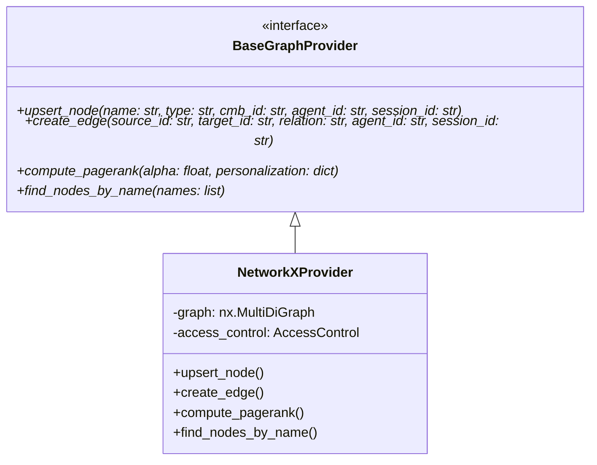
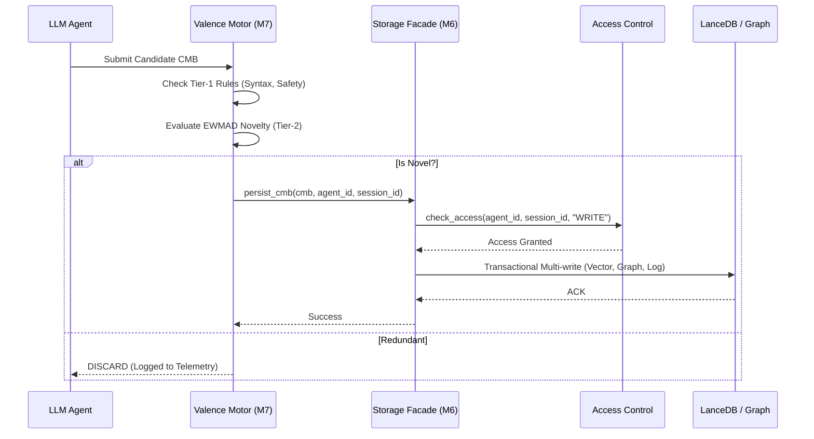

# **MESA Memory Layer: Architecture Whitepaper**

## **1. Executive Summary: Integrity over Velocity**

MESA is fundamentally architected as a high-throughput, asynchronous cognitive memory engine. The core design principle is **"Integrity over Velocity."** While the system leverages non-blocking `asyncio` routines and decoupled storage layers to achieve high scalability, it deliberately introduces computational bottlenecks (via the Valence Motor) to aggressively validate data before persistence.

## **2. Interface Abstraction Layer (P0-B)**

To eliminate synchronous bottlenecks and vendor lock-in, MESA implements a strictly asynchronous Interface Abstraction Layer. The system is database-agnostic, interacting with storage exclusively through the `BaseGraphProvider` contract. This prevents abstraction leaks (e.g., exposing underlying `nx.MultiDiGraph` objects) and allows seamless migration to high-performance backends like RocksDB or Memgraph.

## **3. Multi-Dimensional Vector Routing**

MESA natively supports multi-model embedding pipelines (e.g., OpenAI `1536` dimensions, local Ollama `768` dimensions). Rather than utilizing mathematical projections like Procrustes—which destroy clinical semantic accuracy—the `VectorStorage` engine dynamically isolates vector spaces.

Upon ingestion, MESA analyzes the incoming tensor dimension and routes the vector to a dedicated, dimension-specific LanceDB table (e.g., `mesa_memory_1536` or `mesa_memory_768`). This ensures absolute semantic integrity while allowing real-time switching between cloud and local SLMs.

## **4. RBAC Enforcement Flow**

Security is deeply integrated at the lowest storage mutation points. The `AccessControl` module evaluates agent authorization based on robust `session_id` and `agent_id` tracking.

- **Read Operations:** Validated at the retrieval boundaries. If an agent lacks `READ` privileges, the system raises a strict `PermissionError` before any computational expense is incurred.
- **Write Operations:** Validated directly inside the persistence methods (e.g., `upsert_node`, `upsert_vector`). By enforcing the check inside the data adapter itself, MESA ensures zero-trust security even if higher-level logic is compromised.

## **5. Cognitive Data Lifecycle (Valence to Storage)**

The journey of a Cognitive Memory Block (CMB) involves rigorous filtering, algorithmic novelty detection, and transactional persistence.

## **6. Data Pipeline & Isolation Logic**

To guarantee deterministic extraction from non-deterministic LLMs, the pipeline enforces strict JSON schema generation. Malformed responses trigger the **"Isolation & Recovery"** protocol.

> [!WARNING]
> If an LLM response fails validation, it must never mutate the graph. MESA employs a 3-Layer Recovery system to attempt salvage via a secondary local SLM before permanently discarding the data.

---
*MESA Architecture is proprietary. Designed for integrity-first enterprise environments.*
