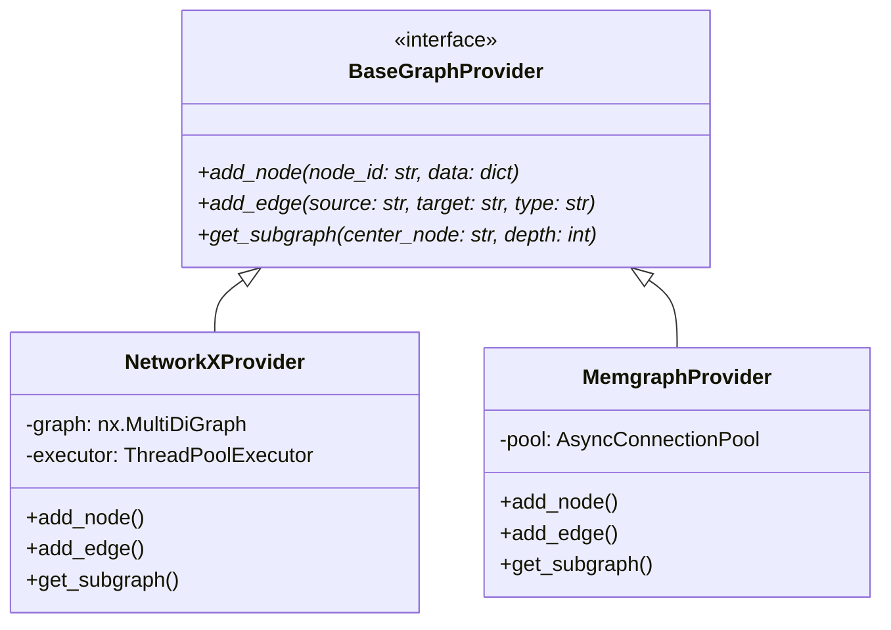
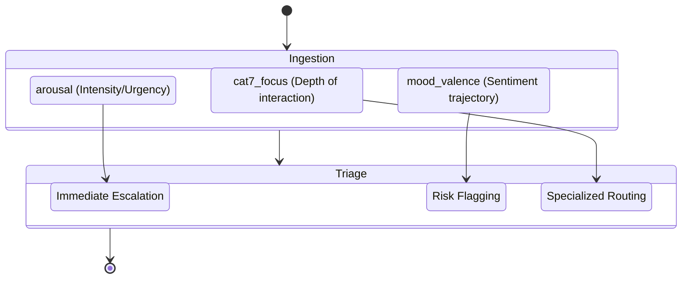

# **Architectural Design & Engineering Principles**

## **1. System Design Overview: Integrity over Velocity**

MESA is fundamentally architected as a high-throughput, asynchronous cognitive memory engine. The core design principle is **"Integrity over Velocity."** While the system leverages non-blocking `asyncio` routines and decoupled storage layers to achieve high scalability, it deliberately introduces computational bottlenecks (via the Valence Motor) to aggressively validate data. 

## **2. Storage Abstraction Layer**

The graph storage tier is decoupled to eliminate synchronous bottlenecks and vendor lock-in. The `BaseGraphProvider` enforces a strictly asynchronous contract.



## **3. Cognitive State Modeling**

The fundamental data structure, the Cognitive Memory Block (CMB), is not just text; it maps state over time through an **Affective Memory Schema**. 



## **4. Data Pipeline & Isolation Logic**

To guarantee deterministic extraction from non-deterministic LLMs, the pipeline enforces strict JSON schema generation. Malformed responses trigger the **"Isolation & Recovery"** protocol.

### **JSON Schema Enforcement**

```json
{
  "$schema": "http://json-schema.org/draft-07/schema#",
  "title": "ExtractedGraphEntities",
  "type": "object",
  "properties": {
    "nodes": {
      "type": "array",
      "items": {
        "type": "object",
        "required": ["id", "type", "properties"]
      }
    },
    "edges": {
      "type": "array",
      "items": {
        "type": "object",
        "required": ["source", "target", "relation"]
      }
    }
  },
  "required": ["nodes", "edges"]
}
```

### **Isolation & Recovery Algorithm**

> [!WARNING]
> If an LLM response fails validation, it must never mutate the graph.

```python
async def process_llm_response(raw_response: str) -> ExtractedGraphEntities:
    try:
        # Step 1: Strict Validation Boundary
        validated_data = ExtractedGraphEntities.model_validate_json(raw_response)
        return validated_data
    except ValidationError as e:
        # Step 2: Isolation
        log_to_dead_letter_queue(raw_response, error=str(e))
        
        # Step 3: Attempt Salvage using Tier-0 Model
        repaired_response = await attempt_json_salvage(raw_response)
        if repaired_response:
             return repaired_response
        else:
             raise FatalGraphMutationError("Irrecoverable malformed response.")
```

## **5. Storage Synchronization & Consistency**

MESA maintains a decoupled dual-storage architecture: a relational system (SQLite) for the immutable raw log of CMBs, and a high-dimensional vector store (LanceDB) for semantic search.

> [!CAUTION]
> **State Drift Prevention:** The `reconcile_orphans` background loop continually audits the SQLite transaction log against the LanceDB index IDs. Orphaned SQLite records are automatically queued for re-embedding. Phantom vectors are securely purged. This guarantees 100% referential integrity.

---
*MESA Architecture is proprietary. Designed for integrity-first enterprise environments.*
