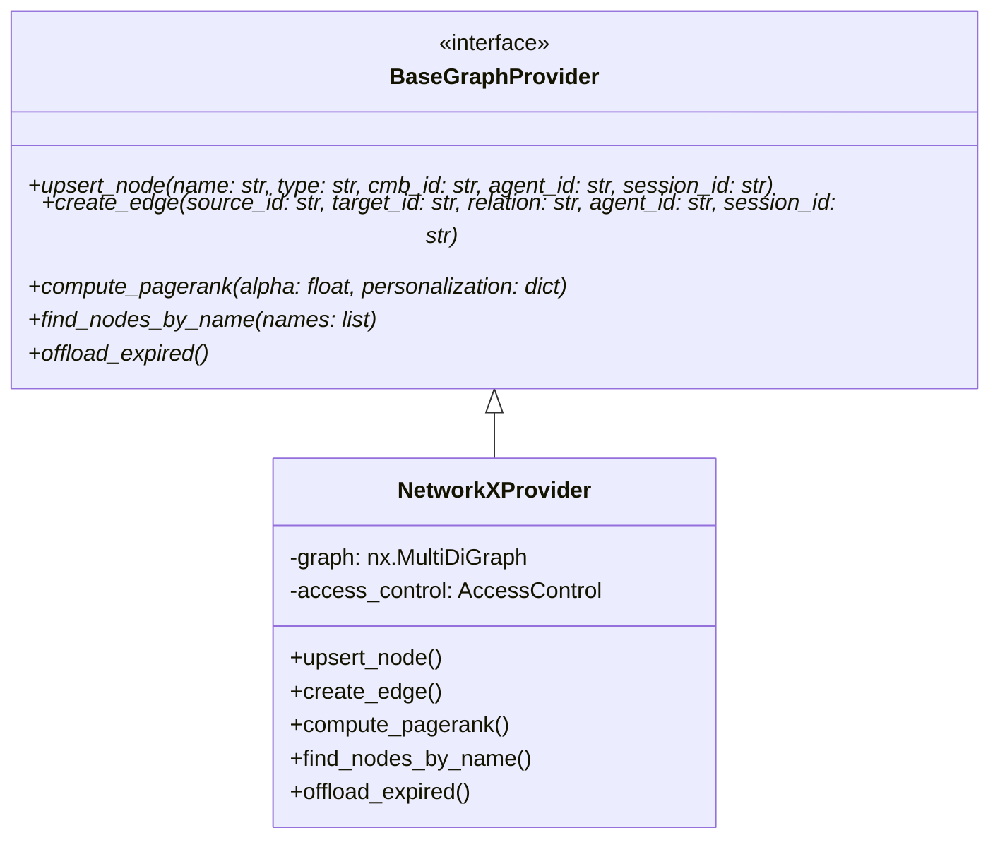
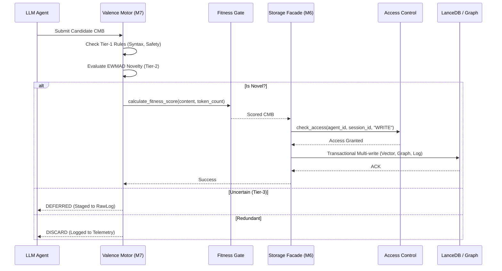
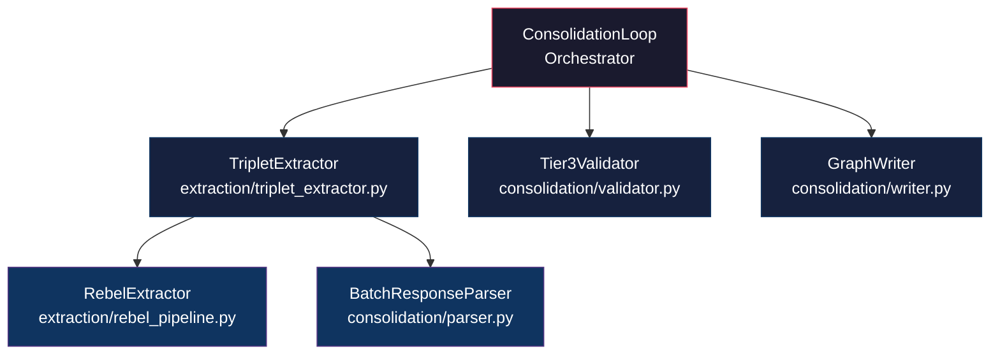
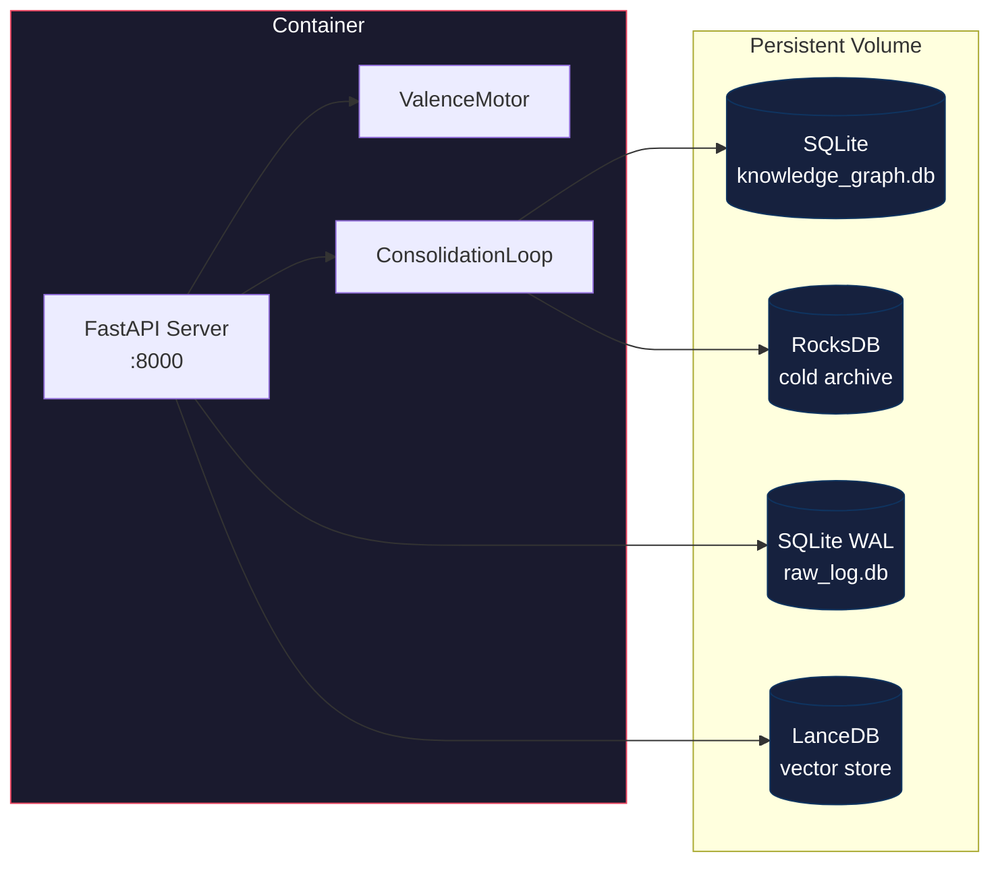

# MESA Memory Layer: Architecture Whitepaper

> **Version:** 0.2.0
> **Last Updated:** 2026-05-16

---

## 1. Executive Summary: Integrity over Velocity

MESA is fundamentally architected as a high-throughput, asynchronous cognitive memory engine. The core design principle is **"Integrity over Velocity."** While the system leverages non-blocking `asyncio` routines and decoupled storage layers to achieve high scalability, it deliberately introduces computational bottlenecks (via the Valence Motor) to aggressively validate data before persistence.

---

## 2. Interface Abstraction Layer (P0-B)

To eliminate synchronous bottlenecks and vendor lock-in, MESA implements a strictly asynchronous Interface Abstraction Layer. The system is database-agnostic, interacting with storage exclusively through the `BaseGraphProvider` contract. This prevents abstraction leaks (e.g., exposing underlying `nx.MultiDiGraph` objects) and allows seamless migration to high-performance backends.



Graph analytics (`compute_pagerank`) and cold-storage archival (`offload_expired`) are delegated to a stateless `analytics.py` module. This separation keeps the core provider focused on CRUD operations while allowing analytics to be independently tested and optimized.

---

## 3. Multi-Dimensional Vector Routing

MESA natively supports multi-model embedding pipelines (e.g., OpenAI `1536` dimensions, local MiniLM `384` dimensions). Rather than utilizing mathematical projections like Procrustes—which destroy clinical semantic accuracy—the `VectorStorage` engine dynamically isolates vector spaces.

Upon ingestion, MESA analyzes the incoming tensor dimension and routes the vector to a dedicated, dimension-specific LanceDB table (e.g., `mesa_memory_1536` or `mesa_memory_384`). This ensures absolute semantic integrity while allowing real-time switching between cloud and local SLMs.

---

## 4. RBAC Enforcement Flow

Security is deeply integrated at the lowest storage mutation points. The `AccessControl` module evaluates agent authorization based on robust `session_id` and `agent_id` tracking.

- **Authentication:** The FastAPI server requires an `X-API-Key` header on all sensitive endpoints, validated against the `MESA_API_KEY` environment variable. Invalid or missing keys receive `401 Unauthorized`.
- **Read Operations:** Validated at the retrieval boundaries. If an agent lacks `READ` privileges, the system raises a strict `PermissionError` before any computational expense is incurred.
- **Write Operations:** Validated directly inside the persistence methods (e.g., `upsert_node`, `upsert_vector`). By enforcing the check inside the data adapter itself, MESA ensures zero-trust security even if higher-level logic is compromised.
- **Multi-Tenancy:** Both `IngestRequest` and `QueryRequest` require a dynamic `session_id`, ensuring full tenant isolation across storage, retrieval, and RBAC layers.

---

## 5. Cognitive Data Lifecycle (Valence to Storage)

The journey of a Cognitive Memory Block (CMB) involves rigorous filtering, algorithmic novelty detection, and transactional persistence.



---

## 6. ValenceMotor Persistence

The `ValenceMotor` maintains adaptive novelty thresholds via Exponentially Weighted Moving Average of Distances (EWMAD). These thresholds are **stateful** — they drift over time as the memory pool grows. Losing them on process restart would force the system back to bootstrap-mode, causing a flood of redundant admissions until the threshold reconverges.

### Persistence Mechanism

| Operation | Trigger | Storage |
|-----------|---------|---------|
| `save_state()` | FastAPI `shutdown` event | `valence_state` table in SQLite |
| `load_state()` | FastAPI `startup` event | `valence_state` table in SQLite |

**What is persisted:**

- `ewmad_threshold` — The current adaptive novelty baseline (float).
- `memory_count` — Total number of admitted CMBs since initialization (int).

**Hydration flow on startup:**

1. `ValenceMotor.__init__()` calls `_hydrate_embeddings()` to load the last `N` embeddings from the vector store (capped by `max_embedding_history`).
2. `load_state()` restores the EWMAD threshold from the `valence_state` SQLite table.
3. If the state table is missing or corrupt (cold start), the motor silently falls back to `bootstrap_cosine_threshold` from configuration.

```python
# Serialized state format (JSON in SQLite)
{
    "ewmad_threshold": 0.7234,
    "memory_count": 1847
}
```

### Threshold Blending

During the transition zone between bootstrap and full-EWMAD operation, the motor uses a sigmoid-weighted blend:

```
threshold = (1 - w) × bootstrap_threshold + w × ewmad_threshold
```

Where `w` is a sigmoid function of `memory_count`, controlled by `drift_sigmoid_weight`. This prevents abrupt threshold jumps when crossing the recalibration boundary.

---

## 7. Fitness Gate

Before any CMB is persisted to the database, `calculate_fitness_score` evaluates whether the content carries sufficient information density to justify storage costs. This gate runs inside the `StorageFacade.persist_cmb()` lifecycle — scores are computed dynamically at the point of persistence, not pre-computed.

### Scoring Formula

The fitness score is a weighted composite of three dimensions:

| Dimension | Weight | Metric |
|-----------|--------|--------|
| **Content Density** | 0.3 | `word_count / token_count`, clamped to `[0, 1]` |
| **Token Efficiency** | 0.3 | Optimal range: 50–500 tokens (penalty outside) |
| **Novelty Score** | 0.4 | Cosine-distance novelty from Valence Tier-2 |

**Token Efficiency penalties:**

- Below 50 tokens: `max(0.1, token_count / 50)` — penalizes trivially short content.
- Above 500 tokens: `max(0.1, 500 / token_count)` — penalizes verbose, low-density blocks.
- 50–500 tokens: `1.0` — no penalty.

**Output:** A float in `[0.0, 1.0]`. The score is attached to the CMB record before database insertion and is used downstream by the cold-start reranker in `HybridRetriever` to prioritize high-quality memories during retrieval.

---

## 8. Extraction Pipeline

The extraction pipeline transforms raw text records into structured knowledge graph triplets. Formerly a monolithic God-Object (`ConsolidationLoop`), the pipeline was decomposed into focused modules following the Single Responsibility Principle.

### Module Architecture



### `parser.py` — Response Parsing & Prompt Templates

Owns all LLM interaction formatting and response recovery:

- **Prompt templates:** `BATCH_PROMPT_A_TEMPLATE`, `BATCH_PROMPT_B_TEMPLATE` (batch extraction), and `PROMPT_A_TEMPLATE`, `PROMPT_B_TEMPLATE` (1:1 fallback).
- **`_sanitize_llm_response()`:** Multi-pass sanitization — strips markdown fences, isolates the outermost JSON object by locating first `{` and last `}`.
- **`_salvage_truncated_json()`:** Bracket-depth parser that recovers complete array elements from truncated JSON (when LLMs hit `max_tokens` mid-generation).
- **`BatchResponseParser`:** Three-layer recovery pipeline:

| Layer | Strategy | Trigger |
|-------|----------|---------|
| 0 | Passthrough | Adapter returned a validated `BaseModel` |
| 1 | Sanitize → `json.loads` → Pydantic validate | Raw string response |
| 2 | Bracket-depth partial salvage | Layer 1 fails (truncated JSON) |
| 3 | Bisection retry (in `TripletExtractor`) | All parsing layers fail |

### `triplet_extractor.py` — REBEL Pipeline & LLM Fallback

Manages the full extraction lifecycle:

1. **REBEL Zero-Cost Extraction:** Every record is first processed through the `RebelExtractor` (Babelscape/rebel-large), a transformer-based triplet extraction model. This is the preferred path — zero LLM API cost.

2. **LLM Fallback:** Records that REBEL cannot handle are batched and sent to dual LLMs (LLM_A and LLM_B) with positionally-tagged prompts (Lost-in-the-Middle mitigation):
   - **Layer 1 — Positional Tagging:** Explicit `=== RECORD N ===` / `=== END RECORD N ===` delimiters.
   - **Layer 4 — Anchor Tokens:** Attention-reset checkpoints every `anchor_interval` records.

3. **Bisection Retry (Layer 3):** When a sub-batch produces irrecoverable JSON, the batch is split in half recursively. At max retry depth (`truncation_max_retries`), individual records fall back to 1:1 single-record prompts.

4. **Salience-First Ordering (Layer 2):** Before prompting, records are sorted by information density and interleaved so that high-salience items occupy batch edges (primacy/recency positions), mitigating Lost-in-the-Middle degradation.

### `validator.py` — Tier-3 Consensus Gate

Dual-LLM consensus validation for deferred memory candidates:

| Decision Matrix | LLM_A: STORE | LLM_A: DISCARD |
|----------------|--------------|----------------|
| **LLM_B: STORE** | ✅ Admit | ❌ Reject (disagree) |
| **LLM_B: DISCARD** | ❌ Reject (disagree) | ❌ Reject (consensus) |

Infrastructure errors (JSON parse failure, rate limits, network) raise `Tier3ValidationError` and route to the dead-letter queue — they **never** silently default to DISCARD.

---

## 9. Data Pipeline & Isolation Logic

To guarantee deterministic extraction from non-deterministic LLMs, the pipeline enforces strict JSON schema generation via Pydantic models (`ExtractedTriplet`, `BatchExtractionResponse`). Malformed responses trigger the **"Isolation & Recovery"** protocol.

> [!WARNING]
> If an LLM response fails validation, it must never mutate the graph. MESA employs a multi-layer recovery system (sanitize → salvage → bisect → 1:1 fallback) before permanently discarding the data.

---

## 10. Deployment Architecture



**Key deployment notes:**

- The spaCy language model (`en_core_web_sm`) is downloaded at **build time** in the Dockerfile — no runtime network calls in air-gapped environments.
- Persistent storage is mounted at `/app/storage` via a Docker volume.
- The `MESA_API_KEY` environment variable must be set for production authentication.

---

*MESA Architecture is proprietary. Designed for integrity-first enterprise environments.*
