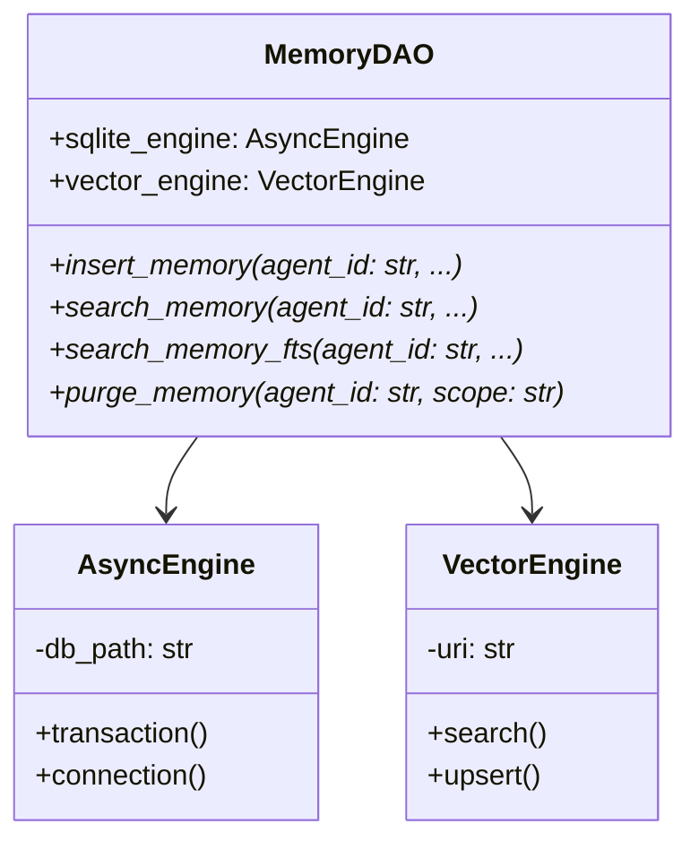
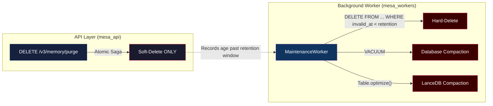
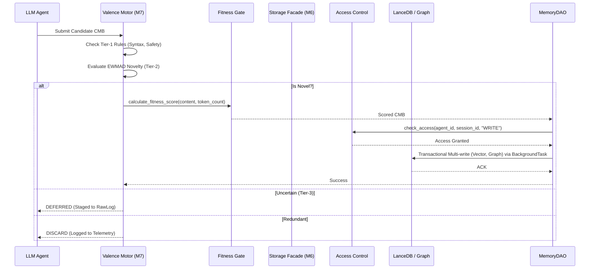
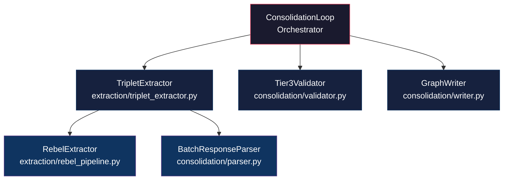
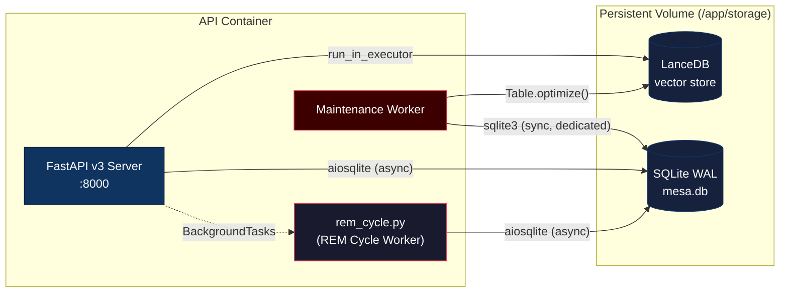

# MESA Memory Layer: Architecture Whitepaper

> **Version:** 0.5.0
> **Last Updated:** 2026-06-01

---

## 1. Executive Summary: Integrity over Velocity

MESA is fundamentally architected as a high-throughput, asynchronous cognitive memory engine. The core design principle is **"Integrity over Velocity."** While the system leverages non-blocking `asyncio` routines and decoupled storage layers to achieve high scalability, it deliberately introduces computational bottlenecks (via the Valence Motor) to aggressively validate data before persistence.

In v0.3.0, MESA transitioned from an importable library to a **headless FastAPI daemon** (API-first architecture). All client interaction flows through versioned REST endpoints (`/v3/memory/*`) or the Python SDK (`mesa_client`). This architectural shift enables deployment as a standalone service with strict process-level isolation between API request handling and background maintenance operations.

---

## 2. Epistemic Isolation Layer (MemoryDAO)

To eliminate synchronous bottlenecks and legacy in-memory limitations, MESA v0.3.0 implements the strictly asynchronous `MemoryDAO`. The system interacts with storage exclusively through this Data Access Object, completely replacing the deprecated `StorageFacade`. 



The `MemoryDAO` is responsible for unifying the relational graph operations (SQLite) and the semantic vector operations (LanceDB). It strictly enforces row-level security (RLS) by hardcoding `agent_id` into every underlying query, ensuring that multi-tenant boundaries are never breached by the application logic.

---

## 3. Storage Layer (MemoryDAO)

The legacy split-brain storage (`mesa_memory/storage`) has been completely eliminated in Phase 1. MESA now unifies all relational graph operations (SQLite) and semantic vector operations (LanceDB) directly under a single interface: `MemoryDAO`. It strictly enforces row-level security (RLS) by hardcoding `agent_id` into every underlying query — including the `raw_logs` ingestion table — ensuring that multi-tenant boundaries are never breached by the application logic.

> [!IMPORTANT]
> As of v0.5.0, the `raw_logs` table includes an explicit `agent_id` column with mandatory `WHERE agent_id = ?` predicates on all `INSERT`, `SELECT`, and `UPDATE` queries. Every `MemoryDAO` method that touches `raw_logs` (`insert_raw_log`, `get_raw_log`, `update_raw_log_status`) calls `_assert_valid_agent_id(agent_id)` at entry, guaranteeing zero-trust tenant isolation across the entire ingestion path.

### 3.1 SQLite — Relational Store (aiosqlite + WAL)

The relational layer uses `aiosqlite` for fully non-blocking database I/O within the `asyncio` event loop. The engine enforces production-grade PRAGMA settings at connection time:

| PRAGMA | Value | Rationale |
|---|---|---|
| `journal_mode` | `WAL` | Concurrent readers + single writer without blocking |
| `synchronous` | `NORMAL` | Durability with reduced fsync overhead |
| `cache_size` | `-64000` (64 MB) | Reduce disk I/O for hot-path queries |
| `foreign_keys` | `ON` | Referential integrity enforcement |

The schema is fully idempotent (`CREATE TABLE IF NOT EXISTS`) with trigger-based FTS5 synchronisation for lexical search.

### 3.2 SQLite FTS5 — Zero-VRAM Lexical Pre-Filtering

MESA provisions a `nodes_fts` FTS5 virtual table that mirrors the `entity_name` and `type` columns of the `nodes` table. Three triggers maintain synchronisation:

| Trigger | Event | Action |
|---|---|---|
| `nodes_fts_insert` | `AFTER INSERT ON nodes` | Insert new row into `nodes_fts` |
| `nodes_fts_update` | `AFTER UPDATE ON nodes` | Delete old + insert updated row |
| `nodes_fts_delete` | `AFTER DELETE ON nodes` | Remove row from `nodes_fts` |

FTS5 provides **zero-VRAM lexical pre-filtering** — enabling fast keyword/prefix search (`con*`, `trademark AND infringement`) before the system incurs the cost of vector similarity or graph traversal operations. All FTS5 queries are scoped by `agent_id` via a JOIN predicate: `AND n.agent_id = ?`.

### 3.3 LanceDB — Vector Store

Vector embeddings are stored in LanceDB with **multi-dimensional table routing**. Upon ingestion, the engine detects the embedding dimensionality and routes to a dedicated table (`mesa_vectors_384`, `mesa_vectors_1536`, etc.), preserving full semantic integrity across embedding providers.

All LanceDB operations are offloaded from the event loop via `ThreadPoolExecutor` + `asyncio.run_in_executor()`. The vector engine supports:

- **Upsert** with mandatory `agent_id` and optional `session_id`
- **Soft-delete** via `expired_at` timestamp (no physical removal in the hot path)
- **Cosine similarity search** with mandatory `agent_id` filtering in the WHERE clause

### 3.4 Dual-Write Atomicity (Saga Pattern)

MESA persists every memory record to **two** independent stores — SQLite (relational metadata, graph edges, FTS5) and LanceDB (vector embeddings). A partial write to only one store creates a **split-brain orphan**: a record that exists relationally but has no embedding, or vice versa. This is a data-integrity P0.

To prevent split-brain, all dual-write paths implement an **atomic Saga**:

1. **Begin** a SQLite transaction (`BEGIN DEFERRED`).
2. **Execute** the SQLite `INSERT`/`UPDATE` statements — but do **not** commit.
3. **Upsert** the vector embedding into LanceDB.
4. **On LanceDB success →** `COMMIT` the SQLite transaction.
5. **On LanceDB failure →** `ROLLBACK` the SQLite transaction; no partial state persists.

This guarantees that both stores are always consistent: either the full record is present in both, or in neither. The pattern is enforced in `MemoryDAO.insert_memory()` and `MemoryDAO.purge_memory()`.

> [!IMPORTANT]
> The SQLite `COMMIT` is **never** issued before LanceDB confirms the upsert. This ordering is load-bearing — reversing it would re-introduce the split-brain window.

### 3.5 KùzuDB — Graph Engine

In Phase 3 (v0.5.0), the legacy in-memory NetworkX graph and intermediate SQLite relational graph schema were completely deprecated in favor of **KùzuDB**, an embedded, highly optimized property graph database. KùzuDB manages all node topology and relationship persistence, enabling **infinite out-of-core scaling**. This architectural migration entirely eliminates the 50,000 node RAM exhaustion and OOM (Out-Of-Memory) crashes that previously affected the system at extreme scale.

#### Composite Primary Keys & Zero-Trust Isolation

Because KùzuDB does not natively support secondary indexing on non-Primary Key properties via Cypher DDL, MESA implements a **Composite Primary Key** pattern to guarantee O(log N) lookup times and absolute tenant isolation. 

- All graph nodes are uniquely identified and stored using the structure: `agent_id::node_id`.
- This enforces strict Zero-Trust segregation structurally at the disk level. Cypher queries dynamically strip this prefix when returning data, ensuring the abstraction does not leak to the application layer, while simultaneously defending against multi-tenant data contamination via mandatory `{agent_id: $agent_id}` Cypher bindings.

#### Asynchronous Execution Wrapper

KùzuDB's Python API operates synchronously via C++ bindings. To integrate this seamlessly into MESA's asynchronous FastAPI architecture without blocking the event loop, all KùzuDB interactions are funneled through the `KuzuGraphProvider`. 
This provider utilizes a dedicated `ThreadPoolExecutor` and the `asyncio.run_in_executor()` pattern to fully offload heavy graph traversals (like multi-hop BFS) to background threads. This guarantees zero event-loop blocking under high-concurrency loads.

### 3.6 Semantic Conflict Resolution (Check-Then-Act)

During dual-write insertions, `MemoryDAO` implements a "Check-Then-Act" semantic conflict resolution protocol. Before inserting a new memory record, the vector index is queried for highly similar existing entities. 

If a contradiction or semantic update is detected (e.g., highly similar cosine distance combined with an exact entity match), the older conflicting records are explicitly marked via a **soft-delete** (`invalid_at` timestamp) prior to the new record's insertion. This ensures the cognitive pool does not degrade over time due to hallucination loops or factual contradictions, resolving semantic corruption dynamically.

---

## 4. Resilience & Fault Tolerance

MESA operates within an inherently noisy LLM environment where API rate limits (HTTP 429) and service outages (HTTP 503) are common. The consolidation pipeline is fortified with a dedicated Resilience Engine:

### 4.1 Exponential Backoff
All LLM integration pathways (Triplet Extraction and Tier-3 Validation) utilize the `tenacity` library to manage transient faults. Failed external API calls are retried automatically using configurable exponential backoff (`MESA_RETRY_MIN_WAIT_SEC` and `MESA_RETRY_MAX_WAIT_SEC`).

### 4.2 LLM Circuit Breaker
If the external LLM provider consistently fails (exceeding `MESA_CIRCUIT_BREAKER_THRESHOLD`), a global `CircuitBreaker` dynamically opens. This halts further calls to the degraded provider, preventing cascading failures and prolonged pipeline starvation.

### 4.3 Dead Letter Queue (DLQ)
When records exhaust all retry budgets or fail while the Circuit Breaker is open, they are gracefully routed to a Dead Letter Queue. The background worker safely commits these failures to the SQLite `raw_logs` table with a `failed` status, ensuring operational observability without halting the main ingestion loop.

---

## 5. Security & Tenant Isolation

### 4.1 Epistemic Isolation (Row-Level Security)

> **Invariant:** Every SQL query, LanceDB filter, and graph traversal in the MESA data path **MUST** include a mandatory `agent_id` predicate. No function accepts `agent_id` as optional. This is enforced at the function signature level (keyword-only argument) and in every `WHERE` clause.

This rule guarantees **mathematical row-level security**: Agent A can never read, modify, or traverse Agent B's data, regardless of application-layer bugs.

**Enforcement points:**

| Layer | Mechanism |
|---|---|
| `mesa_api/schemas.py` | Pydantic V2 rejects empty `agent_id` and `__unset__` sentinel values |
| `mesa_storage/dao.py` | Every DAO method requires `agent_id` as the first positional argument |
| `mesa_storage/schemas.py` | All 11 query/mutation functions hardcode `AND agent_id = ?` |
| `mesa_storage/vector_engine.py` | `agent_id` filter injected into every LanceDB `WHERE` clause |
| `mesa_memory/retrieval/hybrid.py` | Retrieval path passes `agent_id` through all sub-queries |

### 4.2 Soft-Delete vs. Hard-Delete Separation

The API layer and the maintenance layer have **strict, non-overlapping responsibilities**:



**Why this matters:** SQLite VACUUM requires an exclusive lock on the database file. If VACUUM were triggered from the API request path, it would cause catastrophic WAL reader starvation under concurrent load. By sequestering all destructive operations in the `MaintenanceWorker` — which runs on a **dedicated synchronous `sqlite3` connection** with `isolation_level=None` — the API's WAL readers are never blocked. The `purge` API endpoint utilizes an atomic Two-Phase Commit Saga pattern to execute LanceDB soft-deletes prior to SQLite soft-deletes, avoiding "zombie data" if exceptions occur.

### 4.3 RBAC & Input Sanitisation

- **Authentication:** `X-API-Key` header validated against `MESA_API_KEY` environment variable.
- **Content Sanitisation:** `sanitize_cmb_content()` strips null bytes, ANSI escape sequences, dangerous HTML tags (script/style/iframe), shell metacharacters, and normalises whitespace. Prompt injection patterns are logged (advisory) but not hard-blocked to avoid false positives.
- **Schema Validation:** All API payloads pass through strict Pydantic V2 schemas (`MemoryInsertRequest`, `MemorySearchRequest`, etc.) before reaching any storage logic.

### 4.4 Epistemic Gating (Bi-Temporal Read Path)

The retriever (`mesa_memory/retriever.py`) implements bi-temporal awareness: memories that have not yet been processed by the consolidation pipeline (`is_consolidated = FALSE`) are wrapped in an explicit `⚠️ UNVERIFIED MEMORY` Markdown warning. This prevents the downstream LLM from treating unconsolidated data as authoritative.

---

## 5. Multi-Dimensional Vector Routing

MESA natively supports multi-model embedding pipelines (e.g., OpenAI `1536` dimensions, local MiniLM `384` dimensions). Rather than utilizing mathematical projections like Procrustes—which destroy clinical semantic accuracy—the `VectorEngine` dynamically isolates vector spaces.

Upon ingestion, MESA analyzes the incoming tensor dimension and routes the vector to a dedicated, dimension-specific LanceDB table (e.g., `mesa_vectors_1536` or `mesa_vectors_384`). This ensures absolute semantic integrity while allowing real-time switching between cloud and local SLMs.

---

## 6. RBAC Enforcement Flow

Security is deeply integrated at the lowest storage mutation points. The `AccessControl` module evaluates agent authorization based on robust `session_id` and `agent_id` tracking.

- **Authentication:** The FastAPI server requires an `X-API-Key` header on all sensitive endpoints, validated against the `MESA_API_KEY` environment variable. Invalid or missing keys receive `401 Unauthorized`.
- **Read Operations:** Validated at the retrieval boundaries. If an agent lacks `READ` privileges, the system raises a strict `PermissionError` before any computational expense is incurred.
- **Write Operations:** Validated directly inside the persistence methods (e.g., `upsert_node`, `upsert_vector`). By enforcing the check inside the data adapter itself, MESA ensures zero-trust security even if higher-level logic is compromised.
- **Multi-Tenancy:** Both `MemoryInsertRequest` and `MemorySearchRequest` require a non-empty `agent_id`, ensuring full tenant isolation across storage, retrieval, and RBAC layers.

---

## 7. Cognitive Data Lifecycle (Valence to Storage)

The journey of a Cognitive Memory Block (CMB) involves rigorous filtering, algorithmic novelty detection, and transactional persistence.



---

## 8. ValenceMotor Persistence

The `ValenceMotor` maintains adaptive novelty thresholds via Exponentially Weighted Moving Average of Distances (EWMAD). These thresholds are **stateful** — they drift over time as the memory pool grows. Losing them on process restart would force the system back to bootstrap-mode, causing a flood of redundant admissions until the threshold reconverges.

### Persistence Mechanism

| Operation | Trigger | Storage |
|-----------|---------|---------:|
| `save_state()` | FastAPI `shutdown` event | `valence_state` table in SQLite |
| `load_state()` | FastAPI `startup` event | `valence_state` table in SQLite |

**What is persisted:**

- `ewmad_threshold` — The current adaptive novelty baseline (float).
- `memory_count` — Total number of admitted CMBs since initialization (int).

**Hydration flow on startup:**

1. `ValenceMotor.__init__()` calls `_hydrate_embeddings()` to load the last `N` embeddings from the vector store (capped by `max_embedding_history`).
2. `load_state()` restores the EWMAD threshold from the `valence_state` SQLite table.
3. If the state table is missing or corrupt (cold start), the motor silently falls back to `bootstrap_cosine_threshold` from configuration.

```python
# Serialized state format (JSON in SQLite)
{
    "ewmad_threshold": 0.7234,
    "memory_count": 1847
}
```

### Threshold Blending

During the transition zone between bootstrap and full-EWMAD operation, the motor uses a sigmoid-weighted blend:

```
threshold = (1 - w) × bootstrap_threshold + w × ewmad_threshold
```

Where `w` is a sigmoid function of `memory_count`, controlled by `drift_sigmoid_weight`. This prevents abrupt threshold jumps when crossing the recalibration boundary.

---

## 9. Fitness Gate

Before any CMB is persisted to the database, `calculate_fitness_score` evaluates whether the content carries sufficient information density to justify storage costs. This gate runs dynamically at the point of persistence—scores are computed dynamically and not pre-computed.

### Scoring Formula

The fitness score is a weighted composite of three dimensions:

| Dimension | Weight | Metric |
|-----------|--------|--------|
| **Content Density** | 0.3 | `word_count / token_count`, clamped to `[0, 1]` |
| **Token Efficiency** | 0.3 | Optimal range: 50–500 tokens (penalty outside) |
| **Novelty Score** | 0.4 | Cosine-distance novelty from Valence Tier-2 |

**Token Efficiency penalties:**

- Below 50 tokens: `max(0.1, token_count / 50)` — penalizes trivially short content.
- Above 500 tokens: `max(0.1, 500 / token_count)` — penalizes verbose, low-density blocks.
- 50–500 tokens: `1.0` — no penalty.

**Output:** A float in `[0.0, 1.0]`. The score is attached to the CMB record before database insertion and is used downstream by the cold-start reranker in `HybridRetriever` to prioritize high-quality memories during retrieval.

---

## 10. Extraction Pipeline

The extraction pipeline transforms raw text records into structured knowledge graph triplets. Formerly a monolithic God-Object (`ConsolidationLoop`), the pipeline was decomposed into focused modules following the Single Responsibility Principle.

### Module Architecture



### `parser.py` — Response Parsing & Prompt Templates

Owns all LLM interaction formatting and response recovery:

- **Prompt templates:** `BATCH_PROMPT_A_TEMPLATE`, `BATCH_PROMPT_B_TEMPLATE` (batch extraction), and `PROMPT_A_TEMPLATE`, `PROMPT_B_TEMPLATE` (1:1 fallback).
- **`_sanitize_llm_response()`:** Multi-pass sanitization — strips markdown fences, isolates the outermost JSON object by locating first `{` and last `}`.
- **`_salvage_truncated_json()`:** Bracket-depth parser that recovers complete array elements from truncated JSON (when LLMs hit `max_tokens` mid-generation).
- **`BatchResponseParser`:** Three-layer recovery pipeline:

| Layer | Strategy | Trigger |
|-------|----------|---------|
| 0 | Passthrough | Adapter returned a validated `BaseModel` |
| 1 | Sanitize → `json.loads` → Pydantic validate | Raw string response |
| 2 | Bracket-depth partial salvage | Layer 1 fails (truncated JSON) |
| 3 | Bisection retry (in `TripletExtractor`) | All parsing layers fail |

### `triplet_extractor.py` — Native LLM Extraction & Optional REBEL

Manages the full extraction lifecycle:

1. **Primary LLM Extraction (Zero-Shot Turkish):** By default (`MESA_REBEL_ENABLED=false`), records are processed via the primary LLM adapter using a highly optimized, zero-shot Turkish legal triplet extraction prompt (`MESA_EXTRACTION_LANG=tr`). This completely eliminates the 1.8GB transformer model overhead for standard API deployments.

2. **Optional REBEL Zero-Cost Extraction:** If `MESA_REBEL_ENABLED=true` is explicitly set (and the `[rebel]` poetry extra is installed), records are first processed through the `RebelExtractor` (Babelscape/rebel-large). This provides zero API cost at the expense of local memory and CPU/GPU compute. Records that REBEL cannot handle fall back to the primary LLM.

3. **LLM Fallback & Lost-in-the-Middle:** For LLM extraction, records are batched and sent to dual LLMs (LLM_A and LLM_B) with positionally-tagged prompts:
   - **Layer 1 — Positional Tagging:** Explicit `=== RECORD N ===` / `=== END RECORD N ===` delimiters.
   - **Layer 4 — Anchor Tokens:** Attention-reset checkpoints every `anchor_interval` records.

4. **Bisection Retry (Layer 3):** When a sub-batch produces irrecoverable JSON, the batch is split in half recursively. At max retry depth (`truncation_max_retries`), individual records fall back to 1:1 single-record prompts.

5. **Salience-First Ordering (Layer 2):** Before prompting, records are sorted by information density and interleaved so that high-salience items occupy batch edges (primacy/recency positions), mitigating Lost-in-the-Middle degradation.

### `validator.py` — Tier-3 Consensus Gate

Dual-LLM consensus validation for deferred memory candidates:

| Decision Matrix | LLM_A: STORE | LLM_A: DISCARD |
|----------------|--------------|----------------|
| **LLM_B: STORE** | ✅ Admit | ❌ Reject (disagree) |
| **LLM_B: DISCARD** | ❌ Reject (disagree) | ❌ Reject (consensus) |

Infrastructure errors (JSON parse failure, rate limits, network) raise `Tier3ValidationError` and route to the dead-letter queue — they **never** silently default to DISCARD.

---

## 11. Data Pipeline & Isolation Logic

To guarantee deterministic extraction from non-deterministic LLMs, the pipeline enforces strict JSON schema generation via Pydantic models (`ExtractedTriplet`, `BatchExtractionResponse`). Malformed responses trigger the **"Isolation & Recovery"** protocol.

> [!WARNING]
> If an LLM response fails validation, it must never mutate the graph. MESA employs a multi-layer recovery system (sanitize → salvage → bisect → 1:1 fallback) before permanently discarding the data.

---

## 12. REM Cycle & Consolidation Worker

The `rem_cycle.py` background worker handles asynchronous knowledge graph extraction and consolidation. It avoids blocking the API's hot path by consuming the backlog in idle cycles.

- **Activation Thresholds:** The worker is strictly triggered when the queue of unconsolidated records exceeds **50 records**.
- **Token-Budgeting Logic:** It respects predefined token limits per consolidation batch to ensure it does not overwhelm LLM rate limits or exceed operational cost boundaries. This token-budgeting governs the size of chunks processed concurrently.

---

## 13. Evaluation & Quality Gates (`mesa_evals`)

MESA v0.3.0 enforces strict CI/CD quality assurance through its evaluation pipeline. The `gatekeeper.py` quality gate acts as the primary CI/CD enforcer. 

- **Ablation Pipeline:** Evaluates algorithmic changes (e.g., FTS5 lexical candidate limits, RRF weight calibration) by isolating variables and running comprehensive synthetic benchmarks against a domain-specific Golden Dataset.
- **Strict Enforcement Rules:** It balances **Recall vs. Cost**. Any pull request that drops Recall below the established baseline (e.g., `Base_Hybrid` < `0.344`) or exceeds maximum TTFT (Time To First Token) latency limits is immediately rejected by the CI runner.

---

## 14. Deployment Architecture



**Key deployment notes:**

- The spaCy language model (`xx_ent_wiki_sm`) is downloaded at **build time** in the Dockerfile — no runtime network calls in air-gapped environments.
- Persistent storage is mounted at `/app/storage` via a Docker volume.
- The `MESA_API_KEY` environment variable must be set for production authentication.
- The `MaintenanceWorker` operates on a **separate synchronous `sqlite3` connection** with `isolation_level=None` to avoid WAL reader contention during VACUUM.
- LanceDB disk I/O is offloaded from the asyncio event loop via `ThreadPoolExecutor`.

---

## 15. External Integration

### Model Context Protocol (`mesa_mcp`)
MESA natively implements an MCP (Model Context Protocol) server inside `mesa_mcp`. This allows ecosystem tools such as Claude Desktop and other MCP-compliant agents to directly interface with the MESA memory engine. Agents can query context and store memory natively without writing custom API wrappers.

### Python Client SDK (`mesa_client`)
The `mesa_client` module provides both synchronous and asynchronous `httpx`-based clients:
- Includes strict Pydantic V2 validation and exponential backoff retries.
- Features a native **LangChain retriever** extension (`MesaLangchainRetriever`), allowing seamless drop-in replacement in existing AI pipelines that use LangChain.

---

*MESA Architecture is proprietary. Designed for integrity-first enterprise environments.*
