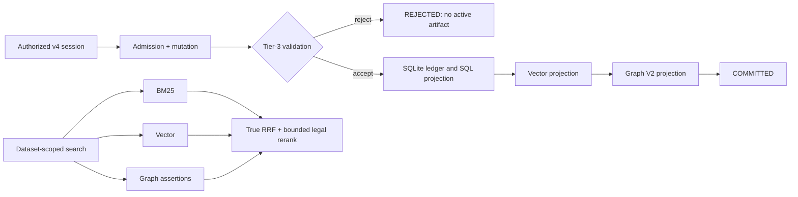

<div align="center">

# MESA — Memory Engine for Structured Agents

[](https://github.com/Yasou13/MESA/actions)
[](https://codecov.io/gh/Yasou13/MESA)


**A durable, tenant- and dataset-isolated memory engine for autonomous AI agents.**
The v3 compatibility runtime remains a model-disabled lexical core. The
unreleased v4 runtime adds canonical source provenance, mandatory validation,
idempotent SQL/vector/graph projection and Graph V2 in one storage-owner
process. V4 remains `NO-GO` until its external release and soak gates pass.

</div>

---

## ⚡ Quickstart (Local Installation)

For repeatable development and deployment, use the checked-in lock file:

```bash
git clone https://github.com/Yasou13/MESA.git
cd MESA
uv sync --locked --extra dev
# Optional local ML models and external-provider SDKs:
uv sync --locked --extra dev --extra ml --extra adapters
```

## 🐳 Quickstart (Docker) — 60 Seconds

Copy-paste this to get a running MESA instance with zero local dependencies:

```bash
git clone https://github.com/Yasou13/MESA.git
cd MESA
export MESA_API_KEY=local-dev-key
export MESA_PRINCIPAL_ID=local-compose-principal
docker compose config --quiet
docker compose up --build -d
```

> **Safe core runtime profile:** Compose starts separate API and worker roles with the
> persistent named `mesa-data` volume. It deliberately sets
> `MESA_MODEL_ENABLED=false` and `MESA_EXTERNAL_PROVIDER_ENABLED=false`.
> The application does not load a dotenv file, nor does its worker invoke
> REBEL, an LLM adapter, or dual-LLM consensus; it commits accepted records as
> durable raw memories. Supply Compose variables from exported environment
> variables or Compose's interpolation `.env` file. Use a reviewed explicit
> full cognitive runtime when model or provider access is required.

Verify it's running:

```bash
curl --fail -H "X-API-Key: $MESA_API_KEY" http://localhost:8000/health
# → {"status": "ok", ...}
```

MESA is now live at **`http://localhost:8000`** with Swagger docs at [`/docs`](http://localhost:8000/docs).

### v4 full cognitive runtime

`docker-compose.yml` is the backwards-compatible v3 lexical-core topology.
For v4, use the single storage-owner topology in `docker-compose.v4.yml`.
It deliberately requires explicit model/provider enablement and never starts a
second process against the same SQLite, LanceDB, or Kùzu storage directory:

```bash
export MESA_API_KEY=replace-with-a-secret
export MESA_PRINCIPAL_ID=production-principal
export MESA_MODEL_ENABLED=true
export MESA_EXTERNAL_PROVIDER_ENABLED=true
docker compose -f docker-compose.v4.yml config --quiet
docker compose -f docker-compose.v4.yml up --build -d
```

Provision hash-backed keys and catalog authorization with the offline operator
CLI (the generated credential is shown once):

```bash
mesa-v4-admin issue-key --principal production-principal
mesa-v4-admin grant-role --principal production-principal \
  --tenant tenant-a --role OWNER
mesa-v4-admin grant-agent --principal production-principal \
  --agent agent-a --permission SESSION_CREATE
```

The selected adapter and its credentials must be configured by the deployment
platform; do not put credentials in the Compose file. v4 is not production
ready until its validation, migration, backup/restore and soak gates pass.
The canonical design is
[`docs/architecture-v4.md`](docs/architecture-v4.md); root
`ARCHITECTURE.md` is a preserved historical v3 record.

The v4 catalog and provenance hierarchy is
`Tenant → Workspace → Dataset → Document → DocumentRevision → SourceChunk`.
Sessions are created by the server with an immutable authorized dataset set;
insert and search derive tenant/agent scope from that session. Canonical entity
IDs use tenant, entity type and ontology URI (or a normalized canonical name).
Mutation status, replay and source-owned rollback remain durable operations:

```text
POST /v4/catalog/workspaces        GET /v4/catalog/workspaces
POST /v4/catalog/datasets          GET /v4/catalog/datasets
POST /v4/catalog/documents         GET /v4/catalog/documents
POST /v4/catalog/revisions         GET /v4/catalog/revisions
POST /v4/catalog/source-chunks
POST /v4/sessions/start
POST /v4/memory/insert             POST /v4/memory/search
GET  /v4/mutations/{id}
POST /v4/mutations/{id}/replay
POST /v4/mutations/{id}/rollback
```

---

## 🔑 API Examples (v3)

All endpoints require the `X-API-Key` header. It must match the `MESA_API_KEY`
provided to the running API process. For Compose this value may come from an
exported environment variable or Compose's interpolation `.env` file; the
container itself does not load `.env`.

### Insert a Memory

```bash
curl -X POST http://localhost:8000/v3/memory/insert \
  -H "Content-Type: application/json" \
  -H "X-API-Key: local-dev-key" \
  -d '{
    "agent_id": "analyst_1",
    "session_id": "session_001",
    "content": "Tesla Q4 2025 revenue exceeded $25B, up 12% YoY."
  }'
# → {"status": "queued", "log_id": 1, "processing_mode": "async"}
```

The insert endpoint returns **202 Accepted** after durable admission; latency
depends on the deployment, storage, and queue state. The safe-core cold path
performs novelty checks and a raw-memory commit. Model extraction and dual-LLM
consensus are available only in an explicitly enabled full cognitive runtime.
The [historical five-minute soak result](docs/historical_benchmarks/v0.4.2_results.md)
used 20 RPS and 30 connections and explicitly states that it is not production
certification; do not treat it as a universal latency guarantee.

### Check Ingestion Status

```bash
curl "http://localhost:8000/v3/memory/status/1?agent_id=analyst_1" \
  -H "X-API-Key: local-dev-key"
# → {"log_id": 1, "status": "processed"}
```

### Search Memories

```bash
curl -X POST http://localhost:8000/v3/memory/search \
  -H "Content-Type: application/json" \
  -H "X-API-Key: local-dev-key" \
  -d '{
    "agent_id": "analyst_1",
    "query": "What was Tesla Q4 revenue?",
    "limit": 5
  }'
# → {"context": "...", "retrieved_nodes": [...], "metrics": {"latency_ms": 12}, "degraded_sources": []}
```

`degraded_sources` boş değilse istek başarılı sonuç üretmiştir, ancak ilgili
retrieval kaynağı (`vector`, `graph` veya `lexical`) kullanılamamıştır. İstemci
bu sonucu eksik sinyalli olarak ele almalıdır; aynı olay Prometheus'ta
`mesa_retrieval_degraded_total{source=...}` ile sayılır.

### Purge Memories (Tombstoning)

```bash
curl -X DELETE http://localhost:8000/v3/memory/purge \
  -H "Content-Type: application/json" \
  -H "X-API-Key: local-dev-key" \
  -d '{
    "agent_id": "analyst_1",
    "scope": "agent"
  }'
# → {"status": "purged", "deleted_records_count": 42}
```

---

## 🐍 Python SDK

V4 applications use the version-specific client:

```python
from mesa_client import MesaV4Client

with MesaV4Client("http://localhost:8000", api_key=credential) as client:
    session = client.start_session(
        tenant_id="tenant-a",
        workspace_id="workspace-a",
        dataset_ids=["dataset-a"],
        agent_id="agent-a",
    )
    accepted = client.insert(
        session_id=session["session_id"],
        dataset_id="dataset-a",
        document_id="doc-a",
        revision_id="rev-1",
        chunk_id="chunk-1",
        source_ref="contract://a",
        content="Exact source text",
    )
    client.wait_until_committed(accepted["mutation_id"])
```

The following client remains the v3 compatibility SDK:

```python
from mesa_api.schemas import MemoryInsertRequest, MemorySearchRequest
from mesa_client import MesaClient

client = MesaClient(base_url="http://localhost:8000", api_key="local-dev-key")

# Insert
response = client.insert(MemoryInsertRequest(
    agent_id="analyst_1",
    session_id="s1",
    content="Tesla Q4 revenue: $25B, up 12% YoY.",
))
print(f"Queued: log_id={response.log_id}")

# Search
results = client.search(MemorySearchRequest(
    agent_id="analyst_1",
    query="Tesla revenue",
    limit=5,
))
print(f"Found {results.total} results")
for r in results.results:
    print(f"  {r.entity_name} (score: {r.score:.4f})")
```

---

## 🤖 Integrations: Claude Desktop (MCP)

MESA includes a built-in [Model Context Protocol](https://modelcontextprotocol.io/)
server (`mesa_mcp.server`) that uses the same v4 catalog, session, memory,
status, replay and rollback API as the Python SDK.

### Setup

1. **Start MESA** (Docker or local — must be running on `localhost:8000`).

2. **Add to your Claude Desktop config** (`~/Library/Application Support/Claude/claude_desktop_config.json` on macOS, or `%APPDATA%\Claude\claude_desktop_config.json` on Windows):

```json
{
  "mcpServers": {
    "mesa-memory": {
      "command": "python",
      "args": ["-m", "mesa_mcp.server"],
      "cwd": "/absolute/path/to/MESA",
      "env": {
        "MESA_BASE_URL": "http://localhost:8000",
        "MESA_API_KEY": "local-dev-key",
        "MESA_TENANT_ID": "tenant-a",
        "MESA_WORKSPACE_ID": "workspace-a",
        "MESA_DATASET_IDS": "dataset-a",
        "MESA_AGENT_ID": "agent-a"
      }
    }
  }
}
```

3. **Restart Claude Desktop.** The principal behind the API key must already
   have the required tenant/workspace/dataset role and agent permission.

| MCP Tool | Description |
|---|---|
| `catalog` | Create/list authorized workspaces, datasets, documents and revisions |
| `start_session` | Create an immutable authorized v4 session |
| `record_memory` | Admit an exact source chunk and return its mutation ID |
| `search_memory` | Run dataset-filtered vector/BM25/graph RRF retrieval |
| `mutation_status` | Read durable pipeline and projection state |
| `rollback_mutation` / `replay_mutation` | Operate an authorized mutation |
| `get_context` / `end_session` | Read provenance context or finalize a session |

Claude can now persist facts across conversations and recall them on demand through your local MESA instance.

> [!TIP]
> `agent_id` is a persona/compute context, not a tenant boundary. Isolation
> comes from the API-key principal, tenant/workspace/dataset ACL and the
> server-created session. Give each conversation its own v4 session.

---

## Why MESA?

Traditional agent memory is a flat buffer of text. MESA v3 preserves a durable
lexical core. V4 adds dataset isolation, source provenance, mandatory
validation and ordered structured projections before retrieval.

| Runtime | V3 lexical-core Compose | V4 combined runtime |
|---|---|---|
| Model/provider access | Disabled | Explicitly enabled and reviewed |
| Cold-path result | Durable raw memory | Validated mutation plus ordered projections |
| REBEL / LLM extraction | Not invoked | Opt-in |
| Dual-LLM consensus | Not invoked | Opt-in |

### Full cognitive runtime

Full cognitive processing uses `docker-compose.v4.yml`, explicitly sets
`MESA_MODEL_ENABLED=true`, supplies only the required provider credentials and
runs one combined storage owner. It has different cost, latency,
model-download and provider-rate-limit characteristics from v3.

| Capability | MESA | LangChain Memory | MemGPT |
|---|---|---|---|
| **Hallucination Mitigation** | Mandatory Tier-3 gate; rejected mutations create no active artifact | Prompt-based | Self-correction |
| **Validation Architecture** | Versioned pipeline with ledger, retries, DLQ and rollback | None | Prompt-based |
| **Knowledge Graph** | Graph V2 Entity/Assertion projection with provenance | Manual | None |
| **Zero-Cost Mode** | Native 100% local execution via Ollama (`MESA_ZERO_COST_MODE`) | External | External |
| **Tenant Isolation** | V4 principal → tenant → workspace → dataset ACL and server-bound session | None | None |
| **Session Lifecycle APIs** | Native `/session/start`, `/context`, `/end` endpoints | None | Implicit |
| **Fault Tolerance** | Fenced leases + bounded retry + DLQ + reconciliation | Try/Catch | Retry Decorator |
| **Local-First** | Yes (SQLite WAL, LanceDB, KùzuDB) | Cloud-dependent | Cloud-dependent |
| **Observability** | Prometheus + structured JSON logs | Basic logging | Basic logging |

---

## Features & Capabilities

The published v0.6.1/v3 line and unreleased v4 line have different contracts.
Current v4 capabilities include:

1. **Canonical ingestion:** exact source, version and pipeline provenance from
   admission through every projection.
2. **Mutation ledger/outbox:** ordered, idempotent SQLite → vector → graph
   projection with fenced leases, retry, DLQ, rollback and reconciliation.
3. **Graph V2:** deterministic tenant-scoped entities, immutable
   provenance-rich assertions and source-owned rollback.
4. **Dataset security:** principal/tenant/workspace/dataset roles plus explicit
   purge and rollback permissions.
5. **Retrieval V2:** dataset-filtered vector/BM25/graph rank fusion with true
   RRF and deterministic bounded legal reranking.
6. **Versioned clients:** matching v4 REST, sync/async SDK and MCP lifecycle
   operations.

---

## Architecture Overview

MESA uses three physical stores, but v4 has one decision source:
1. **SQLite:** mutation/pipeline ledger, catalog, authorization, artifact
   ownership, assertions and ordered outbox.
2. **LanceDB:** idempotent vector projection with embedding provenance.
3. **KuzuDB:** idempotent Graph V2 projection; it is not the assertion decision
   source.



---

## Local Development (without Docker)

### 1. Install

`pyproject.toml` defines supported dependency ranges; `uv.lock` is the
reproducible deployment graph consumed by Docker and CI. Prefer `uv sync
--locked` for development and operator environments. The core package avoids
heavy ML dependencies unless explicitly requested.

```bash
git clone https://github.com/Yasou13/MESA.git
cd MESA
python3 -m venv venv && source venv/bin/activate
python -m pip install -e .
```

**Optional Heavy ML Models:** If you need the local REBEL transformer model for English-only offline triplet extraction, install the optional package:
```bash
python -m pip install -e ".[ml]"
```

**Optional LLM Adapters:** The core package avoids installing third-party LLM SDKs to keep the footprint small. If you intend to use cloud providers (OpenAI, Anthropic, Groq, LiteLLM) or Ollama instead of pure local logic, install the adapters group:
```bash
python -m pip install -e ".[adapters]"
```

### 2. Configure

```bash
export MESA_RUNTIME_PROFILE=api-only
export MESA_STORAGE_ROOT=/absolute/path/to/mesa-data
export MESA_LOAD_DOTENV=false
export MESA_MODEL_ENABLED=false
export MESA_EXTERNAL_PROVIDER_ENABLED=false
export MESA_API_KEY=local-dev-key
export MESA_PRINCIPAL_ID=local-api-principal
```

### 3. Launch

> **WARNING:** `make dev` is not a production-parity command. For the separate
> API/worker topology, use the Compose quickstart above or the operator
> runbook in [`docs/installation.md`](docs/installation.md).

```bash
uvicorn mesa_memory.api.server:app --host 0.0.0.0 --port 8000 --reload
# → http://127.0.0.1:8000/docs  (Swagger UI)
# → http://127.0.0.1:8000/health
```

---

## API Endpoints (v3)

| Method | Path | Description |
|---|---|---|
| `POST` | `/v3/memory/insert` | Admit durable lexical-core worker ingestion |
| `POST` | `/v3/memory/search` | Hybrid vector + graph + FTS5 retrieval |
| `GET` | `/v3/memory/status/{log_id}` | Query cold-path processing status |
| `DELETE` | `/v3/memory/purge` | Tombstoning only (hard-delete is background-only) |
| `POST` | `/v3/memory/session/start` | Generate a v3 agent/session-scoped session |
| `GET` | `/v3/memory/session/{session_id}/context` | Retrieve episodic + graph context scoped to session |
| `POST` | `/v3/memory/session/{session_id}/end` | Terminate session and trigger final consolidation |
| `GET` | `/health/init` | Container orchestration readiness probe (returns 200 when workers are alive) |
| `GET` | `/health` | System status and database health check |
| `GET` | `/metrics` | Prometheus scrape endpoint |

---

## Environment Variables

| Variable | Default | Description |
|---|---|---|
| `MESA_RUNTIME_PROFILE` | *(required)* | `api-only`, `worker-only`, `combined` veya yalnız testler için `test-isolated` |
| `MESA_STORAGE_ROOT` | *(required)* | Uygulamanın sahip olduğu mutlak ve yazılabilir storage dizini |
| `MESA_LOAD_DOTENV` | `false` | `.env` yüklemeyi yalnız açıkça izin verilmiş profilde etkinleştirir |
| `MESA_MODEL_ENABLED` | `false` | Model hattını etkinleştirir; v4 Compose açık değer ister |
| `MESA_EXTERNAL_PROVIDER_ENABLED` | `false` | Haricî provider erişimini etkinleştirir; v4 Compose açık değer ister |
| `MESA_API_KEY` | *(required)* | V3 bootstrap key veya v4 `key_id.secret` credential |
| `MESA_PRINCIPAL_ID` | *(required)* | API key ile ilişkilendirilen sunucu tarafı principal |
| `MESA_PRINCIPAL_TYPE` | `SERVICE` | Principal türü |
| `MESA_PRINCIPAL_STATUS` | `active` | Principal durumu |
| `LLM_API_KEY` | *(provider profile)* | Yalnız external-provider erişimi açık, gözden geçirilmiş profiller için sağlayıcı anahtarı |
| `MESA_ZERO_COST_MODE` | `false` | Yerel Ollama/embedding seçimini ister; Compose profili bunu etkinleştirmez |

---

## Running Tests

```bash
# Full test suite
pytest tests/ -q

# With coverage
pytest tests/ --cov=mesa_memory --cov=mesa_api --cov=mesa_storage --cov-report=term-missing --ignore=tests/bench

# Type checking
mypy mesa_memory mesa_storage mesa_workers mesa_api mesa_client --ignore-missing-imports --explicit-package-bases

# Formatting
black --check mesa_memory/ mesa_api/ mesa_storage/ tests/
ruff check .

# MESA çekirdek değerlendirme/CI paketi (rakip benchmarkı değildir)
python -m mesa_evals.evals        # Run 30-entry synthetic benchmark
python -m mesa_evals.gatekeeper   # CI/CD gate (exit 0 = PASS)
```

`mesa_evals`, MESA çekirdeğinin sentetik golden-dataset ve CI regresyon
paketidir. MESA, Mem0, Zep veya Letta arasında yayınlanabilir karşılaştırma
sonucu üretmez. Bu amaçla ayrı paket ve CLI olan `mesa-benchmark` kullanılır;
onun metodolojisi, external dataset kuralları ve sonuç geçerliliği
`mesa-benchmark/README.md` içinde tanımlanır.

---

## Known Limitations

> [!WARNING]
> **Understand these constraints before deploying to production.**

### KùzuDB Graph Scalability

MESA uses **KùzuDB** for disk-backed graph topology. This reduces the need to
hold the complete graph topology in application memory, but capacity remains
bounded by storage, query shape, indexes, process memory, and host resources.
Load and soak testing are required for each production deployment.

### LLM Provider Rate Limits

When using Groq's free tier as the LLM backend, you may hit **30 requests/minute** rate limits during consolidation batches. Mitigations:
- Reduce `consolidation_batch_size` in your `.env` or config.
- Use the `mock` provider for local development and testing.
- Deploy with a paid plan or switch to a self-hosted Ollama instance.

### CPU-Only REBEL Extraction

The REBEL model (`Babelscape/rebel-large`, 1.8 GB) runs at **~2–5 seconds per record on CPU**. For high-throughput workloads:
- Set `MESA_REBEL_DEVICE=cuda` if a GPU is available.
- REBEL is English-only. Set `MESA_REBEL_ENABLED=false` to use the configured
  LLM extraction prompts, which support Turkish (`tr`) and English (`en`).
- The system automatically falls back to LLM-based extraction when REBEL fails, so extraction never blocks the pipeline.

### Current status

V0.6.1 is the preserved v3 lexical-core compatibility release. Its queue and
compensating-write behavior must not be read as a v4 guarantee. Unreleased v4
uses a mutation/pipeline ledger, ordered outbox, artifact ownership and
reconciliation. Production status remains `NO-GO` until real-provider,
production-like crash/concurrency, migration/restore and 24-hour soak evidence
is complete.

---

## Project Structure

```
MESA/
├── mesa_api/             # Versioned FastAPI v3 compatibility + v4 routers
├── mesa_client/          # Versioned Python SDKs (v3 and v4, sync/async)
├── mesa_evals/           # MESA çekirdek golden dataset + CI regresyon değerlendirmesi
├── mesa-benchmark/       # Dış sistem karşılaştırmalı, yayınlanabilir benchmark CLI'ı
├── mesa_memory/
│   ├── adapter/          # LLM provider adapters (Claude, Ollama, Mock)
│   ├── api/              # FastAPI server entrypoint + auth middleware
│   ├── consolidation/    # Batch orchestration + graph writing
│   ├── extraction/       # REBEL triplet extraction pipeline
│   ├── observability/    # Prometheus metrics + structured logging
│   ├── retrieval/        # Hybrid vector + graph retrieval
│   ├── schema/           # Pydantic CMB schema
│   ├── security/         # RBAC access control + input sanitisation
│   └── valence/          # ECOD anomaly detection + novelty scoring
├── mesa_mcp/             # Model Context Protocol server (Claude Desktop)
├── mesa_storage/         # Triple Storage Engine
│   ├── dao.py            # Orchestration & WAL queueing
│   ├── kuzu_provider.py  # Graph Storage
│   └── vector_engine.py  # Vector Storage
├── mesa_workers/         # Cold-path ingestion worker, MaintenanceWorker, rem_cycle.py
├── tests/                # pytest suite + benchmarks
├── examples/             # Tutorial scripts (hello_mesa.py, legal_assistant.py)
├── Dockerfile            # Production container
├── docker-compose.yml    # V3 lexical-core API + worker deployment
├── docker-compose.v4.yml # V4 single combined storage-owner deployment
├── pyproject.toml        # Package metadata + dependency ranges
├── uv.lock               # Reproducible resolved dependency graph
└── SECURITY.md            # Security disclosure policy
```

---

## Contributing

We welcome contributions! Please follow the **Fork → Feature Branch → Pytest → Pull Request** workflow. Ensure all tests pass and code is formatted with `black` and `ruff` before submitting.

## License

This project is licensed under the [MIT License](LICENSE) — Copyright © 2026 MESA Core Team.
