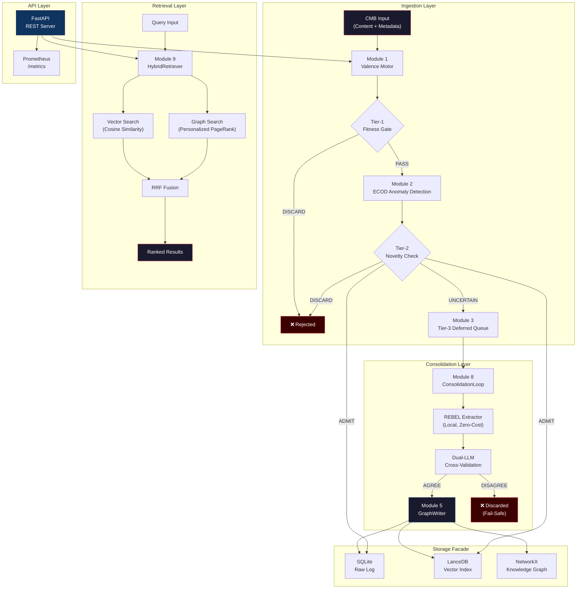

<div align="center">

# MESA — Memory Engine for Structured Agents

[](https://github.com/Yasou13/MESA/actions)
[](https://codecov.io/gh/Yasou13/MESA)


**Enterprise-grade cognitive memory engine for autonomous AI agents.**
Ingest → Validate → Extract → Store → Retrieve — with dual-LLM consensus that statistically minimises hallucination cascades.

</div>

---

## Why MESA?

Traditional agent memory is a flat buffer of text. MESA replaces that with a **9-module pipeline** that gates every incoming record through statistical novelty checks, anomaly detection, and asymmetric dual-LLM cross-validation before committing structured knowledge triplets to a persistent graph. The result: agents that remember *accurately*, not just *recently*.

| Capability | MESA | LangChain Memory | MemGPT |
|---|---|---|---|
| **Hallucination Mitigation** | Dual-LLM Consensus + Fail-safe Discard | Prompt-based | Self-correction |
| **Validation Architecture** | 3-Tier Statistical + LLM Pipeline | None | Prompt-based |
| **Knowledge Graph** | Automated REBEL + LLM Triplet Extraction | Manual | None |
| **Local-First** | Yes (SQLite, LanceDB, NetworkX) | Cloud-dependent | Cloud-dependent |
| **Observability** | Prometheus + structured JSON logs | Basic logging | Basic logging |

---

## Architecture Overview



### Module Inventory

| # | Module | File | Responsibility |
|---|---|---|---|
| 1 | **Valence Motor** | `mesa_memory/valence/core.py` | 3-tier admission gate with EWMAD drift calibration |
| 2 | **ECOD Detector** | `mesa_memory/valence/novelty.py` | Embedding-space anomaly detection for novelty scoring |
| 3 | **Fitness Scorer** | `mesa_memory/valence/fitness.py` | Content density × cost efficiency × novelty composite |
| 4 | **Observability** | `mesa_memory/observability/metrics.py` | Prometheus counters/histograms + structured JSON audit |
| 5 | **Graph Writer** | `mesa_memory/consolidation/graph_writer.py` | Atomic triplet commit with MVCC node versioning |
| 6 | **REBEL Extractor** | `mesa_memory/extraction/rebel_pipeline.py` | Local seq2seq triplet extraction (zero token cost) |
| 7 | **Storage Facade** | `mesa_memory/storage/__init__.py` | Unified SQLite + LanceDB + NetworkX interface |
| 8 | **Consolidation Loop** | `mesa_memory/consolidation/loop.py` | Batch orchestration with dual-LLM cross-validation |
| 9 | **Hybrid Retriever** | `mesa_memory/retrieval/hybrid.py` | RRF-fused vector + PPR graph search |

---

## 5-Minute Quickstart

### 1. Install

```bash
git clone https://github.com/Yasou13/MESA.git
cd MESA
python3 -m venv venv && source venv/bin/activate
pip install -r requirements-core.txt
```

### 2. Configure

```bash
cp .env.example .env
# Edit .env with your provider credentials, or use mock mode:
# MESA_LLM_PROVIDER=mock
```

### 3. Run the Demo

```bash
python scripts/run_investor_demo.py
```

**Expected output:**

```
Initializing MESA StorageFacade...
Concurrent ingestion using multiple agents...
[Agent_A] Ingested SEC-001
[Agent_B] Ingested EMAIL-002
...
Running ConsolidationLoop (Tier-3 processing)...
Consolidated Tier-3 deferred records.

================ FINAL REPORT ================
Query: Explain the Twitter Inc. Acquisition...
Found Results:
- [SEC-008] Musk, Twitter'ın tüm hisselerini ...
- [EMAIL-010] Morgan Stanley, 46.5 milyar dolar...
==============================================
```

### 4. Launch the API Server

```bash
uvicorn mesa_memory.api.server:app --reload
# → http://127.0.0.1:8000/docs  (Swagger UI)
# → http://127.0.0.1:8000/health
# → http://127.0.0.1:8000/metrics (Prometheus)
```

### 5. Docker Deployment

```bash
docker compose up --build -d
# API available at http://localhost:8000
# Storage persisted to ./storage/
```

---

## API Endpoints

| Method | Path | Description |
|---|---|---|
| `POST` | `/ingest` | Submit a memory record through the validation pipeline |
| `POST` | `/query` | Hybrid vector + graph retrieval |
| `GET` | `/health` | System status, admission rates, divergence metrics |
| `GET` | `/metrics` | Prometheus scrape endpoint |

**Ingest example:**

```bash
curl -X POST http://localhost:8000/ingest \
  -H "Content-Type: application/json" \
  -d '{"content": "Tesla Q4 revenue exceeded $25B", "source": "earnings_report", "agent_id": "analyst_1"}'
```

---

## Running Tests

```bash
# Full test suite
pytest tests/ -q

# With coverage
pytest tests/ --cov=mesa_memory --cov-report=term-missing --ignore=tests/bench

# Type checking
mypy mesa_memory/ --ignore-missing-imports --explicit-package-bases

# Formatting
black --check mesa_memory/ tests/
ruff check mesa_memory/ tests/
```

---

## Known Limitations

> [!WARNING]
> **Understand these constraints before deploying to production.**

### NetworkX Graph Scalability

The default graph provider uses **in-memory NetworkX** backed by SQLite persistence. This works well for graphs up to ~100K nodes. For larger knowledge bases, the planned `MemgraphProvider` (currently stubbed) will provide a scalable alternative with Cypher query support.

### Groq / LLM Provider Rate Limits

When using Groq's free tier as the LLM backend, you may hit **30 requests/minute** rate limits during consolidation batches. Mitigations:
- Reduce `consolidation_batch_size` in your `.env` or config.
- Use the `mock` provider for local development and testing.
- Deploy with a paid Groq plan or switch to a self-hosted Ollama instance.

### CPU-Only REBEL Extraction

The REBEL model (`Babelscape/rebel-large`, 1.8 GB) runs at **~2–5 seconds per record on CPU**. For high-throughput workloads:
- Set `MESA_REBEL_DEVICE=cuda` if a GPU is available.
- The system automatically falls back to LLM-based extraction when REBEL fails, so extraction never blocks the pipeline.

### Transformers Compatibility

The `text2text-generation` pipeline task used by REBEL may conflict with newer versions of the `transformers` library. If you encounter `KeyError: "Unknown task text2text-generation"`, pin `transformers<=4.44.0` or rely on the automatic LLM fallback path.

---

## Project Structure

```
MESA/
├── mesa_memory/
│   ├── adapter/          # LLM provider adapters (Claude, Ollama, Mock)
│   ├── api/              # FastAPI REST server
│   ├── consolidation/    # Batch orchestration + graph writing
│   ├── extraction/       # REBEL triplet extraction pipeline
│   ├── observability/    # Prometheus metrics + structured logging
│   ├── retrieval/        # Hybrid vector + graph retrieval
│   ├── schema/           # Pydantic CMB schema
│   ├── security/         # RBAC access control
│   ├── storage/          # StorageFacade (SQLite, LanceDB, NetworkX)
│   └── valence/          # 3-tier admission gate + fitness scoring
├── scripts/              # Demo and utility scripts
├── examples/             # Tutorial scripts (hello_mesa.py)
├── tests/                # pytest suite (159+ tests)
├── Dockerfile            # Production container
├── docker-compose.yml    # Single-command deployment
└── requirements-core.txt # Lightweight API dependencies
```

---

## Contributing

We welcome contributions! Please follow the **Fork → Feature Branch → Pytest → Pull Request** workflow. Ensure all tests pass and code is formatted with `black` and `ruff` before submitting.

## License

This project is licensed under the [MIT License](LICENSE) — Copyright © 2026 MESA Core Team.
