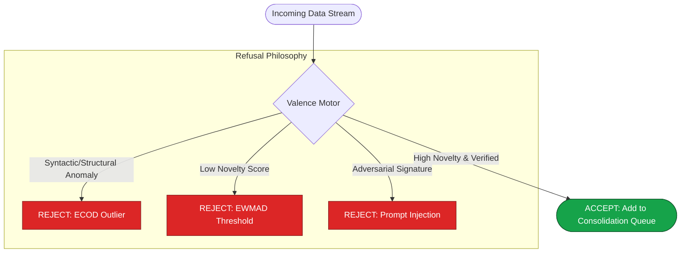

# **MESA: Mission-Critical Enterprise AI Memory**

> **MESA: A highly resilient, asynchronous cognitive memory engine built for mission-critical enterprise AI agents, prioritizing absolute data integrity and zero-hallucination cross-verification.**

## **1. Core Value Proposition**

General-purpose RAG (Retrieval-Augmented Generation) systems fail in enterprise settings due to a lack of strict referential integrity and deterministic safeguards. MESA bridges this gap. By leveraging a robust, asynchronous graph-vector consolidation core, MESA enables absolute cross-verification of entities. It is engineered for enterprise workflows—ensuring that sensitive organizational data is processed securely and that generated insights are cryptographically and contextually verifiable.

## **2. The Refusal Philosophy**

MESA is designed to actively reject low-value, anomalous, or potentially harmful data *before* it enters the memory graph. The Valence Motor acts as the gatekeeper.

## **3. Technology Stack**

MESA is built upon a high-performance, asynchronous foundation optimized for scale and security.

<table>
  <thead>
    <tr>
      <th>Layer</th>
      <th>Technology</th>
      <th>Enterprise Role</th>
    </tr>
  </thead>
  <tbody>
    <tr>
      <td><strong>Core Engine</strong></td>
      <td>Python 3 (asyncio) / FastAPI</td>
      <td>High-throughput, non-blocking ingestion and routing.</td>
    </tr>
    <tr>
      <td><strong>Data Validation</strong></td>
      <td>Pydantic V2</td>
      <td>Strict schema enforcement to prevent malformed data ingestion.</td>
    </tr>
    <tr>
      <td><strong>Vector Storage</strong></td>
      <td>LanceDB</td>
      <td>High-dimensional semantic similarity search and retrieval.</td>
    </tr>
    <tr>
      <td><strong>Graph Storage</strong></td>
      <td>NetworkX / Memgraph</td>
      <td>Abstracted relationship modeling via <code>BaseGraphProvider</code>.</td>
    </tr>
    <tr>
      <td><strong>Dual-LLM Tiering</strong></td>
      <td>Local SLMs + Cloud LLMs</td>
      <td>Asymmetric routing for privacy-preserving pre-processing and complex reasoning.</td>
    </tr>
  </tbody>
</table>

## **4. Environment Configuration**

> [!IMPORTANT]
> **Strict Limits Applied:** The batch size for consolidation is hard-capped to protect memory and ensure transaction atomicity. You MUST adhere to these limits.

<table>
  <thead>
    <tr>
      <th>Variable</th>
      <th>Example Value</th>
      <th>Description</th>
    </tr>
  </thead>
  <tbody>
    <tr>
      <td><code>MESA_OPENAI_API_KEY</code></td>
      <td><code>sk-...</code></td>
      <td>Cloud model API key for Tier-1 extraction.</td>
    </tr>
    <tr>
      <td><code>MESA_ANTHROPIC_API_KEY</code></td>
      <td><code>sk-...</code></td>
      <td>Alternative Cloud model API key.</td>
    </tr>
    <tr>
      <td><code>MESA_LOCAL_LLM_ENDPOINT</code></td>
      <td><code>http://localhost:11434/api/generate</code></td>
      <td>Tier-0 Local SLM endpoint for sensitive data processing.</td>
    </tr>
    <tr>
      <td><code>MESA_DB_PATH</code></td>
      <td><code>./data/raw_log.db</code></td>
      <td>Path to the primary SQLite immutable log.</td>
    </tr>
    <tr>
      <td><code>MESA_VECTOR_PATH</code></td>
      <td><code>./data/vector_index.lance</code></td>
      <td>Path to the LanceDB vector store.</td>
    </tr>
    <tr>
      <td><code>MESA_CONSOLIDATION_BATCH_SIZE</code></td>
      <td><code>20</code></td>
      <td><strong>CRITICAL: Must not exceed 20 (Pydantic/RAM constraint).</strong></td>
    </tr>
  </tbody>
</table>

---
*MESA Architecture is proprietary. Designed for integrity-first enterprise environments.*
