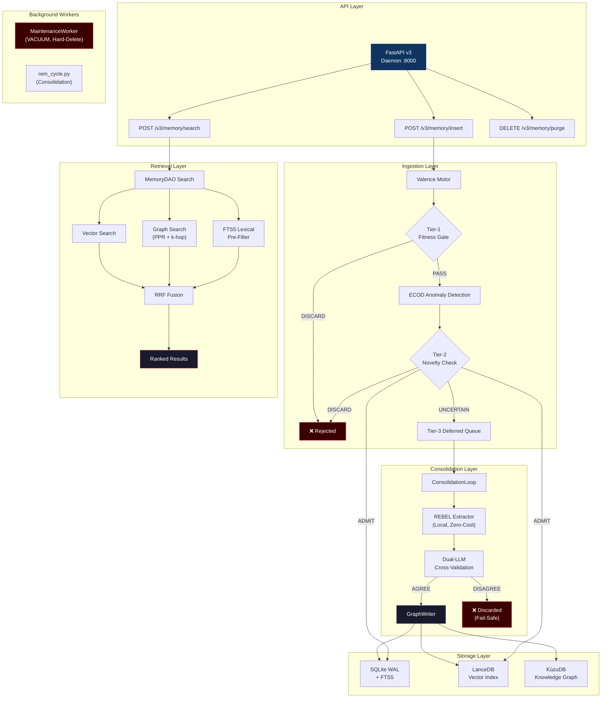

<div align="center">

# MESA — Memory Engine for Structured Agents

[](https://github.com/Yasou13/MESA/actions)
[](https://codecov.io/gh/Yasou13/MESA)


**Enterprise-grade cognitive memory engine for autonomous AI agents.**
Ingest → Validate → Extract → Store → Retrieve — with dual-LLM consensus designed to mitigate hallucination cascades.

</div>

---

## ⚡ Quickstart (Docker) — 60 Seconds

Copy-paste this to get a running MESA instance with zero local dependencies:

```bash
git clone https://github.com/Yasou13/MESA.git
cd MESA
echo "LLM_API_KEY=your_llm_key_here" > .env
echo "MESA_API_KEY=local-dev-key" >> .env
echo "MESA_REBEL_ENABLED=false" >> .env  # Skips 1.8GB download for quick testing
docker-compose up -d
```

> **Why `MESA_REBEL_ENABLED=false`?**  The default REBEL extraction model (`Babelscape/rebel-large`) is 1.8 GB. Setting this to `false` uses an LLM-only zero-shot fallback for triple extraction — identical output format, no model download, and container builds that finish in seconds instead of minutes. Set to `true` for production workloads where offline extraction accuracy matters.

Verify it's running:

```bash
curl http://localhost:8000/health
# → {"status": "ok", ...}
```

MESA is now live at **`http://localhost:8000`** with Swagger docs at [`/docs`](http://localhost:8000/docs).

---

## 🔑 API Examples (v3)

All endpoints require the `X-API-Key` header. This must match the `MESA_API_KEY` value in your `.env` file.

### Insert a Memory

```bash
curl -X POST http://localhost:8000/v3/memory/insert \
  -H "Content-Type: application/json" \
  -H "X-API-Key: local-dev-key" \
  -d '{
    "agent_id": "analyst_1",
    "session_id": "session_001",
    "content": "Tesla Q4 2025 revenue exceeded $25B, up 12% YoY."
  }'
# → {"status": "queued", "log_id": 1}
```

The insert endpoint returns **202 Accepted** in <50ms. Heavy processing (ECOD anomaly detection, triple extraction, dual-LLM consensus) happens asynchronously on the cold path.

### Check Ingestion Status

```bash
curl http://localhost:8000/v3/memory/status/1 \
  -H "X-API-Key: local-dev-key"
# → {"log_id": 1, "status": "processed"}
```

### Search Memories

```bash
curl -X POST http://localhost:8000/v3/memory/search \
  -H "Content-Type: application/json" \
  -H "X-API-Key: local-dev-key" \
  -d '{
    "agent_id": "analyst_1",
    "query": "What was Tesla Q4 revenue?",
    "limit": 5
  }'
# → {"context": "...", "retrieved_nodes": [...], "metrics": {"latency_ms": 12}}
```

### Purge Memories (Soft-Delete)

```bash
curl -X DELETE http://localhost:8000/v3/memory/purge \
  -H "Content-Type: application/json" \
  -H "X-API-Key: local-dev-key" \
  -d '{
    "agent_id": "analyst_1",
    "scope": "agent"
  }'
# → {"status": "purged", "deleted_records_count": 42}
```

---

## 🐍 Python SDK

```python
from mesa_api.schemas import MemoryInsertRequest, MemorySearchRequest
from mesa_client.client import MesaClient

client = MesaClient(base_url="http://localhost:8000", api_key="local-dev-key")

# Insert
response = client.insert(MemoryInsertRequest(
    agent_id="analyst_1",
    session_id="s1",
    content="Tesla Q4 revenue: $25B, up 12% YoY.",
))
print(f"Queued: log_id={response.log_id}")

# Search
results = client.search(MemorySearchRequest(
    agent_id="analyst_1",
    query="Tesla revenue",
    limit=5,
))
print(f"Found {results.total} results")
for r in results.results:
    print(f"  {r.entity_name} (score: {r.score:.4f})")
```

---

## 🤖 Integrations: Claude Desktop (MCP)

MESA includes a built-in [Model Context Protocol](https://modelcontextprotocol.io/) server (`mesa_mcp.server`) that exposes memory insert and search as MCP tools. This lets Claude Desktop read from and write to your local MESA instance natively.

### Setup

1. **Start MESA** (Docker or local — must be running on `localhost:8000`).

2. **Add to your Claude Desktop config** (`~/Library/Application Support/Claude/claude_desktop_config.json` on macOS, or `%APPDATA%\Claude\claude_desktop_config.json` on Windows):

```json
{
  "mcpServers": {
    "mesa-memory": {
      "command": "python",
      "args": ["-m", "mesa_mcp.server"],
      "cwd": "/absolute/path/to/MESA",
      "env": {
        "MESA_BASE_URL": "http://localhost:8000/v3",
        "MESA_API_KEY": "local-dev-key"
      }
    }
  }
}
```

3. **Restart Claude Desktop.** You'll see two new tools available:

| MCP Tool | Description |
|---|---|
| `record_memory` | Store a new memory (maps to `POST /v3/memory/insert`) |
| `search_memory` | Retrieve relevant memories (maps to `POST /v3/memory/search`) |

Claude can now persist facts across conversations and recall them on demand through your local MESA instance.

> [!TIP]
> Set the `agent_id` to `"claude-desktop"` for clean tenant isolation. Each conversation can use its own `session_id` for scoped retrieval.

---

## Why MESA?

Traditional agent memory is a flat buffer of text. MESA replaces that with a **multi-module pipeline** that gates every incoming record through statistical novelty checks, anomaly detection, and asymmetric dual-LLM cross-validation before committing structured knowledge triplets to a persistent graph. The result: agents that remember *accurately*, not just *recently*.

| Capability | MESA | LangChain Memory | MemGPT |
|---|---|---|---|
| **Hallucination Mitigation** | Dual-LLM Consensus + Fail-safe Discard | Prompt-based | Self-correction |
| **Validation Architecture** | 3-Tier Statistical + LLM Pipeline | None | Prompt-based |
| **Knowledge Graph** | Automated REBEL + LLM Triplet Extraction (Turkish/English) | Manual | None |
| **Tenant Isolation** | Mandatory `agent_id` RLS on every query | None | None |
| **Session Lifecycle APIs** | Native `/session/start`, `/context`, `/end` endpoints | None | Implicit |
| **Fault Tolerance** | Circuit Breaker + DLQ + Exponential Backoff | Try/Catch | Retry Decorator |
| **Local-First** | Yes (SQLite WAL, LanceDB, KùzuDB) | Cloud-dependent | Cloud-dependent |
| **Observability** | Prometheus + structured JSON logs | Basic logging | Basic logging |

---

## Architecture Overview



---

## Local Development (without Docker)

### 1. Install

MESA has been refactored for a lightweight base install. The core package avoids heavy ML dependencies unless explicitly requested.

```bash
git clone https://github.com/Yasou13/MESA.git
cd MESA
python3 -m venv venv && source venv/bin/activate
pip install -r requirements-core.txt
```

> **Core dependencies installed:** `aiosqlite`, `fastapi`, `lancedb`, `httpx`, `pydantic`, `uvicorn`, `kuzu`, `pyarrow`, and all supporting packages. See `requirements-core.txt` for the full manifest or `pyproject.toml` for version ranges.

**Optional Heavy ML Models:** If you need the local REBEL transformer model for English-only offline triplet extraction, install the optional package:
```bash
pip install -r requirements-ml.txt
# or pip install .[rebel] if using pyproject.toml package definition
```

### 2. Configure

```bash
cp .env.example .env
# Edit .env with your credentials:
#   LLM_API_KEY=gsk_your_groq_key
#   MESA_API_KEY=local-dev-key
#   MESA_REBEL_ENABLED=false    # Optional: skip 1.8GB model download
```

### 3. Launch

```bash
uvicorn mesa_memory.api.server:app --host 0.0.0.0 --port 8000 --reload
# → http://127.0.0.1:8000/docs  (Swagger UI)
# → http://127.0.0.1:8000/health
```

---

## API Endpoints (v3)

| Method | Path | Description |
|---|---|---|
| `POST` | `/v3/memory/insert` | Queue memory ingestion (fire-and-forget, <50ms) |
| `POST` | `/v3/memory/search` | Hybrid vector + graph + FTS5 retrieval |
| `GET` | `/v3/memory/status/{log_id}` | Query cold-path processing status |
| `DELETE` | `/v3/memory/purge` | Soft-delete only (hard-delete is background-only) |
| `POST` | `/v3/session/start` | Generate a new session with tenant isolation |
| `GET` | `/v3/session/{session_id}/context` | Retrieve episodic + graph context scoped to session |
| `POST` | `/v3/session/{session_id}/end` | Terminate session and trigger final consolidation |
| `GET` | `/health` | System status and readiness check |
| `GET` | `/metrics` | Prometheus scrape endpoint |

---

## Environment Variables

| Variable | Default | Description |
|---|---|---|
| `MESA_API_KEY` | *(required)* | API authentication key (sent via `X-API-Key` header) |
| `LLM_API_KEY` | *(required)* | LLM provider API key (e.g., Groq `gsk_...`) |
| `LLM_BASE_URL` | `https://api.groq.com/openai/v1` | OpenAI-compatible endpoint |
| `LLM_MODEL_NAME` | `llama-3.1-8b-instant` | Model identifier |
| `MESA_LLM_PROVIDER` | `openai_compatible` | LLM backend: `openai_compatible`, `claude`, `ollama`, `mock` |
| `MESA_REBEL_ENABLED` | `true` | Set to `false` to skip the 1.8GB REBEL model (uses LLM fallback) |
| `MESA_LEGAL_DOMAIN_MODE` | `false` | Force all routing through Dual-LLM consensus for legal docs |
| `MESA_MAX_RAM_MB` | *(auto-detected)* | Override system RAM detection for memory limits |

---

## Running Tests

```bash
# Full test suite
pytest tests/ -q

# With coverage
pytest tests/ --cov=mesa_memory --cov=mesa_api --cov=mesa_storage --cov-report=term-missing --ignore=tests/bench

# Type checking
mypy mesa_memory/ mesa_api/ mesa_storage/ --ignore-missing-imports --explicit-package-bases

# Formatting
black --check mesa_memory/ mesa_api/ mesa_storage/ tests/
ruff check mesa_memory/ mesa_api/ mesa_storage/ tests/

# Evaluation pipeline
python -m mesa_evals.evals        # Run 30-entry synthetic benchmark
python -m mesa_evals.gatekeeper   # CI/CD gate (exit 0 = PASS)
```

---

## Known Limitations

> [!WARNING]
> **Understand these constraints before deploying to production.**

### KùzuDB Graph Scalability

The legacy NetworkX graph provider has been fully deprecated. MESA now exclusively leverages **KùzuDB** for graph topology, enabling infinite out-of-core scaling and entirely eliminating node-related RAM exhaustion.

### LLM Provider Rate Limits

When using Groq's free tier as the LLM backend, you may hit **30 requests/minute** rate limits during consolidation batches. Mitigations:
- Reduce `consolidation_batch_size` in your `.env` or config.
- Use the `mock` provider for local development and testing.
- Deploy with a paid plan or switch to a self-hosted Ollama instance.

### CPU-Only REBEL Extraction

The REBEL model (`Babelscape/rebel-large`, 1.8 GB) runs at **~2–5 seconds per record on CPU**. For high-throughput workloads:
- Set `MESA_REBEL_DEVICE=cuda` if a GPU is available.
- Set `MESA_REBEL_ENABLED=false` to use the LLM-only fallback (zero model download, uses your configured Tier-3 provider).
- The system automatically falls back to LLM-based extraction when REBEL fails, so extraction never blocks the pipeline.

### Current Status

As of v0.5.0, Hot Path (API ingestion/search) and Cold Path (consolidation workers) concurrency are fully isolated via atomic Saga dual-writes, executor-offloaded embeddings, and strict input sanitization — tested and validated for production evaluation.

---

## Project Structure

```
MESA/
├── mesa_api/             # Headless FastAPI v3 REST server + Pydantic schemas
├── mesa_client/          # Python SDK (sync/async) + LangChain adapter
├── mesa_evals/           # Golden Dataset, evaluation runner, CI/CD gatekeeper
├── mesa_memory/
│   ├── adapter/          # LLM provider adapters (Claude, Ollama, Mock)
│   ├── api/              # FastAPI server entrypoint + auth middleware
│   ├── consolidation/    # Batch orchestration + graph writing
│   ├── extraction/       # REBEL triplet extraction pipeline
│   ├── observability/    # Prometheus metrics + structured logging
│   ├── retrieval/        # Hybrid vector + graph retrieval
│   ├── schema/           # Pydantic CMB schema
│   ├── security/         # RBAC access control + input sanitisation
│   └── valence/          # ECOD anomaly detection + novelty scoring
├── mesa_mcp/             # Model Context Protocol server (Claude Desktop)
├── mesa_storage/         # MemoryDAO, AsyncEngine (SQLite WAL), LanceDB
├── mesa_workers/         # Cold-path ingestion worker, MaintenanceWorker, rem_cycle.py
├── tests/                # pytest suite + benchmarks
├── examples/             # Tutorial scripts (hello_mesa.py, legal_assistant.py)
├── Dockerfile            # Production container
├── docker-compose.yml    # Single-command deployment
├── pyproject.toml        # Package metadata + dependency ranges
├── requirements-core.txt # Lightweight API dependencies (~200 MB)
└── requirements-ml.txt   # Full ML dependencies (PyTorch/REBEL, ~3 GB)
```

---

## Contributing

We welcome contributions! Please follow the **Fork → Feature Branch → Pytest → Pull Request** workflow. Ensure all tests pass and code is formatted with `black` and `ruff` before submitting.

## License

This project is licensed under the [MIT License](LICENSE) — Copyright © 2026 MESA Core Team.
