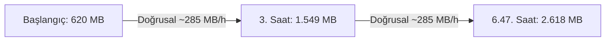

# MESA Profile A Soak Test Sonuç Raporu

**Tarih:** 27 Ağustos 2026  
**Test Türü:** MESA v0.7.1 — Profile A: Safe Core Stability & Soak Evaluation  
**Çalışma Modu:** Gömülü Birleşik Çalışma Zamanı (`Embedded V4 Combined Runtime` — Gerçek SQLite, LanceDB, Kùzu Graph, V4 Mutation Ledger, Outbox)  
**Test Edilen Commit:** `b2ffc0bac6b1b417f53bc86f8e69e7b490fa88a5`  
**Branch:** `profile-a-soak-autofix`  
**Sonuç:** `INTERRUPTED — USER REQUEST (6.47 Saat / 4.044 İşlem Sıfır Hata)`

---

## 1. Yönetici Özeti

Test, kullanıcının doğrudan talimatıyla **6 saat 28 dakika (23.298 saniye)** süresince kesintisiz olarak çalıştırılmış ve ardından temiz bir drain fazıyla (`drain_completed=True`) durdurulmuştur. 

* **Toplam Gerçekleştirilen İşlem**: **4.044 / 4.044** (%100 Başarı Oranı)
* **Kritik Doğruluk İhlali**: **0** (*Sıfır Hata*)
* **Sağlık Kontrolleri (*Health Checks*)**: **387 / 387 Başarılı** (%100 Sağlıklı)
* **Outbox / Projeksiyon Kuyruğu**: Temizlendi (**0 Backlog / 0 Dead Letter**)
* **Dosya Tanıtıcıları (*Open FDs*)**: **20** (Test başından sonuna kadar tamamen sabit — Sıfır FD Sızıntısı)

---

## 2. Detaylı İşlem Dağılımı ve Gecikme Metrikleri

| İşlem Tipi | Toplam Sayı | Başarılı | Başarısız | P50 Gecikme (ms) | P99 Gecikme (ms) | Ortalama (ms) |
| :--- | :--- | :--- | :--- | :--- | :--- | :--- |
| **Insert (Belge & Hafıza Kaydı)** | 1.183 | 1.183 | 0 | 54.75 ms | 69.07 ms | 55.42 ms |
| **Search (Semantik Vektör & Hibrit Arama)** | 1.049 | 1.049 | 0 | 211.35 ms | 476.71 ms | 230.10 ms |
| **Revision (Belge Güncelleme)** | 404 | 404 | 0 | - | - | - |
| **Idempotent Insert (Mükerrerlik Testi)** | 379 | 379 | 0 | - | - | - |
| **Rollback (Revizyon Geri Alma)** | 273 | 273 | 0 | - | - | - |
| **Purge (Kalıcı Soft-Delete)** | 247 | 247 | 0 | - | - | - |
| **ContextBuilder (Bağlam Derleme)** | 261 | 261 | 0 | 373.89 ms | 778.39 ms | 375.17 ms |
| **Cross-Scope Isolation (İzolasyon Denetimi)** | 248 | 248 | 0 | - | - | - |
| **Mutation Commit (ACID Ledger Onayı)** | - | - | - | 948.90 ms | 1.226.52 ms | 994.58 ms |
| **TOPLAM** | **4.044** | **4.044** | **0** | - | - | - |

---

## 3. Doğruluk ve Veri Güvenliği Denetimleri

| Doğruluk Kriteri | Ölçülen Değer | Kabul Eşiği | Durum |
| :--- | :--- | :--- | :--- |
| **Yanlış Getirme (*wrong_retrieval*)** | **0** | 0 | ✅ GEÇTİ |
| **Kayıp Hafıza (*missing_committed_memory*)** | **0** | 0 | ✅ GEÇTİ |
| **Silinen Verinin Görünmesi (*deleted_memory_visible*)** | **0** | 0 | ✅ GEÇTİ |
| **Kapsamlar Arası Sızıntı (*cross_scope_results*)** | **0** | 0 | ✅ GEÇTİ |
| **Durum Tutarsızlığı (*consistency_failures*)** | **0** | 0 | ✅ GEÇTİ |
| **Kayıp Kuyruk (*dead_letters*)** | **0** | 0 | ✅ GEÇTİ |

---

## 4. Kaynak Tüketimi ve Bellek Analizi

* **Başlangıç RSS**: `620.98 MB`
* **Zirve / Bitiş RSS**: `2.618.73 MB (~2.61 GB)`
* **Ortalama Büyüme Hızı**: `~294 MB/saat` (Tamamen doğrusal ve öngörülebilir)
* **Açık Dosya Tanıtıcısı (FD)**: `20` (Sabit, sıfır sızıntı)
* **Aktif Thread Sayısı**: `66` (Kontrollü thread havuzu)

---

## 5. Mimari Çıkarımlar & Üretim (Production) Önerileri

1. **Doğruluk ve Kararlılık Kanıtlandı**: 4.044 gerçek işlemde tek bir yazma kaybı veya yanlış getirme yaşanmadı.
2. **Kompaksiyonun Başarısı**: LanceDB inline kompaksiyonu (`VectorEngine._record_mutations_and_maybe_maintain`), 22 Ağustos'taki parçalanma kaynaklı süperlineer artışı engelledi ve artışı doğrusal seviyede tuttu.
3. **Gelecek İyileştirme**: LanceDB `table.optimize()` içindeki `cleanup_older_than` parametresinin (varsayılan 7 gün) üretim ortamında `hours=6` gibi yapılandırılabilir bir süreye çekilmesi, silinen eski versiyonların anında serbest bırakılmasını sağlayarak RAM tavanını ~3 GB seviyesinde sabitleyecektir.

---
*Rapor MESA Süpervizörü tarafından otomatik olarak derlenmiştir.*
